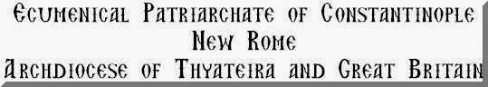
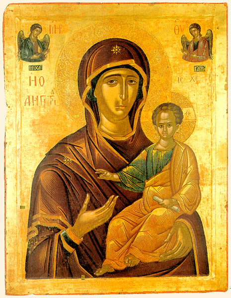
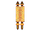

**ANASTASIS**

{width="539" height="100"}

Welcome to Anastasis\
the Home Page\
of the Monastery of Saint Andrew the First Called\
Manchester, England
--------------------------------------------------

{width="348" height="445"}

****L****et the impiousÂ’ lips be bereft of speech,\
who do not worship this your icon, the all-revered,\
this which was depicted\
by Luke, the LordÂ’s Apostle,\
the icon with the title,\
‘She who points out the Way’.

------------------------------------------------------------------------

On these pages you will find, in the main, translations of our Orthodox
liturgical and patristic texts. Most of the latter are of texts which
have not been previously translated into English, or which are only
available in rare or outdated versions.

As the texts on these pages change frequently, I would ask visitors to
link to this opening page only. In this way you will find what is
available more easily. I have tried deliberately to keep things simple,
by not using frames and other elegant refinements.

**Click on the book icon to be taken to the Table of Contents for the
whole site [{width="37"
height="30"}](table_of_contents.md) The Search facility near the bottom
of this page is also a way of finding your way around quickly and
easily.**

The date on which each page was last updated appears at the bottom of
each page, but if any page has been updated or added this first page and
the Table of contents will also be updated.

Some visitors to these pages have pointed out that when printed out in
black and white only, the distinction between text and rubrics is lost.
This can be overcome if the pages are saved into a word processor and
then edited, rather than being printed directly from the screen. The
original text of nearly all these pages was prepared in Microsoft Word
2000.

------------------------------------------------------------------------

As there is now a great deal on these pages, I have decided to draw
attention to recently added material by listing them here and adding the
necessary hyperlinks, and reminders, with hyperlinks, to appropriate
pages from earlier years.

{width="92" height="65"}

[Tone 5: Monday Matins](monday_matins4.md)
------------------------------------------

[Tone 5: Tuesday Matins](tuesday_matins4.md)
--------------------------------------------

------------------------------------------------------------------------

[ REMINDER ]{style="TEXT-TRANSFORM: uppercase"}
-----------------------------------------------

[Menaion for August](august.md)
-------------------------------

[Small Paraklesis to the Mother of God](lit-parak.md)
-----------------------------------------------------

[1 August: Vespers and Matins](1august.md)
------------------------------------------

[4 August: Vespers and Matins](4august.md)
------------------------------------------

[5 August: Vespers and Matins](5_august.md)
-------------------------------------------

------------------------------------------------------------------------

Unless stated otherwise, all texts and translations on these pages are
(c) by Archimandrite Ephrem.

You will find a great treasure house of Orthodox material and good sense
at [Arimathea](http://www.arimathea.co.uk/arimathea.htm), David
Melling’s home page. He has now launched a new web page devoted to
Orthodox church music. The address is:
<http://www.church-music.co.uk/EOChant.htm> It includes his manual of
Psalmodia in PDF format.

If you have any personal comments or suggestions please send us an\
{width="96"
height="64"}[ephrem@chorlton.com](mailto:ephrem@studite.demon.co.uk)

The number of visits since 1 January 1998 is

[{width="124"
height="37"}](http://www.rapidaxcess.com)\
[Counter by Rapid Axcess](http://www.rapidaxcess.com)

{width="145"
height="88"}‘My tongue is the pen of a rapid writer’

Please sign [my Guestbook](http://www.guestbook.de/yasg.cgi?X=74251).
Your comments in my earlier book were most positive and encouraging.

Enter your e-mail address to receive e-mail when this page is updated.\
Your Internet e-mail address:\
\

\
The search facility below is highly recommended and will rapidly find
almost any word on the following pages.

{width="4"
height="1"}

{width="8"
height="1"}

{width="13"
height="1"}

{width="35"
height="1"}

{width="19"
height="1"}

{width="1"
height="1"}

{width="46"
height="1"}

{width="126"
height="21"}

{width="1"
height="21"}

{width="2"
height="26"}

{width="1"
height="26"}

{width="60"
height="55"}

\

{width="46"
height="40"}

{width="1"
height="40"}

{width="1"
height="15"}

{width="4"
height="43"}

\

{width="55"
height="55"}

{width="1"
height="43"}

{width="25"
height="12"}

{width="1"
height="12"}

\

{width="22"
height="22"}

[{width="73" height="104"}](http://www.studyweb.com/)

{width="39" height="40"}

  ---------------------------------------------------------
  [***Links^2^Go* Key Resource**\
  Orthodox Topic](http://www.links2go.com/topic/Orthodox)
  ---------------------------------------------------------

{width="60" height="20"}
   

+-----------------------------------------------------------------------+
| --------------------------------------------------------------------- |
| ---                                                                   |
|                                                                       |
| All texts and translations on this page are copyright to\             |
| Archimandrite Ephrem ©                                               |
|                                                                       |
| **This page was last updated on 31 July 2002**                        |
+-----------------------------------------------------------------------+

