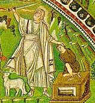

\[ [Home](index.md) \] \[ [Up](ephrem.md) \]
\[ [Sermon in Heptasyllablics](ser-hept.md) \]
\[ [Three Short Discourses](3disc.md) \]
\[ [55 Beatitudes](55beat.md) \]
\[ [To the Monks of Egypt](egypt-int.md) \]
\[ [On the Departed Fathers](dead-pat.md) \]
\[ On Abraham and Isaac \] \[ [On Joseph](on_joseph.md) \]
\[ [On the Transfiguration](on_the_transfiguration.md) \]
\[ [On The Passion](PassSer.md) \]

****

## INTRODUCTION

Among the many metrical texts in Greek attributed to Saint Ephrem the
Syrian are a number of long poems devoted to Old Testament figures. The
one presented here is particularly interesting since it is clearly
related to a text of Saint Gregory of Nyssa ***On the Nature of the
Son***, which may be found in PG 46:565-576. In the translation below
the parts that are identical with St Gregory’s are underlined. It is
very difficult to decide which text is the earlier and the few few
scholars who have given any attention to the subject are divided. I am
inclined to think that St Gregory’s text is the earlier, since it
includes none of the passages in St Ephrem’s text which are explicitly
Christological; for example the long typological series of stanzas (9 to
27) on the Incarnation, or that on Isaac and Christ (94 to 106). Whether
the poem has links to the Syrian Ephrem is another very difficult
question. The description of the tree on which the ram is found hanging
as ’a Sabek plant’ must be based on the Septuagint, on the other hand
the idea that the tree and the ram were a special miraculous creation is
also found in St Ephrem’s own Syriac Commentary on Genesis, ’The ram had
not been there, since Isaac asked about the lamb. The tree was not
there, since the wood on  Isaac’s shoulders shows it. The mountain threw
up the tree, and the tree the ram; so that by the ram which was hanging
from the tree and became a sacrifice for Abraham’s son, might be
prefigured the one who hung like a ram from the wood, and who would
taste death for the whole world’. \[***On Genesis,*** 20.1\]

The description of the moment of the sacrifice, stanzas 133 to 139,
is,as the writer says, based on actual depictions of the scene and is
reminicscent of extant examples from early Christian art, among them a
number of sarcophagi.

The poem is written in the Syrian metre, known as the ’Metre of Mar
Eprem’, which consists of lines of fourteen syllables, with a caesura
after the seventh. These are sometimes printed as couplets of seven
syllable lines. This is unknown in Greek prosody and is based neither on
length of syllabes, as in Classical Greek, nor on patterns of stress
accents, as in Byzantine poetry, but simply on the number of syllables.
Greek Ephrem also uses on occasion octosyllabic lines, made up of two
tetrasyllables. In this poem they are used for Sara’s Lament in stanzas
76  to 92.

The text is translated from the critical edition by Mercati. I have, for
the moment, accepted his division into four line stanzas, though
involves accepting that there some lacunae in the original.

The whole of the Greek text is also found among the (inauthentic)
sermons of St John Chrysostom.

-----

**Sermon of our Venerable Father Ephrem**

> 1.  God banished  
>     the righteous Abraham  
>     from his kinsfolk  
>     and from all his own.  
>       
> 
> 2.  And he was in a foreign land  
>     persevering under hardships  
>     waiting for the hope  
>     of the promise.  
>       
> 
> 3.  Much testing was brought  
>     upon the patriarch,  
>     through which his steadfastness  
>     to God was shown.  
>       
> 
> 4.  A long time passed;  
>     his youth like a flower  
>     finally withered;  
>     old age was at the door.  
>       
> 
> 5.  Nature suffering what  
>     was its own  
>     \<…………..\>  
>     was bowed with old age.  
>       
> 
> 6.  By old age was quenched  
>     for his wife also  
>     the strength and capacity  
>     for bearing a child.  
>       
> 
> 7.  Both their bodies  
>     bowed under nature’s law  
>     now that their youth  
>     had been wasted away.  
>       
> 
> 8.  But the hope in God,  
>     which flourished in them,  
>     was not only unageing,  
>     but also invincible.  
>       
> 
> 9.  Therefore beyond hope  
>     she gave birth to Isaac,  
>     who bore in every way  
>     the type of the Master.  
>       
> 
> 10. It was not nature’s work  
>     that a dead womb conceived  
>     and breasts that were dry  
>     gave Isaac milk.  
>       
> 
> 11. It was not nature’s work  
>     that the Virgin Mary  
>     conceived without a man  
>     and without corruption gave birth  
>     \[to the Saviour of all things\].  
>       
> 
> 12. He made Sara  
>     a mother in old age;  
>     revealed Mary  
>     a virgin after child-birth.  
>       
> 
> 13. An Angel in the tent  
>     said to the patriarch,  
>     ‘At this time  
>     Sara will have a son.’  
>       
> 
> 14. An Angel in Nazareth  
>     said to Mary,  
>     ‘Behold, you will bear a son,  
>     O highly favoured.’  
>       
> 
> 15. Sara laughed  
>     seeing her barrenness,  
>     beholding her deadness  
>     disbelieving the word.  
>       
> 
> 16. ‘How, she said, will this be,  
>     Abraham and I  
>     are both incapable  
>     of having children?’  
>       
> 
> 17. Mary too was at loss,  
>     seeing her virginity  
>     and keeping its seals  
>     unbroken.  
>       
> 
> 18. ‘How will happen to me,  
>     who do not know man?  
>     For this promise  
>     is foreign to nature.’  
>       
> 
> 19. But it was he, who beyond hope  
>     gave Isaac to Sara,  
>     who was born from the Virgin  
>     according to the flesh.  
>       
> 
> 20. Filled with joy were  
>     Sara and Abraham  
>     when Isaac was born,  
>     as God had said.  
>       
> 
> 21. Filled with joy were  
>     Mary and Joseph  
>     when Jesus was born,  
>     as Gabriel had said.  
>       
> 
> 22. Abundantly there flowed  
>     streams of milk  
>     from the mother in old age  
>     into the mouth of Isaac.  
>       
> 
> 23. Abundantly the breasts  
>     of the Virgin streamed with milk  
>     for the One who nourishes  
>     all the ends of the earth.  
>       
> 
> 24. ‘Who will tell Abraham  
>     that Sara gives suck  
>     to a son in her old age?’  
>     cried the barren woman.  
>       
> 
> 25. ‘Who will tell mankind  
>     that I am a virgin,  
>     and having given birth I suckle?’  
>     said Mary.  
>       
> 
> 26. Sara did not laugh  
>     because of Isaac,  
>     but because of the One  
>     who is born from Mary.  
>       
> 
> 27. And just like John  
>     through his leaping,  
>     so Sara by laughing  
>     revealed the joy.  
>       
> 
> 28. The child grew to manhood  
>     and was radiant and fair  
>     with the bloom of youth  
>     of young men.  
>       
> 
> 29. Adding each day  
>     virtues of soul  
>     to the beauty of his body,  
>     he was a delight to his parents.  
>       
> 
> 30. You that have children,  
>     imitate him.  
>     How the father takes pleasure  
>     when he sees his child playing.  
>       
> 
> 31. How he rejoices when he sees  
>     his child making progress,  
>     or being serious  
>     about his lessons.  
>       
> 
> 32. But when Abraham, seeing  
>     these things, rejoiced,  
>     trial and heavy torment  
>     were brought to him,  
>       
> 
> 33. That he might show clearly  
>     to what he gave greater weight,  
>     to the influence of nature  
>     or the love of God.  
>       
> 
> 34. As I recount,  
>     beloved brethren,  
>     the severity of the test,  
>     I tremble and am amazed.  
>       
> 
> 35. For once again God  
>     gives Abraham an order  
>     and summons him,  
>     calling him by name.  
>       
> 
> 36. ‘Take your only son,  
>     Isaac,  
>     your beloved,  
>     whom you love,  
>       
> 
> 37. And offer him  
>     yourself as a sacrifice  
>     on one of the mountains  
>     that I shall tell you.’  
>       
> 
> 38. But when he said to him,  
>     ‘Abraham, Abraham,’  
>     gladly he obeyed,  
>     expecting better things,  
>       
> 
> 39. Ever awaiting  
>     an additional grace,  
>     either to arrange a marriage,  
>     or to erect the marriage chamber,  
>       
> 
> 40. So that to its fulfilment  
>     might come the blessing  
>     and the multitude of descendants,  
>     as he had been promised.  
>       
> 
> 41. But let us learn  
>     the additional word to  
>     ‘Take your only,  
>     your beloved son.’  
>       
> 
> 42. You see how the sharp points  
>     of the word pierce the father,  
>     and how they rekindle  
>     the flame of nature?  
>       
> 
> 43. How they rouse the great love  
>     of the father for his child,  
>     calling him ‘Your only’  
>     and also ‘Your beloved’?  
>       
> 
> 44. So that through such  
>     names his burning  
>     love for him might test  
>     his intention.  
>       
> 
> 45. ‘And offer him  
>     to me as a whole burnt offering  
>     on one of the mountains  
>     that I shall show you.’  
>       
> 
> 46. What have you suffered  
>     as you heard these things?  
>     Did you not stagger  
>     at the telling,  
>       
> 
> 47. You that are fathers  
>     and have clearly learnt  
>     the love for your sons  
>     which comes from nature?  
>       
> 
> 48. For you know, you know  
>     how a father has received  
>     the report of the slaughter
>     
>     ##   
>     
>     of any only son.  
>       
> 
> 49. Who would not be amazed  
>     at such a word?  
>     Who would not at once  
>     turn away his face?  
>       
> 
> 50. \<Or\> who would not at once  
>     at this command not choose  
>     rather to die  
>     than to accept the order?  
>       
> 
> 51. Or who would not have  
>     remonstrated with him,  
>     putting nature forward  
>     as his advocate like this?  
>       
> 
> 52. ‘Why, Master, have you ordered  
>     these things to be?  
>     Why have you uttered  
>     these unwelcome words?  
>       
> 
> 53. Was it for this you wished  
>     to make me a father,  
>     that you might all at once  
>     make me a child murderer?  
>       
> 
> 54. Was it for this you gave me  
>     a taste of the sweet gift,  
>     that you might show me to be  
>     a byword to the whole world?  
>       
> 
> 55. That with my own hands  
>     I might slay my child  
>     defiling my right hand  
>     with the blood of my own kin?  
>       
> 
> 56. Am I to become a child murderer?  
>     Is this what you order,  
>     and is it in such sacrifices  
>     that you take you delight?  
>       
> 
> 57. Do you command me to slay  
>     my most dear son,  
>     by whom I had hoped  
>     with Sara to be buried?  
>       
> 
> 58. Is this the sort of bridal chamber  
>     I am to erect for him, tell me?  
>     Is this the sort of joy  
>     I am to prepare for his marriage?  
>       
> 
> 59. Am I to light for him  
>     not a bridegroom’s torch,  
>     not lights of gladness,  
>     but a funeral fire?  
>       
> 
> 60. Shall I put a garland on him?  
>     Shall I erect a bridal chamber?  
>     Shall I besides  
>     set up dances?  
>       
> 
> 61. Shall I be, as you said,  
>     father of the nations,  
>     who am not worthy  
>     even of my one child?’  
>       
> 
> 62. But the just man did not give  
>     any such answers  
>     \<……………  
>     …………….  
>       
> 
> 63. ………………\>  
>     having become obedient,  
>     he set love alight  
>     more fiercely than the fire.  
>       
> 
> 64. Sharper than the sword  
>     he made his fond love;  
>     for with it he cut  
>     the bonds of nature.  
>       
> 
> 65. Having left behind and discarded  
>     like something earthly  
>     the burden of his  
>     compassionate nature,  
>       
> 
> 66. He gave up his whole self  
>     with fervour and busied  
>     himself with the command  
>     to slaughter his son.  
>       
> 
> 67. But to his wife  
>     he said nothing of this;  
>     nor did he share it with her,  
>     acting to the best advantage;  
>       
> 
> 68. For he considered  
>     that for him woman was  
>     unworthy of credit and  
>     prejudicial to counsel.  
>       
> 
> 69. For he did not agree,  
>     but disapproved  
>     of Adam’s accepting  
>     Eve’s counsel.  
>       
> 
> 70. So, lest Sara suffer  
>     some womanly emotion,  
>     lest she grieve  
>     like a mother,  
>       
> 
> 71. And shake the intensity  
>     and inviolability  
>     of his love for God,  
>     he strove to keep her unaware.  
>       
> 
> 72. For what loud lamentations  
>     would Sara not have used,  
>     either to her child,  
>     or to his father?  
>       
> 
> 73. What would she have not done  
>     as she saw her own son  
>     being forcibly dragged  
>     away to be slaughtered?  
>       
> 
> 74. How would she not,  
>     wrapping him in her arms,  
>     clasping him tightly,  
>     have pulled him close to her?  
>       
> 
> 75. What words would have not  
>     used to Abraham,  
>     and with loud laments  
>     cried out her distress?  

  
  
The following stanzas, which form Sara’s Lament, are in
Octosyllabics*.*  
  
  

‘Spare, spare your own kind;  
spare your child, Abraham,  
spare him, do not become  
an evil tale for the world.  
  

This offspring is my only one;  
this is my first;  
first and last  
in my labour pangs was Isaac.  
  

Do not cut off the one grape cluster  
that we bore as our fruit,  
when through old age we were  
no longer part of the vine.  
  

Do not harvest the one ear of corn  
\[that we bore as our fruit\]  
with the trenchant sickle,  
the one who blossomed from us,  
from the deadness that was ours.  
  

Do not smash the staff  
on which we were supported.  
Do not break the rod  
on which we take our rest.  
  

Do not blind the eye  
which we two have gained.  
Do not remove our memorial  
from the earth beneath the sky.  
  

Do not slaughter like a sheep  
the lamb that we possess.  
Do not take away our joy  
and fill us with lament.  
  

Whom, after him, shall we  
see at out table?  
Who will call me ‘Mother’?  
Who will minister to our old age?  
  

Who will shroud us when dead?  
Who cover our bodies with a tomb?  
Who preserve the memorial  
of us for ever childless?  
  

You see the young man’s beauty,  
the flower of his youth,  
on which, if you saw it in a foe,  
you would surely have compassion.  
  

He has been given as the fruit  
of my yearlong prayers;  
he has been left as the branch  
of my succession.  
  

He is all that is left of our line;  
he the staff of old age;  
he alone is the hope  
of our lack of hope.  
  

If you mean to thrust the sword  
into the neck of my most dear son,  
then kill me first,  
so granting me the greatest grace.  
  

Let the funeral mound be common,  
and common our memorial.  
Let a common dust  
cover both our bodies.  
  

Common be the death  
of the barren and her offspring.  
Let a common gravestone  
tell the suffering of both.  
  

Let not Sara’s eye see  
Abraham a child murderer,  
nor Isaac, slain as a child  
by the hands of his father.’  
  
  
Here the poet reverts to *Heptasyllabics*  
  

These and things like them  
Sara would have done  
had she known that her dear son  
was about to be slaughtered.  
  

Therefore Abraham said  
nothing of this to her,  
that nothing might hinder  
the work of his hands.  
  

He laid on the boy  
the faggots of the wood,  
since the Saviour also  
bore the Cross.  
  

When Isaac was about  
to go to the slaughter,  
the ass followed  
and Abraham’s servants.  
  

And when Christ was about  
to go to his Passion,  
he mounted on a colt  
showing the call of the nations.  
  

While his disciples also  
followed him,  
bearing tokens of victory  
and crying, ‘Hosanna\!’  
  

Isaac bearing  
the wood went up  
the mountain to be sacrificed  
like an innocent lamb.  
  

The Saviour too bearing  
the Cross went out  
to be sacrificed on Calvary  
like a lamb for us.  
  

As you look on the sword  
think of the lance.  
As you consider the altar,  
imagine Calvary.  
  

As you contemplate the faggots  
reflect on the cross.  
As you look on the fire,  
meditate on the love.  
  

Look too on the sheep  
hanged by its two horns  
on the plant  
that is called ‘Sabek’.  
  

Look too on Christ,  
the Lamb of God,  
hanged by his two hands  
upon a Cross.  
  

The plant called Sabek  
means ‘forgiveness’,  
for it saved from slaughter  
the old man’s child,  
  

It foreshadows the cross  
that forgives the world  
its sins  
and grants it life.  
  

The ram hanging  
on the Sabek plant  
mystically redeemed  
Isaac alone,  
  

While the Lamb of God  
hanged on the cross  
delivered the world  
from Death and Hell.  
  

Isaac was torn  
from his servants  
when about to go  
up the mountain to death.  
  

Christ was torn  
from his disciples,  
when about to go  
to the slaughter for our sake.  
  

The righteous Abraham  
left the servants  
lest there might be from them  
some slave-like action  
against the sacrifice.  
  

And taking Isaac,  
alone he led him up alone,  
while they carried together  
fire, sword and wood.  
  

But what did Isaac  
with his sweet voice  
call out and say?  
He addressed him, saying,  
  

‘Tell me, father,’ he says,  
‘See, here are the fire and the wood;  
Where is the sheep  
for the holocaust?’  
  

Again the boy’s voice  
pierces his father to the heart;  
again another dread  
trial held him.  
  

Again another testing  
seized the just man,  
no feebler than the first  
no more compassionate.  
  

How could Abraham  
not be smitten with tears,  
who no longer expected  
to hear the greeting, ‘Father’  

  

No longer to hear  
the voice of his dearest child?  
He says nothing mournful,  
utters nothing sorrowful,  
  

But with unruffled soul  
and unflinching thought  
he accepted the sweet  
words of the boy.  
  

And he answered  
and spoke with him,  
‘God, my child, will provide  
a sheep for the sacrifice.’  
  

Abraham said this either  
to encourage the boy,  
or to prophecy  
the future.  

  

When he had reached with haste  
the appointed place,  
he builds the altar,  
the place of sacrifice.  
  

He prepares the knife  
and gets ready the fire,  
and the father places  
the wood beside the boy.  
  

After this the father  
binds his son,  
and nature does nothing  
contrary to prevent him.  
  

Isaac gave himself  
to his father,  
to use him  
in whatever way he wished.  
  

At whom should I marvel first,  
at which be amazed?  
What garland of praise  
should I weave first?  
  

That for the one who laid hands  
on his most beloved son,  
through his love  
and goodwill towards God,  
  

Or for the one who obeyed  
his father unto death  
and accepted from him  
a heavenly slaughter?  
  

For the former raised  
himself above nature,  
honouring God’s command  
rather than nature’s;  
  

While the latter obeyed  
his father unto death,  
knowing that to grieve his father  
was worse than death.  
  

Then Abraham took  
the bound youth;  
his hand did not grow numb,  
he did not change his mind.  
  

Whenever I have seen  
the icons of this youth,  
I have never been able  
to pass them by without tears,  
  

The powerful skill  
bringing to my sight  
a clear understanding  
with this story.  
  

Isaac was placed  
near the altar,  
crouched on his knees  
before his father,  
  

With his hands tied  
behind him;  
to his rear Abraham,  
treading on his bent knee.  
  

Then, with one hand  
bending back towards himself  
the young man’s hair,  
he leans towards him.  
  

And Isaac’s face  
looks towards him,  
gazing pitifully  
and awaiting the blow.  
  

With his right hand  
armed with the sword,  
he aims for the slaughter,  
touches the body.   
  

Already the knife’s point  
was at his throat;  
he pushed the sword  
against his stomach.  

  

And then there came  
a voice from God,  
restraining the assault,  
preventing the deed,  
  

‘Abraham, Abraham’,  
it says, ‘do not lay  
your hand on Isaac,  
nor do any evil to your son.  
  

For now I know truly  
that you fear God,  
and for my sake did not spare  
your beloved son.  
  

See, a ram is bound  
on the Sabek plant.  
Take it and offer it  
instead of Isaac,  
  

That you may be fully assured  
that I have accepted  
your sacrifice,  
your fervent choice.’  
  

Angels marvelled with  
Principalities and Powers,  
Thrones Dominions  
and all the angelic hosts.  
  

The heavens were amazed  
with sun and moon  
and choirs of stars  
at the wonder.  
  

While God was pleased  
by the single choice  
of holy Abraham,  
who had proved most faithful.  
  

And he said to him, Blessing I will bless  
and multiplying I will multiply  
your descendants upon earth  
like the stars of heaven,  
  
  

Since you have eagerly  
obeyed my voice  
and hastened to fulfil  
my commandment.’  

  

And God gave  
a sheep from the rock  
instead of the child  
to complete the sacrifice.  
  

For God is not pleased  
by a dead sacrifice  
offered to him  
through ash and smoke,  
  

But a living sacrifice,  
holy, well-pleasing,  
the reasonable worship  
he seeks from us,  
  

As the Apostle  
clearly exhorts us all,  
knowing that this  
is well-pleasing to God.  
  

For God did not wish  
to make Abraham  
a child murderer  
when he told him to offer his son,  
  

But so that he might show all  
the inhabitants of the world  
that Abraham loved  
God very greatly,  
  

Because for his sake  
he did not spare Isaac  
although he was  
his only child.  
  

And so too God  
revealed a mystery,  
great and marvellous,  
to his friend Abraham.  
  

For through the sacrifice  
he became a priest;  
while by the type  
he made him a prophet.  
  

And God Most High  
made known to him  
that he too would  
give his only Son  
  

For the world’s sake,  
so that God become man  
might save the human  
race from error.  
  

For this he signified  
in giving in place of Isaac  
a sheep from the Sabek  
to become the sacrifice.  
  

For since disbelieving men  
would not believe  
in the child-bearing  
of the Holy Virgin  
  

— How could she have  
without marriage to a man  
given birth a son;  
something truly impossible —  
  

Therefore he brought  
the ram from a rock  
that by this means  
the marvel might be assured,  
  

Because everything  
that is ordained  
by the will of his divinity  
is instantly realised.  
  

So, as there the word  
brought a sheep into being,  
so in the Virgin  
the Word became flesh.  
  

And as the sheep  
was bound to the plant,  
so the Only-Begotten  
was nailed to a Cross.  
  

Therefore Isaias  
cried out and said,  
‘He was led like a sheep  
silent to the slaughter.’  
  

While again the Lord  
said to the Jews,  
‘Abraham desired  
to see my day,  
  

He both saw it and rejoiced,’  
the day that is of the Passion  
typified by Isaac  
on the holy mountain.  
  

Blessed is God  
who foreshadowed for us  
all our salvation  
in the holy scriptures.  
  

And he came and fulfilled  
the words of the Prophets,  
and ascended in glory  
to his Father,  
  

That in every place  
we may worship the Father  
with Son and Spirit  
to the ages. Amen.

 

-----

All texts and translations on this page are copyright to  
Archimandrite Ephrem ©

**This page was last updated on 03 November 2008**

