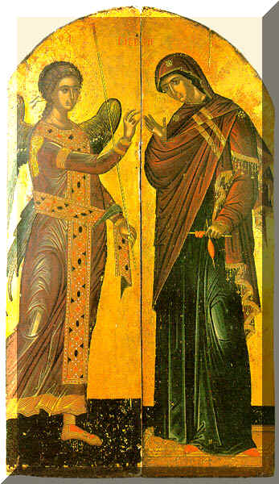

\[ [Home](index.md) \] \[ [Up](romanos.md) \] \[ [Kontakion 16](kontak16.md) \] \[ [Kontakion 20](kontakion_20.md) \] \[ [Kontakion 22](kontakion_22.md) \] \[ [Kontakion 32](kontakion_32.md) \] \[ [Kontakion 49](kontakion_49.md) \] \[ [Kontakion 51](kontakion_51.md) \] \[ The Akathist \]

INTRODUCTION
------------

The authorship of the Akathist Hymn to the Mother of God is the subject of much learned discussion, though many reputable scholars attribute it to St Romanos the Melodist, and so I have put this tentative translation on his page. The poem defies every translator and it is virtually impossible all the rhetorical devices which are such a striking feature of the Greek original. The original has an alphabetical acrostic for the first word of each Kontakion and Ikos and the lines begining
--------------------------------------------------------------------------------------------------------------------------------------------------------------------------------------------------------------------------------------------------------------------------------------------------------------------------------------------------------------------------------------------------------------------------------------------------------------------------------------------------------

‘Hail!’ are marked by many internal rhymes. These are indicated in the translation by em rules.

I have translated the Greek ‘Chaire!‘ by ‘Hail!’ as this is the most natural meaning of the Greek. Even though etymologically it means ‘Rejoice!’, it is a standard greeting, like the Latin ‘Ave!‘, which is what the Roman soldiers presumably said to the Lord as they mocked him. In the New Testament it often translates the Hebrew ‘Shalom!’

Liturgically the Hymn forms part of Matins on the Saturday of the Akathist, and in the monasteries of the the Holy Mountain it is read each night at Compline. In Greek use it is chanted solemnly in four sections at Compline on the first four Fridays of Lent, the whole being chanted at Compline on the fifth, the eve of Akathist Saturday.

THE AKATHIST HYMN
=================

**Section One. The Annunciation**

**Ikos 1**

A prince of the angels
was sent from heaven,
to say to the Mother of God, ‘Hail!’ \[

**Three times**\]
And as, at his bodiless voice,
he saw you, Lord, embodied,
he was astounded and stood still,
crying out to her like this:

Hail, you through whom — joy — will shine out,
Hail, you through whom — the curse — will cease.

Hail, recalling — of fallen Adam,
Hail, redemption — of the tears of Eve.

Hail, height hard to climb —for human thoughts,
Hail, depth hard to scan — even for angels’ eyes.

Hail, for you are — a throne for the King,
Hail, for you carry — the One who carries all.

Hail, star — that makes visible the Sun,
Hail, womb — of divine incarnation.

Hail, you through whom — creation — is renewed.
Hail, you through whom — the Creator — becomes a babe.

Hail, Bride without bridegroom.

****

Kontakion 1

But the holy Virgin,
seeing herself pure,
says boldly to Gabriel,
‘The strangeness of your words
seems hard for my soul to accept.
For from a conception without seed
you foretell pregnancy, as you cry:

Alleluia!’

****

Ikos 2

Calling to the ministering angel,
the Virgin sought to know unknown knowledge,
‘From a pure womb how
can a son be born? Tell me.’
He spoke to her in fear, only crying out:

Hail, initiate — of an ineffable counsel,
Hail, faith — in things that demand silence.

Hail, beginning — of Christ’s wonders,
Hail, crown — of his teachings.

Hail, heavenly ladder — by which God came down,
Hail, bridge, leading — those from earth to heaven.

Hail, wonder — well-known — among the angels,
Hail, wound — much lamented — by the demons.

Hail, for ineffably — you gave birth to the Light,
Hail, for to none — you revealed the mystery.

Hail, you that surpass — the knowledge of the wise,
Hail, you that pour light on —the minds of believers.

Hail, Bride without bridegroom.

****

Kontakion 2

Divine power of the Most High
then overshadowed
for conception the one who knew not wedlock.
And he made her womb fruitful
as a fertile field for all
who wish to reap salvation
as they sing:

Alleluia!

****

Ikos 3.

Enclosing God
within her womb, the Virgin
hastened to Elisabeth;
whose infant at once
recognised her greeting, and rejoicing
with leaps as though with songs,
cried out to the Mother of God:

Hail, vine — with a branch that does not wither,
Hail, orchard — of fruit that bears no taint.

Hail, for you husband — the Husbandman who loves humankind,
Hail, for you cultivate — the Cultivator of our life.

Hail, ploughland yielding — a rich harvest — of compassion,
Hail, table laden — with abundance — of mercy.

Hail, for you make the meadow of delight — flower again,
Hail, for you make ready a haven — for the soul.

Hail, acceptable incense of intercession,
Hail, propitiation for the whole world.

Hail, good pleasure — of God — towards mortals,
Hail, freedom of speech — of mortals — towards God.

Hail, Bride without bridegroom.

****

Kontakion 3.

Feeling in himself a storm of doubtful thoughts,
prudent Joseph was troubled,
seeing that you were unwedded,
and he suspected a stolen union, blameless Maiden.
But when he learnt that your conceiving was
from the Holy Spirit, he said:

Alleluia!

**Section 2. On the Nativity**

**Ikos 4.**

God’s coming in the flesh
the Shepherds heard
the angels praising.
And hastening as to a shepherd,
they see him as a spotless lamb
being pastured in the womb of Mary.
Praising her they said:

Hail, mother of the lamb and shepherd,
Hail, fold of spiritual sheep.

Hail, defence — against unseen foes.
Hail, key that opens — the doors of Paradise.

Hail, for things in heaven — exult with earth,
Hail, for things on earth — rejoice with heaven.

Hail, never-silent — voice — of the Apostles,
Hail, never-conquered — courage — of the Champions.

Hail, firm — foundation of the Faith,
Hail, shining — revelation of Grace.

Hail, you through whom — Hell was stripped bare,
Hail, you through whom — we were clothed with glory.

Hail, Bride without bridegroom.

****

Kontakion 4

Having seen a star
leading to God, Magi
followed its radiance.
Holding to it as a beacon,
through it they searched for a mighty king.
And having attained the Unattainable
they rejoiced and cried to him:

Alleluia!

****

Ikos 5

In the hands of the Virgin
children of the Chaldeans saw
the one who with his hands fashioned humankind.
And knowing him to be their Master,
though he had taken the form of a servant,
they hastened to honour him with their gifts
and to cry to the Blessed Maiden:

Hail, mother of the star that never sets,
Hail, radiance of the mystical day.

Hail, for you quenched the furnace of deception,
Hail, for you enlighten the initiates of the Trinity.

Hail, for you cast out from his rule — the inhuman tyrant,
Hail, for you revealed Christ, — the Lord who loves humankind.

Hail, deliverance— from pagan worship,
Hail, liberation — from filthy deeds.

Hail, for you ended — the worship of fire,
Hail, for you deliver from —the flame of passions.

Hail, guide of believers — to chastity,
Hail, joy of all — generations.

Hail, Bride without bridegroom.

****

Kontakion 5

Journeying back to Babylon,
for they had fulfilled the prophecy concerning you,
the Magi, become
God-bearing heralds,
proclaimed you to all as Christ,
leaving Herod like an idiot
who did not know how to sing:

Alleluia!

****

Ikos 6

Kindling in Egypt
the light of truth,
you dispelled the darkness of falsehood.
For its idols, O Saviour,
not able to withstand your strength, fell down,
while those who were delivered from them
cried out to the Mother of God:

Hail, restoration of humans,
Hail, downfall of the demons.

Hail, for you trampled — on the error of deception,
Hail, for you exposed — the trickery of idols.

Hail, sea that drowned — the Pharao of the mind,
Hail, rock that gave drink — to those thirsting for life.

Hail, pillar of fire, guiding those in darkness,
Hail, protection of the world, wider than the cloud.

Hail, food that replaced the manna,
Hail, minister of holy delight.

Hail, Bride without bridegroom.

****

Kontakion 6

When Symeon was about
to depart from
this present age of deception,
you were given to him as a babe,
but you were known to him also as perfect God.
And so, struck with amazement
at your ineffable wisdom, he cried:

Alleluia!

**Section 3. The Incarnation**

**Ikos 7**

Manifesting himself to us,
who came into being by him,
the Creator revealed a new creation,
for he budded from a womb without seed
and preserved it as it was, incorrupt,
that seeing the wonder
we might sing her praises crying:

Hail, flower of incorruption,
Hail, crown of self-mastery.

Hail, for you show a bright image of the resurrection,
Hail, for you reveal the angels’ way of life.

Hail, tree of glorious fruit — from which believers are nourished,
Hail, wood with shady leaves — under which many shelter.

Hail, for you conceived a guide for those gone astray,
Hail, for you bore a deliverer for captives.

Hail, intercessor with the just Judge,
Hail, forgiveness for many who stumble.

Hail, robe —for those stripped of freedom of speech,
Hail, love — that conquers every longing.

Hail, Bride without bridegroom.

****

Kontakion 7

Now that we have seen a strange birth,
let us become strangers to the world,
fixing our minds in heaven.
For this the most high God
appeared on earth as a lowly human,
wishing to draw on high
those who cry out to him:

Alleluia!

****

Ikos 8

The uncircumscribed Word
was wholly present among things below
and in no way absent from those on high.
For it was God’s condescension,
and not a change of place,
and birth from a Virgin filled by God,
who hears these words:

Hail, enclosure — of God who cannot be enclosed,
Hail, door — of a hallowed mystery.

Hail, doubtful tidings — for unbelievers,
Hail, undoubted boast — for all believers.

Hail, all-holy chariot — of him who rides upon the Cherubim,
Hail, best of dwellings — of him who is above the Seraphim.

Hail, for you bring — opposites to harmony,
Hail, for you yoke — child-birth and virginity.

Hail, for through you transgression has been abolished,
Hail, for through you Paradise has been opened.

Hail, key — of Christ’s kingdom,
Hail, hope — of eternal blessings.

Hail, Bride without bridegroom.

****

Kontakion 8

Every angelic being
was amazed at the great
work of your incarnation.
For they saw the One who is Unapproachable as God,
as a mortal approachable by all,
living his life among us,
while hearing from us all:

Alleluia!

****

Ikos 9

Eloquent orators
we see dumb as fishes
before you, Mother of God.
For they are at a loss to say how
you remain Virgin, yet are able to give birth!
But we, marvelling at the mystery,
cry out with faith:

Hail, vessel — of the wisdom — of God.
Hail, storehouse —of his —providence.

Hail, who show — lovers of wisdom — to be without wisdom.
Hail, who prove — those skilled in reasoning —to be without reason.

Hail, because subtle seekers — have been made fools.
Hail, because myth makers — have been made to wither.

Hail, who tear apart — the webs of the Athenians.
Hail, who fill full — the nets of the Fishermen.

Hail, who draw up from the depths of ignorance.
Hail, who enlighten many with knowledge.

Hail, boat for those who want to be saved.
Hail, harbour for the seafarers of life.

Hail, Bride without bridegroom!

****

Kontakion 9.

Wishing to save the world,
the One who orders all things
came to it of his own free will.
And as God, being shepherd,
for our sake he appeared as a man like us.
For having called like to Like,
as God he hears:

Alleluia!

**Section 4. On the Mother of God.**

**Ikos 10.**

You are a wall for virgins,
Virgin Mother of God, and for all
who have recourse to you.
For the Maker of heaven and earth
made you ready, O most pure,
dwelling in your womb
and teaching all to call to you:

Hail, pillar — of virginity.
Hail, gate — of salvation.

Hail, source — of spiritual — refashioning.
Hail, giver — of divine — lovingkindness.

Hail, for you gave new birth — to those conceived — in shame.
Hail, for you gave counsel — to those robbed — of understanding.

Hail, who destroy — the corrupter of minds.
Hail, who gave birth — to the sower of purity.

Hail, bridal chamber of a marriage without seed.
Hail, who unite believers to the Lord.

Hail, fair nursemaid of virgins.
Hail, bridesmaid of holy souls:

Hail, Bride without bridegroom!

****

Kontakion 10.

Every hymn fails
that seeks to match
the multitude of your many mercies.
For even if we offer you, O holy King,
songs equal in number to the sand,
we achieve nothing worthy
of what you have given us, who cry to you:

Alleluia!

****

Ikos 11

We see the holy Virgin
as a lamp that bears the light,
shining for those in darkness.
For kindling the immaterial Light
she guides all to divine knowledge,
enlightening the mind by its ray,
honoured with this cry:

Hail, beam — of the immaterial sun,
Hail, ray — of the moon that never sets.

Hail, lightning flash — that shines on souls.
Hail, thunder — that terrifies the foe.

Hail, for you make — the enlightenment with many lights — to dawn.
Hail, for you make —the river with many streams — to flow.

Hail, who prefigure the baptismal — font.
Hail, who take away the filth — of sin.

Hail, bath — that washes clean the conscience.
Hail, bowl — in which the wine of joy is mixed.

Hail, scent — of Christ’s fragrance.
Hail, life — of mystical feasting.

Hail, Bride without bridegroom!

****

Kontakion 11.

Wishing to give release
from ancient offences,
the Creditor of all humanity
came of himself
to those who were exiled from his grace,
and having torn up their bond
he hears from all as follows:

Alleluia!

****

Ikos 12.

Your Offspring we sing
and all raise to you our hymn
as a living temple, Mother of God.
For having dwelt in your womb,
the Lord who holds all things in his hand
sanctified, glorified and taught
all to cry out to you:

Hail, tabernacle of God the Word
Hail, greater Holy of Holies.

Hail, Ark — gilded by the Spirit,
Hail, inexhaustible — treasure of life.

Hail, precious diadem of Orthodox — kings,
Hail, honoured boast of devout — priests.

Hail, unshakeable tower — of the Church,
Hail, unbreachable wall of the Kingdom.

Hail, through whom trophies are raised,
Hail, through whom enemies fall.

Hail, healing of my flesh,
Hail, salvation of my soul.

Hail, Bride without bridegroom!

****

Kontakion 12.

O Mother, all praised,
who gave birth to the Word,
the Holiest of all Holies, \[

**Three times**\]
accepting our present offering,
deliver us all from every disaster
and rescue from the punishment to come
those who cry out together,

Alleluia!

All texts and translations on this page are copyright to
Archimandrite Ephrem ©

**This page was last updated on 03 November 2008**
