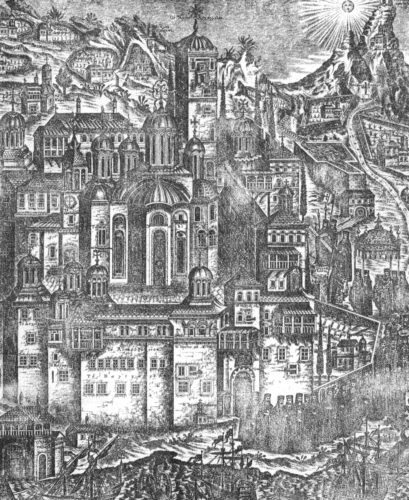

\[ [Home](index.md) \] \[ [Up](anonymou.md) \] \[ All Saints of Athos \]
\[ [All Saints](allstscan.md) \]

 

SECOND SUNDAY OF MATTHEW
------------------------

ALL SAINTS OF THE HOLY MOUNTAIN OF ATHOS
========================================

{width="374" height="450"}

INTRODUCTION
------------

The writer, for he can scarcely be called a poet, of the Canon for the
Saints of the Holy Mountain has with some ingenuity listed in
alphabetical order the principal Saints of the Holy Mountain. The canon
is evidently late, since it includes figures like St Kosmas the
Aitolian. In the ninth Ode the writer gathers together the anonymous
Martyrs who suffered under the Latin patriarchs after the disaster of
the Fourth Crusade in 1204.

The translation is made from the fifth edition of the Greek text,
published in Athens in 1976. This contains the complete text of the
office, together with the regular texts in Tone 1 for the 2nd Sunday of
Matthew, including Little Vespers, Great Vespers, Matins and Liturgy.
There is even a special set of 34 verses for the ***Eklogi***, the third
section of the Polyeleos. The office is anonymous.

At some future date I hope to provide biographical annotations to this
canon.

**THE CANON**
=============

**Canon of the Saints. Ode 1. Tone 8.**

God of all things now give grace to me your servant, as I endeavour to
praise in songs, by letter and by name, the Saints who have shone on
Mount Athos and fulfilled your will.

The sacred founder of the Great Lavra I honour in hymns as the godly
first fruit, as truly declared to be the type and example of the Fathers
of Athos in both contemplation and actions.

It is fitting to hymn the glorious **Agapios** of Vatopedi, because he
heard the voice of the Mother of God and, though a slave, like a free
man ransomed his own master with his sons from eternal punishment.

I praise the radiance of **Athanasios**, the fair palm tree of the
Monastery of Esphigmenou, the dazzling struggles of **Akakios** the New
and **Akakios** the Martyr, boast of the Skete of Iveron.

The famed **Gerontios** was revealed as the glory of the famous Skete of
the Foremother of God, with him let us bless the ascetic life of Saint
**Gabriel** of Iveron, who took the wonder-working Portaïtissa from the
sea.

How shall I not honour revered **Gennadios**, who saw the oil that
gushed up from the Mother of God in Vatopedi? How again shall I pass
over in silence God-bearing **George**, founder of Iveron?

The Monastery of Dionysiou blossomed with godly **Gennadios**, and
Karakallou with the glorious **Gedeon**, the Skete of Koutloumousiou
with **Gerasimos**, whom let us honour with praise, as both monks and
martyrs.

**Theotokion.**

When God apportioned the nations according to his Angels, knowing that
you, O Virgin, would be his immaculate Mother, he then allotted you this
great and beautiful mountain as an inalienable inheritance.

**Ode 3.**

I sing the praise of godlike **Gregory Palamas**, revealed as the great
theologian and sacred instrument of the holy Spirit, right mouthpiece
and seal of all the theologians.

It is right to praise two **Gregories**, who lived radiantly in the
confines of the Lavra; and their namesake, another **Gregory**, who
raised his own famous Monastery.

Like a skilful mother, the inspired Skete of God’s Foremother Anne
brought glorious **David**, who by the struggles of martyrdom glorified
Christ, whom let us now glorify.

The Monastery of Esphigmenou flowered with **Damian**; and Philotheou
sprouted another **Damian**, monk and martyr, and with him the godlike
**Dometios**. Let us call them blessed.

I sing **Dionysios**, the wondrous monk, founder of the Monastery of the
Baptist John, and **Dometios**, Dionysios’s friend, ablaze with the
Spirit’s gifts of grace.

Let **Dionysios** the Rhetor, the far-famed ascetic, who was
well-pleasing to the Lord by words and deeds in the Little Skete of Anne
the chaste, be hymned by me in godly songs.

Another **Dionysios**, shoot of the Iverites, and **Damaskinos**, godly
ornament of the Lavra are now called blessed, because they received the
double crowns of martyrs and of monks.

**Theotokion.**

You promised, O Virgin, always to make war for those who take up war on
this mountain against the enemy the warrior of the thunder. Therefore,
Sovereign Lady, fulfil your promise.

**Ode 4.**

In hymns I honour the leader **Efthymios** of Vatopedi, who was bound
with chains and drowned in the deep for repudiating the error of the
partisans of the Latins, and with him godly **Evdokimos**, the finding
of whose holy remains filled all with joy.

With them I hymn yet another **Efthymios**, founder of the Monastery of
Iveron, who once, as he celebrated the liturgy to God, was seen by those
with him as a pillar formed like the sun; and I sing yet another holy
**Efthymios**, the founder of Docheiariou.

With joy I honour the far-famed, new monk martyr, radiance of the Skete
of Iveron, fair flower of mystic happiness, inspired **Efthymios**, who
shone first by his ascetic life and then by the contest of martyrdom.

It is right to praise **Theodosios**, abbot of the Monastery of
Philotheou, and **Theophanes** the ascetic, ornament of the Monastery of
Docheiariou; and high-minded **Theoleptos** of Philadelphia, revered
fragrance of the Trinity.

How could I neglect, unhonoured, **Theonas**, lamp of the Monastery of
Pantocrator, and famed Hierarch of Thessalonica? How not honour in words
**Theophilos**, the godlike source of myrrh. His fragrance excels all
aromas?

Let holy **John**, the founder of the sacred Monastery of Iveron, be
hymned by me, and **John**, shoot of the Lavra; and with them again the
shoots of Iveron, high-minded **James** and another **James**, monks and
champions.

From the Monastery of Dionysiou flowered the inspired, all-honoured
Joseph, and from the far-famed Skete of Saint Anne inspired
**Hilarion**, and also from the Skete of Iveron **Ignatius**. As martyrs
let us praise them.

**Theotokion.**

Great, Sovereign Lady, is your forethought for your mountain! For you
said you would be for those who inhabit it well the expounder and
teacher of what should be done; nourisher and physician, giving healing,
which you wish, and nourishment of both soul and body.

**Ode 5.**

I bring a hymn to holy **Joasaph**, boast of the Monastery of Dionysiou,
with him I honour **Hierotheos**, ornament and glory of the Monastery of
Iveron, companion of the monks of old.

It is indeed most fitting to honour the great **Kallistos** in hymns,
that wise and inspired instrument of grace, radiance and glory of the
Monastery of Iveron and revered Chief Shepherd of shepherds.

Let the especial sapling of the Monastery of Zographou be honoured in
songs, holy **Kosmas**, who saw with his own eyes the Mother of God. And
let the other **Kosmas** be praised, Equal of the Apostles, radiance of
the Monastery of Philotheou.

A fair ornament of the godly Skete of the grandmother of God has
appeared, godlike **Kosmas**, who first lived there the ascetic life and
then in martyr contests glorified Christ’s name, whom with fitting
honour let us call blessed.

You too Koutloumousiou rejoice, because in your cells there flowered
Christ’s priest and saint, the Martyr **Cyprian**; with whom let
**Konstantios**, who dwelt in Lavra, be praised.

As a mother over her children, let the Monastery of Dionysiou be glad at
the revered ascetic, **Makarios**, new martyr of Christ, and
**Leontios**, who wondrously gushed sweet-smelling myrrh from his tomb.

And **Luke** the inspired, who cast away the pleasure of youth and led
the ascetic life in the godly Skete of the Foremother of the Word;
therefore as he both struggled and magnified the Master he is sacredly
magnified by us.

**Theotokion.**

Who does not rejoice when he hears? Who does not exult over your
promise? For you said, O Maiden, to your Son and God that you will stand
by those who have here ended their lives well, beseeching pardon of
their faults.

**Ode 6.**

Let us honour in songs the sacred offspring of the Lavra, inspired
**Maximos**, without flesh in the flesh, who received from the divine
Spirit the rich grace of prophecy.

With gladness I call blessed valiant **Makarios** and venerable
**Mitrophanes**, the fruitful trees of the famed Skete of the Foremother
of God.

I honour the godlike shoots of the Monastery of Vatopedi, glorious
**Neophytos**, for he heard the voice of the pure Child of God, and
**Nikodemos**, resplendent among the Saints.

Let the outstanding ornament of the Monastery of Dionysiou be praised,
wondrous **Niphon**, named shepherd of Constantinople, and pinnacle of
Ascetics.

Rejoice august Monastery of Docheiariou, enriched with a far-famed
founder, the wise Neophytos, who blossomed with virtues of every kind,
as a most fruitful tree.

The sacred Skete of inspired Anne truly does not cease from rejoicing in
Spirit as it honours its sons: **Niketas**, **Nikodemos** with
**Nektarios**.

**Skete of Karyes** rejoice in the divine Spirit, who also flowered with
glorious **Nektarios**, the sweetest nectar of every virtue and
companion of the Saints.

**Theotokion.**

The Saints of the Mountain, Mother of God, having your alliance as a
stout panoply, destroyed the whole army of the demons and received
crowns of victory.

**Kontakion. Tone 4. Lifted up on the Cross.**

Let us all praise the Fathers who made the Mountain heaven, showed how
to live on it the life of Angels and gathered on it multitudes of Monks,
as we cry to them, ‘Deliver us from every constraint and assault, O
multitude of Saints, boast of Athos!’

**Ikos.**

How good is our union, Fathers wise in God! How sweet and delightful,
this your common feast, on which all you Saints who have shone forth on
this Mountain, those whose names are known, those who are not, whose
fame is one, as brothers in spirit, now take your pleasure! like myrrh
poured upon Aaron’s head, and running down upon his beard, and as the
dew of Hermon. For it was necessary, it was necessary that those who
have been well-pleasing to the Lord should be feasted together on one
day. Therefore we also, solitaries and cenobites have come together and
as is fitting call you blessed; the young, the old; the sons, the
fathers; the polluted, the holy, as we cry aloud with one accord, ‘Keep
this place, which you chose for your dwelling, safe from every evil. O
multitude of Saints, boast of Athos!’

**The Synaxarion of the day, then the following:**

On the Second Sunday of Matthew we celebrate the memory of all the
Venerable Fathers, who have shone forth on the Holy Mountain of Athos.

**Verses for the Mountain and the Fathers who became Saints on it.**

> > Mount Athos far outstrips all mountains high\
> > Of European lands by being called ‘Holy’;\
> > Athos, which nurtures flowers, has ever flowered\
> > With truly spiritual flowers, the godly Fathers;\
> > The choir of Monks of Athos honours now\
> > The godlike choir of Fathers of Mount Athos.\
> > A throng of Athonites stands round the throne of God.

At their holy intercessions, Christ God, have mercy on us and save us.
Amen.

**Ode 7.**

**Niphon**, the God-bearer, is declared one of the Saints of Athos, who
lived the life of winged creatures in the confines of the Lavra, and
received from God the gift of prophecy.

Let **Neilos** of Lavra, who gushed myrrh, and **Nikodemos**, flower of
Saint Anne, who longed for Christ and was a new martyr, be rightly
praised in tuneful songs.

How could we banish from the choir of saints godly **Nikephoros**, who
lived the solitary life in the most deserted places and was found worthy
of the Spirit’s gifts of grace.

Let praises fittingly be sung to godly **Onouphrios**, who put the error
of the Hagarenes to shame, who trained first in the Skete of Iveron and
later entered the contest.

Let **Paul**, the founder of two Monasteries, of Grigoriou and
Xeropotamou, beauty of ascetics, who at the end shone like another sun,
be magnified in songs.

Let **Paul**, shoot of Saint Anne, and **Prokopios**, of the Skete of
Iveron, be praised with one accord with tuneful songs as athletes of
Christ and kindred of the Saints.

I sing a hymn to **Pachomios**, the most valiant new martyr of Christ,
inspired offshoot of Kavsokalyvia, who received a double crown from the
Lord.

**Theotokion.**

You, pure Ever-virgin, are the Sovereign Lady of the world, but
pre-eminently of this Mountain, and its defender, who save it from every
abuse and harm.

**Ode 8.**

The first of the hesychasts of the Mountain, **Peter** of Athos, is
honoured, who lived an immaterial life; he routed the bodiless Demons in
body; he passed his whole life naked and was richly granted the inspired
gifts of the Spirit at the prayers of the Mother of God.

Let us honour in songs the glorious **Romanos**, pride of ascetics and
sweetness of the new martyrs of Christ, whom the Skete of the Lavra of
Kavsokalyvia blossomed as a rose, and whom **Akakios**, young in years
and old in asceticism had as his own disciple.

Let **Savvas**, the inspired Hierarch, who received the power of wonders
from Christ, be praised by me; who enlightened the palace of the Serbs
like the sun, with **Symeon**, his father according to the flesh, but
his son according to the Spirit, who poured forth myrrh, the godly
founders of the Monastery of Chilandar.

Let us honour **Symeon**, finest abbot of Philotheou; and **Simon**, who
poured forth myrrh, who founded the lofty sited Monastery of the Rock
through the oracle of the heavenly star; he received the power of
wonders from God and authority against unclean spirits.

Adorned with the beauties of gladness, **Sophronios**, sacred among
priests, lived soberly and glorified Christ in the godly Skete of
inspired Anne, radiant by his blameless way of life and fair adornment
of behaviour; therefore let us publicly sing his praise.

The holy fold of Esphigmenou has been found worthy again of greater
honour, for it sprouted a sacred shoot, the godlike **Timothy**, who
truly honoured by sacred contests the Master of all; and so it rejoices
as it praises him and highly exalts Christ, the only Judge of the
contest.

Leap for joy and dance again all the august Monastery of Dionysiou,
which flowered the godly **Philotheos**, glory of ascetics; whom Mary
the Mother of God delivered from prison and from every abuse of demons,
and whose head appeared like a shining star.

**Theotokion**.

You appeared seated on a high tribunal and shining throne, Sovereign
Lady, all radiant, and around you stand unnumbered choirs of the unwed,
in the southern peaks of Athos, and around the Mountain, like towers of
fire, they were seen typifying those who are now being praised.

**Ode 9.**

Be glad, august Monastery of Vatopedi, which was enriched by **twelve
saints** and athletes, who courageously refuted every false doctrine of
the impious partisans of the Latins, by whom they were delivered to the
axe and received double crowns.

Rejoice godly Monastery of Iveron, because you offered Jesus a whole
multitude of **Monk Martyrs** from among your children through
suffocation by water, as they had with courageous mind rejected king
Michael and patriarch Vekkos, partisans of the Latins.

Raise the paean and rejoice too, Monastery of Zographou, who offered to
the Lord your sons, **twenty four** in number, godly Monk Martyrs, as
sacred whole burnt offerings, made perfect by fire as they bravely
triumphed over the partisans of the Latins.

And you, Skete of Karyes, why do you not dance and be happy? For you
also offered your children to Christ, brave **Monk Martyrs**, their
heads struck off by the sword, as they championed the doctrine of the
Fathers and held the partisans of the Latins to scorn.

But let all the foothills of the Mountain with the famed desert joyfully
sing the praises of those who mystically shone forth in you, known and
unknown, who served Christ in the ascetic life in different ways.

Holy and far-famed company, God-assembled gathering of Ascetics,
light-bearing and sacred multitude of Hierarchs, godly army of Martyrs,
all, both unnamed and known, bright stars of Athos, do not cease to
intercede for our sakes to the Queen of all.

Accept, august, all-holy Trinity, those whom Mount Athos offers you as
first-fruits and chosen incense, all those who on it have called you
‘Holy’, at first and later, known and unknown, and at their prayers keep
it free from all harm.

**Theotokion.**

All we who dwell on the Mountain offer you songs of thanksgiving, Mother
of God, for you ever keep us safe from every peril; you nourish, cherish
and care for us. But we beg you, ‘After our end, grant us the divine
Kingdom’.

------------------------------------------------------------------------

All texts and translations on this page are copyright to\
Archimandrite Ephrem ©

**This page was last updated on 03 November 2008**
