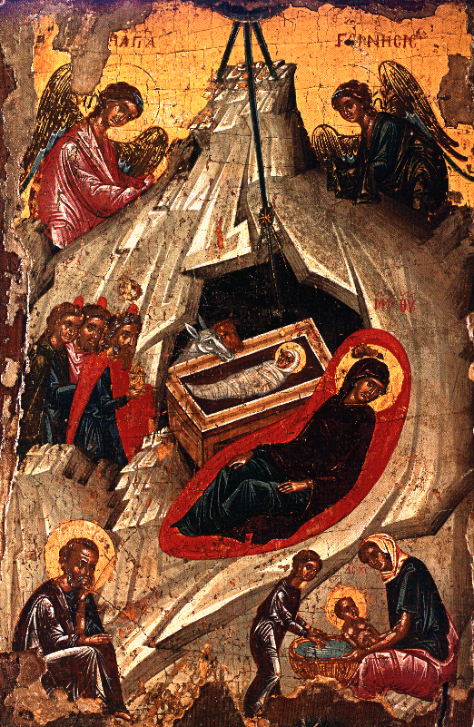

\[ [Home](index.md) \] \[ [Up](saintsof.md) \] \[ [September](septembe.md) \] \[ [October](october.md) \] \[ [November](november.md) \] \[ December \] \[ [January](january.md) \] \[ [February](feb.md) \] \[ [June](june.md) \] \[ [July](july.md) \] \[ [August](august.md) \]

MONTH OF DECEMBER
=================

**It has 31 days. The day has 9 hours and the night 15**

 1. Of the Holy Prophet Naum. 

**If it is not Alleluia,
Apolytikion. Tone 2.**

 As we celebrate the memory of your Prophet Naum, O Lord, through him we beseech you: save our souls. 

 2. Of the Holy Prophet Avvakoum. 

**The same.**

 3. Of the Holy Prophet Sophonias. 

**The same.**

These three prophets are of the number of the twelve Minor Prophets, and each of their prophecies is divided into three chapters. Naum was an Elkesite by origin, of the tribe of Symeon, seventh in order. He prophesied in the reign of Ezekias, after the overthrow of Samaria in 721 BC. Avvakoum, whose name is also spelt Avakoum and Amvakoum, is eighth in order, his country and tribe are unclear from holy Scripture. He prophesied in the times of Joachim, who is also called Jechonias, before the migration of the people to Babylon in 599 BC. The fourth Canticle of Matins is the work of Avvakoum: ‘Lord, I heard your voice and was afraid’. Sophonias, the ninth in order, was son of Chusi, of the tribe of Levi, or according to some a second cousin of king Ezekias. He prophesied in the days of Josias, who reigned from 641-610 BC.

 4. Of the holy Great Martyr Barbara; and of our venerable Father John of Damascus.

Barbara was from Nikomedia in the time of Maximianos, daughter of an idolater named  Dioskoros, who tortured her inhumanly because of her faith in Christ and finally beheaded her with his own hands in the year 290.

John was from Damascus in Syria, the son of wealthy and devout parents. He was brought up with Kosmas (October 14th), who had been adopted by his own father, Sergios, and with him had become a disciple of a monk also called Kosmas, who had been taken prisoner by some Arabs from Italy, but ransomed by his father. He became a great philosopher and the beacon of his age. He was honoured by the Caliphs (the descendants of Mohammed) with the rank of counsellor, but he soon abandoned this and took the monastic habit in the monastery of St  Savvas, where he was ordained priest. He struggled bravely through his writings against the iconoclasts, Leo the Isaurian and his son Constantine Copronymous. He was surnamed,  Chrysorroas \[‘Gold-flowing’\]because of the skill and eloquence of his words, being given the same title as the name of the river which flows by Damascus. He was the originator of systematic and the father of scholastic theology, by his accurate setting out of the orthodox faith. He lived altogether for eighty four years and died in peace in 760. Among his theological writings, his verse and prose hymns and his honey-sweet songs adorn the Church of Christ.

**Apolytikia: of the Martyr. Tone 4.**

 Let us honour holy Barbara; for she smashed the snares of the foe; and like a sparrow the all-honoured one was delivered from them by the help and weaponry of the Cross. 

**Of the Ascetic. Tone 8. Orthodoxy’s guide. \[Common\]**

 Orthodoxy’s guide, teacher of piety and reverence, beacon of the world, fair ornament of monks, inspired by God, O wise John, by your teaching you have enlightened all, O harp of the Spirit; intercede with Christ God that our souls may be saved. 

**Kontakia: of the Martyr. Tone 4. Lifted up on the Cross.**

 August Champion, following devoutly the One who is hymned in Trinity, you abandoned the rites of idols; while you struggled in the midst of the stadium, courageous Barbara, you did not tremble at the threats of tyrants, as you sang with mighty voice: A Trinity I honour, the one Godhead. 

**And of the Ascetic. The same melody.**

 Let us believers sing the praise John, the august hymn-writer, the educator and beacon of the Church, the opponent of her foes; for taking up the Cross of the Lord, he destroyed all the error of heresies; and as a fervent intercessor with God, he grants pardon of offences to all. 

 5. Of our venerable and god-bearing father Savvas the sanctified. 

He was born in 439 in Moutalaski, a little village of Cappadocia; from boyhood he entered the stadium of monastic life, under the trainer Evthymios, the great teacher of the desert. He became the leader of many monks and teacher of the monasteries of Palestine. He went as an envoy to the emperors Anastasios and Justinian the Great, on behalf of the orthodox faith and the doctrines of the Council of Chalcedon. He lived for 93 years and died in 533. The Typikon which is preserved of the Church offices had its origin in the saint’s monastery.

**No work, and permission for wine and oil.**

**Apolytikion. Tone 8. \[Common\].**

 With the streams of your tears you cultivated the barren desert, and with your deep groans your made your toils bring forth fruit a hundredfold, and you have become a beacon, shining in all the world by your wonders: Venerable Father  Savvas, intercede with Christ God that our souls may be saved. 

**Kontakion. Tone 8. To you, my Champion.**

 From infancy, blest Savvas, through virtue you were offered as an unblemished sacrifice to God, who knew you before you were born; and you were declared to be the ornament of Ascetics, praiseworthy founder of the desert; and so I cry to you: Hail, honoured Father! 

6. Of our father among the saints Nicolas, bishop of Myra in Lycia, the wonderworker.

He flourished under Constantine the Great. He was one of the 318 holy fathers of the 1st Ecumenical Council of Nicea in 325, and died in about 330.

**No work, and permission for wine and oil.**

**Apolytikion. Tone 4. Model Melody.**

 The truth of your actions proclaimed you to your flock as a rule of faith, an image of meekness and a teacher of self-control; and so you gained through humility the things on high, through poverty riches, O Father and high priest Nicolas; intercede with Christ God that our souls may be saved. 

**Kontakion. Tone 3. Today the Virgin.**

 In Myra, Holy one, you were proved a true priest, for you fulfilled, venerable Father, the gospel of Christ, you laid down your life for you people, you saved the innocent from death; therefore you have been hallowed as a great initiate of God’s grace. 

 7. Of our father among the saints Ambrose, bishop of Milan. 

He was born in Gaul in 340 and became a member of the Senate in Rome; then in 374, on the 7th of December, he ascended the episcopal throne; he wrote many treatises in Latin, lived for 57 years and died on the Eve of Pascha, on the 4th of April in 397.

**Apolytikion. Tone 4. \[Common\]**

 The truth of your actions proclaimed you to your flock as a rule of faith, an image of meekness and a teacher of self-control; and so you gained through humility the things on high, through poverty riches, O Father and high priest Ambrose; intercede with Christ God that our souls may be saved. 

 8. Of our venerable father Patapios. 

He was from Thebes in Egypt; he led the ascetic life for many years in the desert. He went to Constantinople, where he performed many wonders and cures of the sick. He died in peace.

**Apolytikion. Tone 8. In you, Mother, was preserved. \[Common\]**

 In you, Father, was preserved unimpaired that which is according to the image, for you took up the cross, and you followed Christ; and by your deeds you have taught us to despise the flesh, for it passes away; but to care for the soul, which is a thing immortal; and therefore your spirit, holy Patapios, rejoices with the Angels. 

**Kontakion. Tone 3. Today the Virgin.**

 Finding your temple to be a spiritual surgery, O Saint, they come to it with haste and ask to receive healing of diseases, and release from the offences of life; for you have appeared as patron of all who are in need, venerable  Patapios. 

9. The conception by the holy foremother of God, Anne.

According to the ancient tradition of the Church, Anne, the foremother of God, was childless and barren, and advanced in age, as was her husband Joachim; and so grief-stricken because of their childlessness, they besought God with a promise that if he were to grant them fruit of the womb, they would offer the child as a gift to him. God heard their entreaty and revealed to them by an Angel the birth of the Virgin from them. And so Anne conceived by divine promise, according to the laws of nature, and was found worthy to become the mother of the mother of our Lord (see also the 8th of September).

**Note that from to-day, the day of the winter solstice \[by the old calendar\] the sun begins to turn towards the north, and to make the days longer for us.**

**No work, and permission for wine and oil.**

**Apolytikion. Tone 4.**

 To-day the bonds of childlessness are loosed; for God, hearkening to Joachim and Anne, clearly promises beyond their hope that they will give birth to the child of God, from whom was born the Uncircumscribed, become a mortal, through an Angel he ordered to cry to her: Hail, full of grace; the Lord is with you. 

**Kontakion. Tone 4. You have appeared today.**

 The inhabited world celebrates today the conceiving of Anne, which took place through God; for she bore in her womb her who beyond reason bore the Word. 

 10. Of the holy martyrs Menas the fair-sounding, Hermogenes and Evgraphos. 

Menas was an Athenian by birth, according to the Synaxaristes, a man of rank, education and eloquence, and so he was surnamed ‘fair-sounding’. Evgraphos was his secretary. Both were of Christian parentage. Hermogenes, who held the rank of Prefect, was born a pagan, but came to the faith of Christ through the wonders of St Menas. All three suffered in Alexandria under Maximin in 235.

**Apolytikion. Tone 8. Taking knowledge.**

Having slain the burning assaults and movements of the passions through self-mastery, Christ’s martyrs received grace to drive away the diseases of the sick, and both while living and after death to work wonders. O truly amazing wonder! that bare bones pour out healings. Glory to our God alone. 

**Kontakion. Tone 1. The soldiers guarding.**

 Let us all honour Menas the wonderful, godlike Hermogenes and with them  Evgraphos, with sacred melodies, as ones who honoured the Lord, struggled for his sake, attained the bodiless choir in heaven and pour out wonders. 

**Another. Tone 4. You have appeared today.**

 Menas, the Lord who grants you an incorruptible crown, snatched you from the transient army and revealed you, with your fellow-athletes, coheir of the incorruptible. 

 11. Of our venerable father Daniel the Stylite. 

He was from Marmoutha in Mesopotamia in the reigns of Leo the Great, Zeno and  Vasiliskos; he live on a column in the suburbs of Constantinople; he helped the Church, which was being assailed by the Eftychians. He died in 490 at the age of 80.

**Apolytikion. Tone 1.**

You became a pillar of endurance, venerable Father, rivalling the forefathers: Job in sufferings, Joseph in trials, and leading the life of the Bodiless Ones while in the body. Our venerable father Daniel, intercede with Christ God that our souls may be saved. 

**Kontakion. Tone 2. Seeking things on high.**

 Longing for things above, passing from things below, you built your Pillar as another heaven, through which you blazed forth the beam of your wonders, venerable Father. For ever intercede with Christ God that our souls may be saved. 

**Note**

On the eleventh of the present month, if it falls on a Sunday, or on the first one which follows it, because of the nearness of the Nativity of our Lord Jesus Christ, we remember his forebears according to the flesh both before the Law and under the Law; especially the patriarch Abraham, to whom the promise was first given when God said to him: ‘In your seed all the nations of the earth shall be blessed’ (Gen. 14:3 and 22:18).

This promise was given 2039 years before Christ when Abraham was 75 years old. God called him and ordered him to leave his country, parents and relatives and depart to the land of the Canaanites. When he reached there God said to him: ‘To your seed I shall give this land’ (ibid.7). And so this land was called the Land of Promise, which became the fatherland of the Hebrews. There Abraham, after the passage of 24 years, was given the law of circumcision by God. In his one hundredth year, and the ninetieth of his wife Sara, he begot Isaac. He lived altogether for 175 years and died in peace, old and full of days.

 Sunday of the holy Ancestors 

**Apolytikion of the Resurrection; and of the Ancestors. Tone 2.**

 You justified the Forefathers by faith, through them betrothing in advance the Church from the nations. The Saints will exult in glory, for from their seed there is a glorious fruit, she who bore you without seed. At their intercessions, O Christ God, save our souls. 

**After the 3rd Ode, the Ypakoï. Tone 2.**

The fire was changed to dew for the Children; the lament was altered to joy for the Women; for an Angel was minister in both marvels: changing the furnace to repose for the former, to the latter making known the Resurrection on the third day. Author of our life, Lord glory to you! 

**Kontakion. Tone 2. Model melody.**

 Because you did not honour an image formed by human hand, but were armed with the breastplate of uncreated being, you were glorified, thrice-blest Youths in the arena of the fire; but standing in the midst of the immaterial flame you called on God: Come swiftly in your pity, hasten in your mercy to come to our aid, for you can accomplish whatever you will. 

12. Of our father among the Saints Spyridon, Bishop of Tremithus in Cyprus, the wonderworker.

This Godbearing Father of the Church, the great defender of Kekyra and the boast of all the Orthodox, was a Cypriot by birth, simple in manner, humble of heart, and was at first a shepherd. He was married and had a daughter named Irene. After his wife’s death he was ordained bishop of Tremithus and became shepherd of rational sheep. When the 1st Ecumenical Council of Nicea was summoned he was present and by his very simple words he silenced the Arians who were supremely confident in their wisdom. Through the divine grace which dwelt in him he performed many wonders, so that he received the title ‘Wonderworker’. He shepherded his flock devoutly and in a manner pleasing to God and died in Cyprus in the year 350. He left his sacred relics in his home country, a comfort to believers and a source of cures.

Around the middle of the 7th century, on account of the attacks of the barbarians his remains were translated to Constantinople, where they remained, honoured by the Emperors. Before the fall of the City, which took place on May 20th, 1453, a priest named George, surnamed Kalochairetis, curate of the church which held his sacred relics, took them together with those of the Augusta Theodora, because of the impending danger, and journeyed through Serbia and went as far as Arta. From there, since the disasters to our race were increasing daily, he took them across to Kekyra in around 1460. The relics of Saint Theodora were given to the people of Kekyra, but those of Saint Spyridon remain to this day a precious treasure for his descendents, a support of believers in orthodoxy and a supernatural marvel for those who see them; because after the passage of 1500 years they remain incorrupt, and the skin preserves its elasticity. Truly ‘God is wonderful in his saints’! \[Ps. 87:35\].

**No work, and permission for wine and oil.**

**Apolytikion. Tone 1. When the stone had been sealed.**

You were revealed as a champion of the first Council and a wonderworker, O our God-bearing Father Spyridon; and so you called to a dead woman in the tomb and changed a snake to gold; and as you sang your holy prayers you had Angels as your fellow ministers, O most holy. Glory to him who glorified you; glory to him who crowned you; glory to him who through you works healings for all. 

**Kontakion. Tone 2.**

Wounded with love of Christ, most holy Father, given wings of the mind by the beam of the Spirit, by active contemplation you found action, O God-inspired, and became a divine altar as you ask enlightenment for all. 

 13. Of the holy Martyrs Efstratios, Afxentios, Evgenios, Mardarios and Orestes; and of the holy Virgin Martyr Lucy. 

The five Martyrs were Cappadocian by race, of the time of Diocletian, and from their forebears secret worshippers of Christ. But confessing boldly they were tortured in many different ways by Lysias the governor, and three of them died under torture. Efstratios and Orestes however survived and were sent to Sevasteia to Agricola, the governor of all the East, by whose order they were put to death by fire in 296. Efstratios was a distinguished man and trained in rhetoric, first among the dignitaries of Mysios and Chartophylax of the his district. In the Synaxarion he has the Latin title ‘Scriniarius’. To him is attributed the prayer which is said at the Midnight Office on Saturdays, ‘Magnifying, I shall magnify you, O Lord’’ The one said at the 3rd Hour and elsewhere, ‘God and Master, Father almighty’ is ascribed to Mardarios.

Lucy, which means in Greek Photini \[‘Light’\], was from Syracuse in Sicily. She was betrothed to a man, but then refused marriage to him because he was unwilling to believe in Christ. She was denounced to the governor by her own suitor and beheaded in 304.

**Apolytikion. Tone 4. \[Common\]**

 Your Martyrs, O Lord, by their struggles obtained  crowns of incorruption from you, our God; for with your might they destroyed tyrants, and shattered the feeble insolence of the demons: at their prayers, O Christ God, save our souls. 

**Kontakion. Tone 2. Nor tomb nor death.**

 Herald of Christ, you were revealed as a bright shining beacon for those who sit in the darkness of ignorance. Armed with the faith as a spear, you did not tremble at the insolence of enemies, Efstratios, more eloquent than orators. 

14. Of the holy Martyrs Thyrsos, Lefkios, Kallinikos, Philemon, Apollonios,  Arrianos and their companions. 

The first three suffered under Decius in 250, the rest under Diocletian in 290.

**If it is not Alleluia,
Apolytikion. Tone 4. \[Common\]**

 Your Martyrs, O Lord, by their struggles obtained  crowns of incorruption from you, our God; for with your might they destroyed tyrants, and shattered the feeble insolence of the demons: at their prayers, O Christ God, save our souls. 

 15. Of the holy Bishop and Martyr Eleftherios. 

He was a Roman by birth. Orphaned in childhood of his father, he was offered by his mother to Anicetus, bishop of Rome, or, as others call him, Anengletos or Anacletus. By him he was taught sacred letters \[the divine Scriptures\], and while still very young was appointed bishop of Illyricum, because of his remarkable virtue, and he turned many unbelievers to Christ through his teaching.

But when a most savage persecution was launched against the Christians under Hadrian Aelius, he was arrested by the tyrants, endured many torments for Christ and was finally slain by two soldiers. When his Christ-loving mother Anthia took remains of her son in her arms and kissed them like a mother, she too was beheaded, around the year 126.

**Permission for wine and oil.**

**Apolytikion. Tone 4. \[Common\]**

You shared their way of life and you succeeded to the Apostles’ thrones; you found the action, O God-inspired, to climb the heights of contemplation; rightly directing the word of truth; and in faith you struggled to shedding of blood, Bishop and Martyr Eleftherios; intercede with Christ God that our souls may be saved. 

**Kontakion. Tone 2.**

 As beauty of priests and sweet wine of champions, venerable Bishop and Martyr Eleftherios, we all praise you and ask: Free from dangers of many kinds those who celebrate your memory with love, as you intercede unceasingly on behalf of us all. 

16. Of the holy Prophet Aggaios. 

He was born in Babylon, at the time of the captivity of the Jews. He began to prophesy in Jerusalem after their return, in the days of Zorobabel, in the second year of Darius Hystaspes, king of the Persians, in about 520 BC. His prophecy, divided into two chapters, is ranked twelfth among the Minor Prophets.

**If it is not Alleluia, then
Apolytikion. Tone 2. \[Common\]**

 As we celebrate the memory of your Prophet Aggaios, O Lord, through him we beseech you: save our souls. 

17. Of the holy Prophet Daniel, and of the Three holy Youths, Ananias, Azarias and Misael; and of our Father among the Saints Dionysios Archbishop of Aegina, who was from the island of Zakynthos. 

Of these, the Bishop was born and brought up on Zakynthos of devout and wealthy parents, Mokios and Pavlini by name. From his youth he entered the royal monastery of the Strophades islands, and was clothed in the monastic habit. Later he was chosen as Archbishop of Aegina, whose throne he adorned for a considerable time. Afterwards he returned to his own country and the rest of his life in holiness, and died in peace in 1624, leaving his remains to his fellow citizens, a proof of virtue and piety.

The Prophet with the Three Youths were all from the royal tribe of Juda. In the year 599 BC in the reign of Joachim, or Joakim, who is also called Jechonias (1 Chron. 3:16 and 2  Chron. 36:8), while they were still boys, they were carried away with the other Jews to Babylon as prisoners by Nabuchodonosor, by whom they were selected from among the other captives for his service, and renamed, Daniel as Baltasar, Ananias Sedrach, Misael Misach, Azarias Abdenago. They were brought up in the royal court and taught all the wisdom of the Chaldeans, in which, after three years, they surpassed all the wise men of the Chaldeans  (Dan. 1).

After this Daniel, while still a boy, expounded the mysterious image which Nabuchodonosor had seen in his sleep, consisting of different metals which were crushed and reduced to powder by a stone which was cut, without human hands, from a mountain. He showed clearly through the Mountain the summit of the holiness of the Virgin, and the overshadowing power of the Holy Spirit; through the Stone, the one born of her without seed, Christ, who at his second Coming, when he has smashed as God all the kingdoms of the earth, which are signified by the Image, he will raise up for his faithful his eternal, heavenly kingdom, which has no successor (ibid. 2:31-45).

Subsequently he foresaw precisely and accurately through the number of the well-known seventy Weeks, the time of his manifestation in the Jordan, the beginning of his preaching of the Gospel, the time of his saving Passion and the cessation of the cult according to the Law (ibid. 9:14-27). He depicted excellently the majestic and awesome image of his second Coming, describing in words as with living colours the throne of flame in place, the eternal Judge seated upon it, the fiery river flowing before it, the reckoning of the relentless assize, the opened books of each one’s deeds, the thousands upon thousands of his ministers, the ten thousands upon ten thousands of those who stand before him (ibid. 7:9-10). He was named by the Angels who appeared to him ‘Man of desires’; because manfully despising every desire of the body, even bread itself, that most necessary food, and desiring to know the freedom of his fellow countrymen and their coming restoration, he did not cease to supplicate God, fasting and kneeling in prayer three times a day; for which cause he was cast into the den of lions, after being denounced by his enemies as a transgressor of the royal decree that had been issued on their advice, that none was to worship, none was to ask anything of God, or of any other man, except the king alone, for thirty days. But he shut up the mouths of the lions by divine power, and appeared in their midst like a shepherd among his sheep, and so proved to the godless the power of true religion (ibid. 6:1-13).

The Three Youths, when they had refused the worship and cult of the image of Nabuchodonosor (Daniel it would appear was not then present), were cast into the furnace of fire; from which they remained quite unharmed, by the descent of an Angel of God, and walking in its midst, as in a dew, the sang the universal praise of God, which is contained in the 7th and 8th Odes of the Canons. When they emerged from it, they did not even bear the smell of fire on their clothing, and prefigured thus in themselves the incorrupt child-bearing of the Virgin, who received the fire of the Godhead, but her womb was not consumed and she remained as she had been before bearing child, a Virgin (ibid. 3).

For these reasons the Church celebrates them and Daniel to-day and on the coming Sunday of the Ancestors, and on the Sunday before the Birth of Christ, as they typify and announce beforehand his incarnation; moreover they were offspring of the tribe of Juda, from which tribe Christ came according to the flesh. The Three Youths died full of days, while the Prophet Daniel lived until Cyrus king of the Persians, from whom he requested and obtained the return of his fellow countrymen to Jerusalem and the re-erection of the Temple. He died in peace, having lived for about 88 years. His prophecy is divided into 12 chapters and is ranked fourth and last among the Major Prophets.

**Permission for wine and oil.**

**Apolytikion. Tone 2.**

Great are the achievements of faith! In the fountain of flame, as by the water of rest, the three holy Youths rejoiced; and the Prophet Daniel was revealed shepherding lions like sheep. At their intercessions, Christ God, save our souls. 

**Another, of the Saint.
Tone 1. When the tone had been sealed.**

 Let us believers all honour in harmony Dionysios, the offspring of Zakynthos, Leader of Aegina, guardian of the Monastery of the Strophades, as we cry sincerely to him: Save those who with entreaties celebrate your memory and cry to you: Glory to Christ who glorified you; glory to him who made you wondrous; glory to him who granted you to us, an unsleeping advocate. 

**Kontakion of the Prophet, after the 3rd Ode. Tone 3.
Today the Virgin.**

Your pure heart, purified by the Spirit, has become a vessel of radiant prophecy; for you see things far off as close at hand, while when cast into the den you muzzle lions; and so we honour you, blest Prophet, glorious Daniel. 

**Another, of the Saints, after the 6th. Tone 2. Model melody.**

Not honouring an image traced by human hand, but armed with the breastplate of uncircum­scribed being you were glorified, thrice-blest, in the arena of fire; standing in the midst of insubstantial flame you called on God: Hasten, O full of pity, and come quickly to our help, as you are merciful, for what you will you can perform. 

**Another, of the Saint. Tone 3. Today the Virgin.**

 With songs of thanksgiving the city of Zakynthos summoning all believers urges them to hymn the mighty, fervent defender in constraints, deliverer of those held fast by dangers, and honouring him she cries: Hail Dionysios, the glory of believers. 

 18. Of the holy Martyr Sebastian and his companions. 

He was from the city of Milan, a Senator by rank and a zealot for the faith of Christ who turned many to the knowledge of God. When the persecution of the Christians was unleashed in the reign of Diocletian and Maximian, he was arrested and pierced with a mass of arrows and his body was battered with cudgels and cut in pieces. He rendered his soul up to God in 288. With him died others, after enduring divers torments. There names are: Marcellinus and Mark, brothers; Tranquilinus and Marcia, their parents; Nikostratos and his wife Zoe; Tiburtius, Claudius, Castolus and Castor.

**If it is not Alleluia then,
Apolytikion. Tone 4. \[Common\]**

 Your Martyrs, O Lord, by their struggles obtained  crowns of incorruption from you, our God; for with your might they destroyed tyrants, and shattered the feeble insolence of the demons: at their prayers, O Christ God, save our souls. 

**NOTICE**

**On the 18th of the present month, if it falls on a Sunday, or on the one immediately following, which is known as the Sunday before the Nativity, we celebrate the memory of all those who have been well pleasing to God from all time, from Adam to Joseph the Betrothed of the most holy Mother of God, as the Evangelist Luke lists them historically (3:23-38), and likewise of the Prophets and Prophetesses, in particular the Prophet Daniel and the Three Youths (see the reason under December 17th).**

 Sunday before the Nativity of Christ 

**Resurrection Apolytikion; then the following of the Fathers.
Tone 2.**

 Great are the achievements of faith! In the fountain of flame, as by the water of rest, the holy Martyr Theodore rejoiced; for wholly consumed by fire he was offered to the Trinity like sweet bread. At his intercessions, Christ God, save our souls. 

**After the 3rd Ode, Ypakoï. Tone 8.**

An Angel turned the furnace of the Youths to dew, while now he halts the women’s lamentation, saying: Why do you bring sweet spices here? Whom do you seek in a tomb? Christ God has risen, for He is the life and salvation of the human race. 

**After the 6th, Kontakion of the Forefeast. Tone 1.**

Bethlehem be glad, Ephratha prepare; for see the Ewe-lamb, bearing in her womb the great Shepherd, hastens to give birth; seeing him the godbearing Fathers exult as with the Shepherds they hymn a Virgin who gives suck. 

 19. Of the holy Martyr Boniface. 

He lived in the time of Diocletian, around 200, the slave of a Roman lady of senatorial rank, named Aglaïs. He was sent by her to the East to bring thence relics of the holy Martyrs as sanctification. He promised jokingly to bring her his own. He left with some of his fellow slaves for Cilicia, where the Saints were then suffering, and was arrested by the Governor. On his confessing Christ with boldness, he endured the death of martyrdom and so truly kept his promise to his lady, when his fellow slaves brought her his holy remains.

**Apolytikion. Tone 4. \[Common\]**

 Your Martyr, O Lord, by his struggle obtained the crown of incorruption from you, our God; for with your might he destroyed tyrants, and shattered the feeble insolence of the demons: at his prayers, O Christ God, save our souls. 

20. Forefeast of the Nativity according to the flesh of our Lord Jesus Christ; and commemoration of the holy Bishop and Martyr Ignatios the Godbearer. 

He was a disciple of John the Divine and a successor of the Apostles, becoming the second bishop of Antioch after Evodos in 68. He was taken to Rome under Trajan and given as fodder to the lions and fulfilled his course of martyrdom in 167 or 109. The remains of his bones were carefully collected by believers and translated to Antioch. He was named  Godbearer because he bore God dwelling in his soul, and his heart was aflame with love of him; for he also said, ‘I am God’s wheat, and I am ground by the teeth of wild beasts, that I may become pure bread’ (Eusebius, Eccl. Hist. 3,36).

**Permission for wine and oil.**

**Apolytikion of the Forefeast. Tone 4.**

 Bethlehem prepare; Eden is opened for all. Make ready Ephratha, because the tree of life has flowered in the Cave from the Virgin. For her womb has been revealed as the spiritual Paradise in which is the plant of life; eating from it we shall live; we shall not die as Adam. Christ is born to raise up his image which had fallen. 

**Of the Saint. Tone 8.**

 You shared their way of life and you succeeded to the Apostles’ thrones; you found the practice, O God-inspired, to climb the heights of contemplation; rightly proclaiming the word of truth; and in faith you struggled to shedding of blood, Bishop and Martyr Ignatios; intercede with Christ God that our souls may be saved. 

**After the 3rd Ode. Kontakion of the Forefeast. Tone 3.
Model Melody.**

 Today the Virgin is coming to the cave, to give birth ineffably to the eternal Word. Hearing this, dance, O inhabited world! Glorify, with Angels and with Shepherds, him who willed to be made manifest, a little Child, God before the ages. 

**After the 6th Ode, Kontakion of the Saint. Same melody.**

 The light-bearing day of your radiant struggles proclaims publicly to all him was brought to birth in a Cave; for athirst with longing to delight in him, you hurried to be ground by wild beasts; because of this you were called God-bearer, glorious Ignatios. 

 21. Of the holy Martyr Juliani. 

She was from Nikomedia in the time of Maximian, the daughter of wealthy parents. She was betrothed to an idolater, by name Elefsios, of Senatorial rank, and later a Prefect. She refused to life him the married life as he was unwilling to come to the faith of Christ. He, enraged, arrested her, and having subjected her to many forms of torture, finally had her beheaded in 299.

**Apolytikion. Tone 4. \[Common\]**

 O Jesu, your lamb cries aloud: O my Bridegroom, I long for you; and seeking you I struggle, and I am crucified and buried with you in your baptism; and I suffer for your sake, that I may reign with you; and I die for you, that I may live in you; but as a spotless victim now accept one who with longing is slain for you. Through her prayers, as you are merciful, save our souls! 

 22. Of the holy Great Martyr Anastasia the Healer of Wounds \[Pharmakolytria\]. 

She was from Rome, a virgin of great beauty, wealthy and distinguished, the daughter of Prepexastus and Fausta. By the latter she was taught the Christian faith. She was married to a man of dissolute life and godless opinions, named Publius Patricius, but was soon left a widow. After this she would go secretly round the houses of the poor and the prisons of Christ’s Martyrs, bringing them what they needed, tending their wounds, and loosing their bonds and healing their pains. As a result she was surnamed Pharmakolytria. When her activities became known she was arrested by Diocletian’s officers, and after many other torments she died by fire in 290.

**Apolytikion. Tone 4. \[Common\]**

 O Jesu, your lamb cries aloud: O my Bridegroom, I long for you; and seeking you I struggle, and I am crucified and buried with you in your baptism; and I suffer for your sake, that I may reign with you; and I die for you, that I may live in you; but as a spotless victim now accept one who with longing is slain for you. Through her prayers, as you are merciful, save our souls! 

**Kontakion. Tone 2. Seeking things on high.**

 Those in trials and tribulations hasten to your temple and receive the revered gifts of the divine grace which dwells in you, Anastasia; for you ever pour out healings for the world. 

 23. Of the ten holy Martyrs of Crete. 

They came from different towns and villages of the island of Crete and suffered under Decius in 250. Their names are Theodoulus, Satorninos, Evropos, Gelasios, Evnikianos, Zotikos, Agathopous, Vasilides, Evarestos and Pompios.

**Apolytikion. Tone 3. Awed by the beauty.**

Let us honour Crete of many wonders, which blossomed with the precious flowers, the pearls of Christ, the boughs of Martyrs; for though only ten in number, the blest saints put to shame the myriad power of the demons; and so they received the crowns, as stalwart Martyrs of Christ. 

**Kontakion. Tone 4. You have appeared today.**

 The morning star has shone, the Martyrs’ honoured struggle, shedding light for beforehand on the one hidden in the Cave, whom the Virgin bore without seed. 

 24. Of the holy Virgin Martyr Evgenia. 

She was from Rome, the daughter of most distinguished and noble parents, Philip and Evgenia. Without their knowledge, she took two of her servants, Protas and Hyacinth, and left the house by night. Wearing a man’s clothing and changing her name to Evgenios, she went away with them and lived as a monk in a man’s monastery. All three died as martyrs in the time of Commodus, who reigned from 180-192.

**Eve of the Nativity of Christ.
Apolytikion of the Forefeast. Tone 4.**

Mary once, with aged Joseph, went to be enrolled in Bethlehem, for he was of David’s line; and she bore in her womb fruit unsown; the time for the birth was at hand, and there was no room in the inn; but the Cave proved a fair place for the Queen. Christ is born, to raise up his image that before had fallen. 

**25. The Nativity according to the flesh of our Lord and God and Saviour Jesus Christ.**

The incomprehensible and inexplicable Nativity of Christ took place according to the chronology of the Eastern Church in the year 5508 from the creation of the world, when Herod the Great was reigning in Judea. He was from Ascalon on his mother’s side and from Idumea on his father’s, and altogether a stranger to the race of Jacob, receiving his kingdom from the Emperors of Rome. He ruled over the Jewish people for 33 years. The former royal tribe of Juda had been deprived of its rights and stripped of all rule and authority. It was in these circumstances for the Jews that the expected Messiah was born, and the prophecy spoken 1807 years earlier by the Patriarch Jacob was unerringly fulfilled: There will not lack a ruler from Juda, nor a leader from his loins until he for whom it is intended comes, and he is the expectation of nations (Gen. 49:10).

Our Saviour was born in Bethlehem, a city of Judea, to which Joseph had gone up from Nazareth in Galilee, taking with him Mary, his espoused, who was with child, that they too might be enrolled, according to the decree that had been issued in those days from the then ruling emperor Augustus Caesar, among his subjects. When the time for the birth came, and because, and because, owing to the great numbers of people who had arrived, there was not sufficient room in the public inn, the Virgin’s condition made it necessary for her to enter a cave near Bethlehem and into a stable used for animals, where she gave birth and wrapped the babe in swaddling clothes when it was born, and laid him in a manger (Lk. 2:1.7). From this there arose the tradition that when he was born Christ was laid between two animals, an ox and an ass. As the words of the Prophets appear also to justify: In the midst of two animals you will be known (Hab. 3:2) and The ox knows its owner and the ass its lord’s manger (Is. 1:3); even though these animals are understood tropologically by the interpreters for those who believed from among the Jews and the nations, or according to another more natural understanding.

But while the earth received the Saviour so poorly at his birth, from above heaven celebrated with magnificence his coming to save the world. Some shepherds in the region of Bethlehem, who were keeping a night watch over their sheep, were suddenly surrounded by an extraordinary light and saw before them an Angel bringing them the good tidings of the joyful birth of the Lord. And immediately, after the one Angel, they saw and heard the whole host of the heavenly Powers praising God and saying: Glory to God in the highest, and on earth peace, good-will among men (Lk. 2:8-14).

**Pascha. No work for three days, and Permission for everything from to-day until the Eve of Theophany.**

**Apolytikion. Tone 4.**

 Your Nativity, O Christ our God, has made the light of knowledge dawn upon the world, for thereby those who adored the stars were taught by a star to worship you, the Sun of justice, and to know you the Dayspring from on high. Lord, glory to you! 

**After the 3rd Ode, the Ypakoï. Tone 8.**

Heaven brings you, the Infant lying in a manger, the first fruits of the nations, by summoning the Magi through a star; sceptres and thrones did not amaze them, but utter poverty; for what is more wretched than a cave? What more lowly than swaddling clothes? By these the wealth of your Godhead shone out. Lord, glory to you! 

**Kontakion 3rd Tone. Model Melody. \[By St Romanos\]**

Today the Virgin gives birth to him who is above all being, and the earth offers the cave to him whom no one can approach; Angels with Shepherds give glory, while Magi journey with a star, for to us there has been born a little Child, God before the ages.

26 The Assembly of the most holy Mother of God; and of the holy Bishop and Martyr Efthymios, bishop of Sardis.

This Assembly, which our gathering to sing the glory of the Mother of God, takes place fittingly particularly for her as the one who gave birth beyond nature to the Son and Word of God, and became the instrument of the salvation of humanity.

The godly Efthymios flourished at the time of the 7th Ecumenical Council in 787, at which he was also present, which was the second assembled in Nicea. Having been driven from his throne because of his veneration of the holy ikons and endured chains and scourges, he died a martyr’s death in a in a remote corner of Bithynia, called Akriti, to which he had been banished by Michael Travlos, who reigned from 820-829.

**Apolytikion of the Feast.**

**Kontakion. Tone 6.**

He that was begotten from the Father without mother before the morning star, today became incarnate from you upon earth without father. Therefore a Star brings the good tidings to Magi, while Angels with Shepherds sing the praise of your birth giving with seed, O Full of grace. 

**NOTICE**

**From the 26th of the present month until the end of it, on whatever date Sunday falls, we celebrate the memory of Saint Joseph, the Virgin’s Betrothed, David, the Prophet and king, and James the Brother of God. If no Sunday falls between these dates, we celebrate it on the 26th.** 

Joseph was the son of Jacob, son in law and subsequently son of Eli (who is also called Eliakim and Joachim), and he is the father of the Virgin Mary (Matt. 1:16. Luke 3:23). He was of the tribe of Juda and the family of David, and was an inhabitant of Nazareth, by trade a carpenter, in age an old man when he was betrothed to the Virgin in accordance with God’s good pleasure, so that he might serve her at the great Mystery of the incarnate dispensation of God. He died, according to the tradition of the Fathers, after the twelfth year from the birth of the Lord.

David the child and ancestor of God, the great Prophet after Moses, and the first after him to write down his prophecy, being a descendent of Juda was a son of Jesse, born in Bethlehem (which as a result was named the ‘City of David’) in the year 1085 BC. While he was still a lad he was mystically anointed by the Prophet Samuel at God’s command as king of the Israelites, though Saul was still living, but had already been deprived of divine grace. When he was thirty, after Saul had been slain in war, he was chosen for the royal dignity, at first by his own tribe only but afterwards by the whole Israelite people, and he reigned for forty years. He lived in all seventy years and died in 1015 BC, having previously declared his son Solomon to be his successor.

Sunday after the Nativity

**Apolytikion of the Resurrection; and of the Saints. Tone 2.**

Joseph, proclaim the good tidings of the wonders to David the Forefather of God; you have seen a Virgin bearing child; with Magi you have worshipped; with Shepherds glorified, been warned through an Angel. Implore Christ God that our souls may be saved.

**Kontakion. Tone 3. Today the Virgin.**

Today godly David is filled with gladness and Joseph with James offers praise, for having received a crown by their kinship with Christ, they rejoice and sing the praise of him who has been born ineffably on earth, and they cry: O Compassionate, save those who honour you!

27. Of the holy Protomartyr and Archdeacon Stephen, and of our venerable father and confessor Theodore the Branded.

Stephen was a Jew by birth, a disciple of Gamaliel, the teacher of the law, as some say, first of the seven deacons, whom the Apostles appointed in Jerusalem for the care of the poor and for the distribution to them of alms. He was a man full of faith and the Holy Spirit, working great signs and wonders among the people. He disputed with the Jews concerning Jesus and refuted all their objections so manifestly that no one was able to stand up against the wisdom and spirit with he spoke, and he was accused as a blasphemer and dragged before the Sanhedrin of the elders, before whom, having with boldness demonstrated from the divine Scriptures the coming of the Just One (Jesus), of whom they had become the betrayers and murderers, he rebuked their unbelief and hardness of heart. Finally, fixing his eves on heaven and having gazed upon the glory of God, he said: I see the heavens opened and the Son of Man standing on the right hand of God. On hearing this they stopped their ears, and having thrown him violently out of the city they stoned him, as he cried out and said: Lord Jesus, receive my spirit. Then imitating his Master’s lack of malice, he knelt on the ground and prayed in a loud voice for those who were stoning him, saying, ‘Lord, do not hold this sin against them’ And having said this he fell asleep in the Lord in the year 36 (Acts 6:7), becoming the first of the Martyrs of Christ’s Church. Concerning St Theodore. see the 11 October.

**Apolytikion. Tone 4. Speedily anticipate.**

Your head was crowned with a royal diadem for the contests you endured for the sake of Christ God, O first Champion of Martyrs; for having refuted the folly of the Jews, you saw your Saviour at the right hand of the Father. Ever entreat him therefore on behalf of our souls.

**Kontakion. Tone 3. Today the Virgin.**

Yesterday the Master came to dwell in the flesh for us, and today the slave leaves the dwelling of the flesh; for yesterday the One who reigns was born in the flesh, but today the servant is being stoned. For his sake too the Protomartyr, godly Stephen, attains perfection.

28. Of the holy 20,000 Martyrs who were burned to death in Nikomedia.

They were all burned alive in the year 303, in the time of Diocletian and Maximianos, 20,000 of them being gathered in a church on the day of Christ’s Nativity, according to the writer of the Syanaxarion. Eusebios however (Ecclesiastical History II,8,6) says that of the Christians then in Nikomedia in their entirety they were progressively wiped out, some being slaughtered with the sword, others being burned alive, and that by some inexplicable godlike zeal both men and women leapt and threw themselves into the fire.

**Apolytikion. Tone 2.**

Champions of the Lord, blessed is the earth that was soaked with your blood and holy the tabernacles which received your spirits; for in the stadium your crushed the enemy and proclaimed Christ with boldness. Implore him, as he is good, we beg, that our souls may be saved.

**Kontakion. Tone 1. The soldiers watching.**

An host that numbers twice ten thousand Martyrs dawns like beacon fire that never sets, enlightening through faith the hearts and minds of the devout; for aflame with divine love of the Master, the noble Martyrs fervently accepted a perfect end through fire.

29. Of the 14,000 holy Infants in Bethlehem who were slain by Herod; and of our venerable Father Marcellus, abbot of the monastery of the Unsleeping ones.

This Herod, the slayer of infants, was the same who was reigning at the time of Christ’s Nativity. In those days certain Magi, that is men of wisdom and power, and possibly kings as well, starting from Persia, or Mesopotomia, or some other distant place, came to Jerusalem seeking the one born as king of Jews, and saying that in the East, where their fatherland was, there had appeared two years earlier an unusual and wondrous star, which, according to an ancient oracle (Numbers 24:17), signified the birth of a great king of the Jews, ‘and so, following the course of this star, we have come’, they said, ‘to worship him’. When Herod heard this he was troubled and the whole city with him. Then, having enquired and been informed by the High Priests and Scribes of the people that according to the prophecies the Christ was to be born in Bethlehem, he sent the Magi there, ordering them that, when they had found the child, they should inform him too, so that, he said, ‘I too may come and worship him’. The Magi, however, after they had worshipped, returned by divine command, to their own country by another way. Then Herod, enraged, sent and killed all the infants in Bethlehem and its neighbourhood from two years and below, thinking that with them he would certainly have put to death the king that had been born. But the foolish enemy of God was tricked, because the child Jesus with his mother Mary, under the protection of Joseph her Betrothed, fled to Egypt on the order of an Angel. And so those innocent babes became the first Martyrs slain for the sake of Christ; but their bloodthirsty executioner and persecutor of Christ shortly afterwards fell victim to dropsy and, having become wholly rotten and his body infested with worms, he ended his miserable life.

Marcellus was from the city of Apamea in Syria, of a renowned family, distinguished by both virtue and education, and chosen to succeed Saint Alexander in about 430 as abbot of the monastery of the Unsleeping ones. This monastery is so called because the monks are divided into three groups which succeed one another in turn at the daily round of Offices and so praise God unceasingly without any interruption. The originator of this system was the one named Alexander, as the writer of the life of both of them says, ‘Later he also founded near the mouth of the Black Sea a renowned place of contemplation and introduced a new rule, but which is than those everywhere else, that the succession of hymns to God should never be interrupted, but that by the successive rotation of those celebrating the never silent and unceasing glorification of the Master should be assured’.

**Apolytikion. Tone 1. Be entreated. \[Common\]**

Be entreated by the sufferings, which the Saints endured for you, O Lord; and heal all our pains, we beg, O Lover of mankind.

**Of the Monk. Tone 8. In you, Father. \[Common\]**

In you, Father, was preserved unimpaired that which is according to the image, for you took up the cross, and you followed Christ; and by your deeds you have taught us to despise the flesh, for it passes away; but to care for the soul, which is a thing immortal; and therefore your spirit, holy Marcellus., rejoices with the Angels.

**Kontakion of the Saints. Tone 8. \[By St Romanos\]
When you had fulfilled.**

When the King was born in Bethlehem, Magi came from the East with gifts, led from above by a star; but Herod is troubled and harvests the Infants like wheat; he is grieved because his might will be swiftly destroyed.

30. Of the venerable Ascetic and Martyr Anysia.

She was from Thessaloniki, daughter of devout and wealthy parents, passing her life in virginity after their death and serving God by good works. In the time of Maximianus, arrested by a soldier as she was on her way to church and dragged by him to the altars of the idols, she spat in his face and confessed Christ. Filled with rage, he thrust his sword into her side and slew her in the year 298.

**Today the office of St Melanie is also sung, because tomorrow is the Leave-taking of the Feast of the Nativity of Christ.** 

31. Of the venerable Melanie, the Roman.

She was a noblewoman, very wealthy and renowned, descended from a line of Roman Consuls. After the death of her husband and two of her children she left for Egypt to visit the monastics of the mountain of Nitria. She distributed her wealth to those in need there and to the confessors of the faith who were being persecuted by the Arians. She fed 5000 of them for three days. Then, when they were banished to Palestine, she left herself for Jerusalem, and founded a women’s monastery at her own expense, where she died a holy death in about 410.

There was another Melanie, granddaughter of the one above, being daughter of her son Publicola, who was prefect of Rome. She was born in 388. She was married and became the mother of two children, but lost both soon afterwards. And so, with the agreement of her husband that they should spend the rest of their lives in self-mastery and purity, and taking with her mother Albina, they left for Africa, where they also saw Saint Augustine. They freed 8000 prisoners, founded two monasteries, one for men and one a hesychasterion for women. Six years later they moved to Jerusalem. Melanie was enclosed in a very narrow little hut on the Mount of Olives and, having worn herself out with fasts and vigils, she died in 434. The writer of the Synaxarion appears to have combined the two Melanies into one.

**Today we take leave of the Feast of the Nativity of Christ, and everything that is sung is of the Feast.** 

 

All texts and translations on this page are copyright to
Archimandrite Ephrem ©

**This page was last updated on 03 November 2008**
