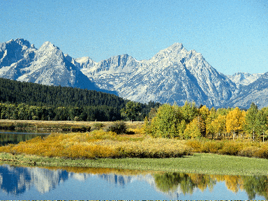

\[ [Home](index.md) \] \[ [Up](sep-int.md) \] \[ [Short Synaxarion](syn-sep01.md) \] \[ Environment \] \[ [1 September Vespers](sep01e.md) \] \[ [1 September Matins & Liturgy](sep01ml.md) \] \[ [5 September](05sep.md) \] \[ [6 September](6_september.md) \] \[ [7 September](07sep.md) \] \[ [13 September](13sep.md) \] \[ [23 September](23sept.md) \] \[ [24 September](24sept.md) \] \[ [26 September](26_september.md) \]

1ST SEPTEMBER
=============

Office of supplication to our God and Saviour Jesus Christ, who loves humankind, for our environment and for the welfare of the whole creation.
-----------------------------------------------------------------------------------------------------------------------------------------------

--------------------------------------------------

INTRODUCTION
------------

The late Patriarch Demetrios I of blessed memory made 1 September a day of special prayer and supplication for the Environment and commissioned the late Monk Gerasimos of the Skete of Little Saint Anne on the Holy Mountain of Athos to compose a special office for it. It is this office that is translated here.

For more than half a century Father Gerasimos, as ‘Hymnwriter of the Great Church’, wrote an imposing number of offices and other hymns for the Church, which makes him one of the most prolific hymnographers in the history of Orthodoxy.

The following translation was originally made at the request of the European Council of Churches in 1992. I have ventured to make two additions to his office. Fr Gerasimos did not provide any verses for the Synaxarion and I have filled this lacuna with the traditional couplet, in both Greek and English. He allowed for two readings from the Gospel at the Liturgy, but only one for the Apostle. Since this is liturgically anomalous, I have tentatively suggested as a second Apostle the reading from the Epistle of James, set for Thursday of Week 32.

In my original translation I added some five dozen footnotes giving references to the many quotations and allusions to Holy Scripture in which the text abounds. I have not added them here, so as not to clutter the text, but I may do so when I move the office to the Geniza. The translations from Holy Scripture are my own. In the Old Testament readings there are a number of differences from the Hebrew and even, in the reading from Isaias taken from the Menaion for 1 September, from the standard text of the Septuagint. I have not attempted to reproduce the acrostic of Canon.

The present Patriarch of Constantinople, His All-Holiness Bartolomew I, has maintained and developed the interest and concern of the Patriarchate for the problems of the environment and this office is now used by a number of Orthodox Churches, either on the 1 September itself or on the first Sunday of September.

AT VESPERS
----------

**After the usual opening, at** Lord, I have cried, **we chant the following Prosomia:**

**Tone 1. Joy of the heavenly hosts.**

Christ Saviour, Lover of mankind, who brought all things into existence from nothing, and with ineffable wisdom arranged for each one to accomplish unerringly the goal which you laid down in the beginning, as you are powerful, bless the whole creation which you fashioned.

Give peace to all the nations, Lord, and understanding in all things, so that we may lead a tranquil life and always keep your laws, which you laid down for the whole creation for the unalterable maintenance and government of the universe.

Lover of mankind, keep unharmed the environment that clothes the earth, through which, by your will, we who inhabit the earth live and move and have our being, so that we, your unworthy suppliants, may be delivered from destruction and ruin.

Fence round the whole creation, Christ Saviour, with the mighty strength of your love for mankind, and deliver the earth we inhabit from the corruption which threatens it; for we, your servants, have set our hopes on you.

Put an end, O Saviour, to the evil designs which are being devised against us with senseless intent, and turn aside from the earth every destructive action of the works of human hands which contrive corruption leading to perdition.

Lord, who wrap creation in clouds, as godly David sang, watch over the environment of the earth, which you created from the beginning for the preservation of mortals, and give us the breath of the winds and the flow of waters.

Glory. **Tone 6.**

Almighty Lord, who created all things with wisdom and who watch over and guide them by your all-powerful hand, grant well-being so that the whole creation may prosper and remain unharmed by hostile elements; for you, Master, commanded that the works of your hands should remain unshaken until the end of the age; for you spoke and they came into being and from you they receive mercy for the turning away of all evil, and for the salvation of the human race that glorifies your name which is praised above all.

Both now. **Theotokion.**

Who will not call you blessed, All-holy Virgin? Who will not sing the praise of your child-birth without labour? For the only-begotten Son, who shone out from the Father beyond time, came forth from you, pure Maiden, ineffably incarnate. By nature he is God, by nature he became man for our sakes, not divided in a duality of persons, but known without confusion in a duality of natures. O honoured and all-blessed, implore him to have mercy on our souls.

**Entrance,** O Joyful Light, **the Prokeimenon of the day and the Readings**.

The Reading is from Leviticus.
\[**26:3-12, 14-17, 19-20, 22, 33, 23-24**\]

**T**he Lord spoke to the children of Israel saying, ‘If you walk in my ordinances and keep my commandments and do them, I will give you rain in its season and the earth will give its produce and the trees of the plains their fruit. Your threshing time will overtake the vintage, and the vintage will overtake the sowing. You will eat your bread to the full and dwell in safety on your land; and no one shall make you afraid. And I will destroy the evil wild beasts from your lands, and war shall not pass through your land, and enemies will fall before you. Five of you will pursue a hundred and a hundred of you will pursue tens of thousands. And I will look upon you and bless you and make you increase and multiply and I will establish my covenant with you. And you will eat what is old and very old, and bring out the old to make way for the new. And my soul will not abhor you, and I will walk among you, and I will be your God and you shall be my people. But if you will not listen to me, nor observe these ordinances of mine, but disobey them, and if your soul loathes my judgements, so that you do not keep all my commandments, I in turn will treat you like this: I will bring distress upon you, and you will sow your seed in vain and your enemies will devour your labours. And I will set my face against you and you will fall before your foes and they will pursue you and you will flee though no one pursues you; and I will smash the arrogance of your pride. And I will make the heaven like iron for you and your earth like solid bronze. And your strength will be in vain and your land will not give its fruit, and the trees of the field will not give their fruit. And I will send the wild beasts of the earth against you, and they will consume your cattle, and the sword will come against you and make you few in number. And your land will be desert and your farms will be desert; because you have walked against me crookedly, and I will walk against you with crooked rage, says the Lord God, the Holy One of Israel’.

The Reading is from the Prophecy of Isaias.
\[**63:15-64:5a, 8-9**\]

**L**ook down, Lord, from heaven and see, from your holy house and your glory. Where is the abundance of your mercy and of your acts of pity, that you have withheld yourself from us? For you are our Father, because Abraham has not known us, nor Israel acknowledged us. But do you, Lord, our Father, deliver us; from the beginning your name is upon us. Why have you made us wander from your way, Lord? Why have you hardened our hearts not to fear you? Return for the sake of your servants, for the sake of the tribes that are your heritage, that in a little while we may inherit your holy mountain. Our enemies have trampled down your sanctuary, we have become as at the beginning when you did not rule over us, nor had your name been invoked upon us. If you open the heaven, trembling from you will seize the mountains and they will melt as wax melts before the fire, and fire will burn up your adversaries, and your name will be manifest among your adversaries; nations will be troubled at your presence. When you do glorious deeds, trembling from you will seize the mountains. From eternity we have not heard, nor have our eyes seen any God but you. And your works are true, and you will perform mercy for those who wait for you. For mercy will meet with those who do right and remember your ways. And now, Lord, you are our Father, while we are clay and you are our Fashioner. We are all the work of your hands. Do not be exceedingly angry with us, Lord, and do not remember our sins for ever. And now, look upon us, Lord, because we are all your people.

The Reading is from the Prophecy of Jeremias.
\[**2:1-12**\]

**T**hus says the Lord: ‘I have remembered the mercy of your youth and the love of your marriage, of your following the Holy One of Israel, says the Lord, the Holy One of Israel. The beginning of his produce was for the Lord. All those who devoured him will offend and evils will come upon them, says the Lord. Hear the word of the Lord, house of Jacob, and every family of the house of Israel. Thus says the Lord, What offence did your fathers find in me, that they revolted far from me and went after vanities and became vain? And they did not say, ‘Where is the Lord who brought us up out of the land of Egypt, who guided us in the wilderness, in a boundless and trackless land, in a land without water or fruit, and in the shadow of death, in a land through which no man had passed, nor had any son of man dwelt there?‘ And I led you to Carmel to eat its fruits and its good things; and you went in and you defiled my land and made my inheritance an abomination. The priests did not say ‘Where is the Lord?‘ And those who cling to the law did not know me, and the shepherds acted impiously towards me, and the prophets prophesied by Baal and went after that which does not profit. Therefore I will be brought to trial before you again, says the Lord, and I will be brought to trial before your children’s children. Cross to the islands of the Kittim and look, and to Kedar and send and observe carefully; and see if such things have been done; if the nations will change their gods, though they are no gods. But my people have changed their glory for something from which they will gain nothing. Heaven was amazed at this and trembled exceedingly, says the Lord.

**At the Liti, Idiomela.
Tone 1.**

Lord, who created the universe at the beginning and gave to each thing its own rank, do not despise the works of your hands, but with an eye of mercy look from heaven upon this vine and restore it according to your will, turning aside from it every purpose that brings corruption and every destroyer; for you are our Shepherd, Deliverer and Saviour, and from you, Master, we receive help in mercy and acts of compassion, as we glorify you.

**Tone 2.**

Lord and Master, who fenced about the domain of the earth and made it sure with an enveloping band, deliver its whole structure from harm and disaster; for you are a treasury of strength and the source of life, and all things minister and are subject to your will as your servants, Lord. And so grant us your mercies and turn away from us every disaster, and save our souls for you love mankind.

**Tone 3.**

Threats and scourges and destruction hang over us, Lord, because of the multitude of our transgressions; for we have sinned and transgressed and gone far from you, and we are affected and afflicted by dire perils; but deliver us, Lord, from the dangers that beset us, and keep the whole structure of the earth unharmed, granting equable breaths of winds and ever-flowing springs of waters for our safe-keeping and salvation, O Lover of mankind.

Glory. **Tone 4*.***

Lord, who hold the circle of the earth and make firm its foundations, as the Prophet says, accept our suppliant entreaties, as our guardian, protector and Saviour; for we are your people and the sheep of your pasture and by your infinite mercy we shall be delivered from anticipated dangers. Do not therefore utterly destroy us, Master, but may your goodness conquer the multitude of our offences, that we may all glorify the ocean of your acts of compassion.

Both now. **Theotokion.**

From dangers of every kind protect your servants, blessed Mother of God, that we may glorify you, the hope of our souls.

**At the Aposticha, Prosomia.
Tone 5. Hail, of ascetic struggles.**

Merciful God, who love mankind, look with an eye of compassion on the works of your hands and set free the expanse of the atmosphere from dread destruction and death-dealing emissions and every poisonous pollution, through which death and danger threaten. Take pity then on what you have fashioned and give to all the prudence not to act senselessly, whose result is corruption, and grant to all pardon, salvation and your divine mercy.

**Verse:** With my voice I cried to the Lord, and he heard me from his holy mountain. \[**Ps. 3:4**\]

Saviour, accept the entreaties of your Mother, which she offers for all creation, and the supplications of all your Saints. Grant to all your mercies, and keep unharmed the firmament which you spread out from the beginning with wisdom, Lord, and brought into being for the benefit of mortals. Keep undamaged from harmful influences, O Word, the whole environment which girds the earth, granting to all pardon and salvation and your great mercy.

**Verse:** When I called you heard to me, O God of my justice; in affliction you set me at large. \[**Ps. 4:1**\]

With humility of soul we all entreat you, Lord, and we fall down before you. At your command deliver the earth on which we dwell from every harm and from harsh ruin, and speedily avert from it and abolish by your will destructive emanations, and pour out the fresh dew of life-sustaining air. With your mighty power, Master and Saviour, fence about the whole enclosure of the environment, granting to all pardon and salvation and your divine mercy.

Glory. Both now. **Theotokion. Tone 5*.***

Through compassionate pity, O Word, you took another form, refashioned corrupted nature and brought it back to incorruption. Now, we beseech you, yield to the supplications of your most pure Mother and grant stability to the inhabited world and well-being to all creation and deliverance from perils, for the salvation of our souls.

**Apolytikion. Tone 4. Speedily anticipate.**

Lord and Saviour, who as God brought all things into being by a word, establishing laws and governing them unerringly to your glory, at the prayers of the Mother of God, keep secure and unharmed all the elements which hold the earth together, and save the universe.

**Theotokion.**

The mystery hidden from all eternity and unknown to Angels has been revealed to those on earth through you, O Mother of God: God being made flesh in a union without confusion, and willingly accepting the Cross for us, through which he raised the first-formed man and saved our souls from death.

**And Dismissal.**

AT MATINS
---------

**After the 1st Reading from the Psalter, Kathisma.
Tone 1. The soldiers watching.**

O Lord, as God you sustain all things by a word, and keep them all in perfect harmony. As you are compassionate keep unaltered the environment which enwraps creation and by your ineffable power turn away from the earth every harm.

**Theotokion.**

All-blameless Virgin, beyond nature you conceived God and gave birth to him in the flesh. Through the abundance of your mercy take pity on those who glorify you in faith and by the streams of your grace cleanse our minds and hearts from sins of many kinds.

**After the 2nd Reading, Kathisma.
Tone 4. Joseph was amazed.**

In the beginning, Saviour, universal King, you founded the earth, while the heavens are the works of your hands, and the stars also with the sun and the moon. All things proclaim your greatness and your strength. Keep their harmony and majesty untroubled, for all things, O Word, are subject to your almighty will.

**Theotokion.**

Ineffably, Mary, you conceived in your womb without change and without confusion the God who is beyond being; and beyond nature you brought forth for those in the world the One who delivers us from condemnation. Therefore we sing the praise of your many mighty works and glorify with faith your child-bearing beyond understanding. But, O Virgin who bore God, deliver us from every affliction.

**After the Polyeleos, Kathisma.
Tone 8. The Wisdom and Word.**

Lord, Lover of mankind, King of all creation, who bring all things into being from nothing, keep unharmed the order which you established and grant your servants temperate climates. Therefore too, diffusing mild airs, disperse all noxious pollutions from the earth, all-powerful Giver of life, and grant your peace to all the nations, that we may all sing the praise of your goodness.

**Theotokion.**

The Master and Maker of all things, taking flesh from your immaculate womb, came forth as man, not changed in his Godhead, and granted salvation to all those who worship your ineffable child-bearing. Therefore, all-pure Mother of God, Ever-Virgin Maiden, we have recourse to your fervent protection, and saved we cry: Intercede with your Son and God to grant forgiveness of faults to those who devoutly sing the praise of your many mighty works.

**The 1st Antiphon of the Anavathmi in Tone 4 and the Prokeimenon.**

Lord, our Lord, how wonderful is your name in all the earth. \[**Ps. 8:1**\]

**Verse:** For I will consider the heavens the works of your fingers; the moon and the stars which you established. \[**Ibid. 3**\]

The Reading is from the Holy Gospel according to Luke.
\[**18:2-8**\]

**T**he Lord spoke this parable: In a certain city there was a judge who neither feared God nor had respect for people. In that city there was a widow who kept coming to him and saying, ‘Grant me justice against my opponent‘. For a while he refused; but later he said to himself, ‘Though I have no fear of God and no respect for anyone, yet because this widow keeps pestering me, I will grant her justice, so that she may not wear me out by continually coming’. And the Lord said: Listen to what the unjust judge says. Will God not grant justice also to his chosen ones who cry to him day and night? Will he delay long in helping them? I tell you, he will quickly grant them justice.

**Psalm 50.**

Glory.

At the prayers of the Apostles, O Merciful One, blot out the multitude of my transgressions.

Both now.

At the prayers of the Mother of God, O Merciful One, blot out the multitude of my transgressions.

**Idiomel. Tone 6.**

Have mercy on me, O God, in accordance with your great mercy. According to the fullness of your compassion blot out my offence. \[**Ps. 50:1**\]

Lord, who with wisdom keep, maintain and direct all things for our government and sure guidance in the paths of your commandments, accept our suppliant entreaties and rescue us from impending dangers and from all change for the worse of the bounds of nature, and save our souls.

**Deacon:** O God, save your people…

**Then the Canon, of which the Acrostic is:**

Christ Saviour, keep us safe. Gerasimos.

**Ode 1. Tone 8. Irmos. Crossing the water.**

Crossing the water as on dry land and fleeing from the wickedness of the Egyptians, Israel cried aloud: To our Redeemer and our God now let us sing.

**Troparia.**

O Word great in mercy, stooping with goodness and compassion, shower down from heaven upon the earth the streams of your divine mercy for our salvation.

Stained with foul passions, Saviour, we defile the atmosphere with our dread actions; but grant us, Lord, genuine repentance.

Look on us, Saviour, with an eye of mercy, and turn from the earth, we beg, the destruction which comes from poisonous and senseless actions.

**Theotokion.**

Mother of God full of grace, who gave birth to the Word without beginning from your pure blood, save us from dread circumstances.

**Ode 3. Irmos. You are the firm strength.**

You are the firm strength, O Lord, of those who have recourse to you. You are the light of those in darkness, and my spirit sings your praise.

**Troparia.**

By the laws which you established, Master, ever keep unshaken and unmoved the works of your hands, which you brought into being of old.

As you possess an inexhaustible ocean of compassion, O All-merciful, dispel the harmful blasts that come against us.

You are Lord of all things, Saviour, you the Giver of life. Cleanse from all corruption the elements in which we your servants live.

**Theotokion.**

You appeared as the dwelling of the Maker of all creation, pure Maiden, bearing him ineffably in your womb.

**Kathisma. Tone 5. Let us believers praise.**

As our Master and Creator, Lover of mankind, we fall before you with faith and we cry out to you, ‘Keep our atmosphere and the whole earth undamaged by harmful corrupters, and give us repentance and wholeness, O Compassionate, for the salvation of our souls’.

**Theotokion. Same melody.**

From your pure blood you bore beyond understanding the Master of all things and remained, as before, a virgin incorrupt, O Mother of God. Keep safe from every evil and corruption of the cunning Deceiver those who with undoubting heart have recourse to your protection.

**Ode 4. Irmos. I have heard, Lord.**

I have heard, Lord, of the mystery of your dispensation; I have understood your works and glorified your Godhead.

**Troparia.**

Keep the elements which surround the earth unharmed, Lord, and ever bless us that we may walk in your fear.

We have been estranged, Lord, by transgressing your divine law, and so we beg you: Give us amendment of life.

From pollutions and from destructive blasts deliver the whole earth, O Saviour, by your strength, that we may magnify your might.

**Theotokion.**

Mother of God, Ever-Virgin, who gave birth in the body to the Fashioner of the whole creation, deliver us from every calamity.

**Ode 5. Irmos. Enlighten us.**

Enlighten us by your commands, O Lord, and by your upraised arm grant us your peace, O Lover of mankind.

**Troparia**.

Cleanse us from blemishes of soul, O Lover of mankind, and preserve in its own order, we beseech you, the earth’s environment.

Empower us, Lord, by your divine fear to accomplish our life without grief in peace and true love.

You founded the heaven and the earth, as David sings, O Creator; guard us then from every affliction.

**Theotokion.**

Accept the voices of those who entreat you with faith, Mother of God, pure and Ever-Virgin, and grant peace to our souls.

**Ode 6. Irmos. I pour out my supplication.**

I pour out my supplication to the Lord, and to him I declare my afflictions, because my soul has been filled with evils and my life has drawn near to Hell; and like Jonas I beg: O God, bring me up from corruption.

**Troparia.**

You established all creation by your mighty strength, O Saviour who love mankind; now, therefore, rescue us by your power, Lord, from threatening destruction, and preserve the environment which enwraps the earth.

Keep the upper air undamaged and the flow of the air free from destructive exhalations, pollutions, and the other effects of dangerous activities which bring most painful death.

By a word, Lord, you established the structure of the earth, and wrapped its circumference with a surrounding element as you wished; ever preserve it from corruption and dread influences.

**Theotokion.**

As Mother of the King of glory, Ever-Virgin Maiden, Mother of God, set free my lowly heart from the disgrace of unclean passions, and give me, I beg, sincere and perfect repentance.

**Kontakion. Tone 2. With your blood.**

With your all-powerful strength you framed all things, both visible and invisible; and so keep unharmed, we implore your goodness, the environment that surrounds the earth.

**Ikos.**

Loving Saviour, we praise the manifestations of your providence and your many saving powers; because with ineffable wisdom and order and harmony you have established for all things laws and unalterable ordinances for the protection of us, your royal fashioning. Keep us unshaken, Lord, from every corrupting activity, change and destruction, as guardian, protector and deliverer of all things, keeping in them the essential power unmoved, and especially watching over the environment that surrounds the earth.

\[**The Synaxarion from the Menaion and the following:**

On the same day, the beginning of the Indiction, we entreat our God, who loves mankind, for the welfare of the earth on which we live and for the whole creation.

**Verses**
We fall before you, Master, as we cry:
O Saviour, from pollutions free the earth.

To him be glory and might to the ages. Amen.\]

**Ode 7. Irmos. The Youths from Judea.**

The Youths from Judaea once having come to Babylon, with the faith of the Trinity trampled down the flame of the furnace, as they sang: God of our fathers, blessed are you!

**Troparia**

You give life to all and conduct all things with ineffable judgements; from harmful pollutions and from every abuse save those who cry out, ‘God of our fathers, blessed are you!’

By your will, Lord, you adorned the heavens with stars, while you made the whole earth fair with flowers and trees as it sings, ‘God of our fathers, blessed are you!’

Give pardon and a calm life to us who dwell on the earth, turning away from it corrupting emanations and saving those who sing, ‘God of our fathers, blessed are you!’

**Theotokion.**

The One born from your womb, pure Maiden, declared you to be the gateway of salvation that leads to the glory of the kingdom on high those who cry out to you with faith, ‘Hail, pure Virgin, the salvation of mortals!’

**Ode 8. Irmos. The King of heavn.**

The King of heaven, whom the hosts of Angels praise, praise and highly exalt to all the ages.

**Troparia.**

Come, all the inhabitants of earth, let us fall down and cry out to Christ with compunction, ‘Deliver us, Saviour, from just condemnation!’

From pollutions and contaminations rescue the environment, Saviour, that we may sing your praise as the only benefactor.

With streams of your vivifying mercy, Compassionate One, quench the flame of bitter passions and grant us well-being and salvation.

**Theotokion.**

Glory of Angels and salvation of mortals, glorious Ever-Virgin Maiden, show us to be partakers in eternal glory.

**Ode 9. Irmos. We who through you.**

We, who have been saved through you, pure Virgin, confess you to be in truth the Mother of God and with the bodiless choirs we magnify you.

**Troparia.**

In your goodness deliver our race from earthquakes and ill fortune, from calamities of many kinds and from soul-destroying pollutions, O Compassionate.

Give strength to the weak, O all-compassionate, and by your power preserve the atmosphere clean from winds that bring death.

From every pollution that breeds death, O Saviour, by your power preserve unsullied the air in creation that we breathe.

Make heavenly our hearts, O Compassionate, through a life of virtue and holiness, and deliver us from the grip of uncleanness.

**Theotokion.**

We sing the praise of your child-bearing, through which, O Virgin, we have been delivered from the ancestral curse; for you bore Christ, the Saviour of all.

**Exapostilarion. Women hear.**

You once stretched out the heavens at your command, Lord, as the Prophet says, and founded the unformed mass of the earth, Master; preserve the constitution of the universe in harmony and keep every element in creation from contamination.

**Theotokion.**

The Maker of creation through his goodness took human form from you, and was created beyond nature from your pure blood. As his all-pure Mother, O all-immaculate, ask him for us, we beg, that we may find salvation.

**At Lauds we insert 4 Stichera and sing the following Prosomia.
Tone 4. You have given us a sign.**

With compunction we offer you our praise, Lover of mankind, and with faith we cry out to you: As Creator you hold fast the ends of the earth, and you maintain and govern them. From noxious emanations and from dire pollutions that harbour bitter death, rescue humanity which you fashioned, for you are pitying and compassionate.

By your almighty will you brought all things into being from nothing, Lover of mankind, and all things, Saviour, serve your might; therefore we implore you: Keep the environment that enwraps the earth unmoved, for the safe government of your royal fashioning, and for life on earth to be free from strife and destruction.

Let us, the nurselings of true religion, offer to the Lord purity of life and splendour of manners, that we may be delivered from pollutions of many kinds which pollute the whole earth and harbour bitter and painful death for the ends of the earth. From these, Lord, preserve our existence by your almighty power.

You walled the circle of the earth, Lord, as with a wall, with a safe environment. Preserve it always as you established it when you poured out the breaths of winds and vivifying breezes for our preservation, and grant us pardon of sins, Master, and the fulfilling of the commands of your holy will.

Glory. **Tone 8.**

As Master of creation do not take from us the treasures of your providence, we beg, Lover of mankind. See our humiliation, Lord, and cleanse creation of polluted winds and noxious contagions and activities, so that, living devoutly and soberly in a pure life, we may be counted worthy of eternal life, as we glorify your great mercy.

Both now. **Theotokion.**

Sovereign Lady, accept the entreaties of your servants and rescue us from every constraint and affliction.

**Great Doxology and Dismissal.**

AT THE LITURGY
--------------

**The usual. Apostle and Gospel of the 1st of the Indiction, but, if you wish, say also the Gospel according to Mark for the Wednesday of the 17th week of Luke** \[**Mark 13:24-31**\].

Prokeimenon in the 4th Tone. \[**Psalm 146**\]

Great is our God, and great is his strength.

**Verse:** Praise the Lord, for psalmody is good: let praise be given sweetly to our God.

The Reading is from the 1st Epistle of Paul to Timothy.
\[**2:1-7**\]

**C**hild Timothy, first of all, then, I urge that supplications, prayers, intercessions, and thanksgivings be made for everyone, for kings and all who are in high positions, so that we may lead a quiet and peaceable life in all godliness and dignity. This is right and is acceptable in the sight of God our Saviour, who desires all to be saved and to come to the knowledge of the truth. For there is one God; there is also one mediator between God and humanity, a human being, Christ Jesus, who gave himself as a ransom for all; this was attested at the right time. For this I was appointed a herald and an apostle (I am telling the truth in Christ, I am not lying), a teacher of the Gentiles in faith and truth.

\[Brethren, submit therefore to God. Resist the devil and he will flee from you. Draw near to God and he will draw near to you. Cleanse your hands, you sinners, and purify your hearts, you double-minded. Be wretched and mourn and weep. Let your laughter be turned to mourning and your joy to dejection. Humble yourselves before the Lord and he will exalt you. Do not speak evil against one another, brethren. One that speaks evil against a brother or judges his brother, speaks evil against the law and judges the law. But if you judge the law, you are not a doer of the law but a judge. There is one lawgiver and judge, he who is able to save and to destroy. But who are you that you judge your neighbour? Come now, you who say, ‘Today or tomorrow we will go into such and such a town and spend a year there and do business and make a profit’; whereas you do not know about tomorrow. What is your life? For you are a mist that will appear for a little time and then it will vanish. Instead you ought to say, ‘If the Lord wishes, we will both live and do this or that’. As it is, you boast in your arrogance. All such boasting is evil. Anyone who knows what it is right to do and fails to do it, for them it is sin. Come now, you rich, weep and howl for the miseries that are coming upon you. Your riches have rotted and your garments are moth-eaten. Your gold and silver have rusted, and their rust will be evidence against you and will eat your flesh. Like fire you have stored up treasure in the last days. Behold, the wages of the labourers who mowed your fields, which you kept back by fraud, cry out; and the cries of the harvesters have reached the ears of the Lord of hosts. You have lived on the earth in luxury and in pleasure; you have fattened your hearts in a day of slaughter. You have condemned, you have killed the righteous one; he does not resist you. Be patient, therefore, brethren, until the coming of the Lord. Behold, the farmer waits for the precious fruit of the earth, being patient over it until it receives the early and the late rain. You also be patient. Strengthen your hearts, for the coming of the Lord is near. Do not grumble, brethren, against one another, that you may not be judged. See, the Judge is standing at the doors.\]

Alleluia in the 4th Tone. \[**Psalm 64**\]

**Verse 1:** To you, O God, praise is due in Sion; and to you a vow shall be performed.

**Verse 2:** We shall be filled with good things of your house.

The Reading is from the holy Gospel according to Luke.
\[**4:16-22**\]

**A**t that time Jesus came to Nazareth, where he had been brought up, he went to the synagogue on the Sabbath day, as was his custom. He stood up to read, and the scroll of the prophet Isaias was given to him. He unrolled the scroll and found the place where it was written: The Spirit of the Lord is upon me, because he has anointed me to bring good news to the poor. He has sent me to proclaim release to the captives and recovery of sight to the blind, to let the oppressed go free, to proclaim the year of the Lord’s favour. And he rolled up the scroll, gave it back to the attendant, and sat down. The eyes of all in the synagogue were fixed on him. Then he began to say to them: Today this scripture has been fulfilled in your hearing. All spoke well of him and were amazed at the gracious words that came from his mouth.

The Lord said to his Disciples: In those days, after that suffering, the sun will be darkened, and the moon will not give its light, and the stars will be falling from heaven, and the powers in the heavens will be shaken. Then they will see the Son of Man coming in clouds with great power and glory. Then he will send out the angels, and gather his elect from the four winds, from the ends of the earth to the ends of heaven. From the fig tree learn its lesson: as soon as its branch becomes tender and puts forth its leaves, you know that summer is near. So also, when you see these things taking place, you know that he is near, at the very doors. Truly I tell you, this generation will not pass away until all these things have taken place. Heaven and earth will pass away, but my words will not pass away.

**Communion.**

Praise the Lord from the heavens, praise him in the highest. Alleluia!

**Megalynarion.**

At all times keep unharmed the whole creation we beg you, O Redeemer, and grant us breaths of winds and breezes moist with dew for our safety and salvation, O Lover of mankind.

**Distich.**
Gerasimos, O Master, cries with faith:
Grant to creation a mild atmosphere.

Translation © Archimandrite Ephrem 1997

All texts and translations on this page are copyright to
Archimandrite Ephrem ©

**This page was last updated on 03 November 2008**
