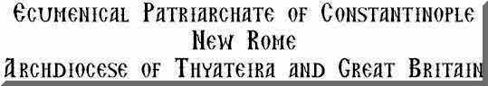

ANASTASIS

[](liturgic.md)[Liturgical Texts](liturgic.md)
[Voice of the Fathers](voiceof.md)
[Songs of the Fathers](songsof.md)
[Obiter Scripta](obiter_scripta.md)

****Welcome to Anastasis
the Home Page
of Archimandrite Ephrem****

------------------------------------------------------------------------

On these pages you will find, in the main, translations of our Orthodox liturgical and patristic texts. Most of the latter are of texts which have not previously been translated into English.

Some visitors to these pages have pointed out that when printed out in black and white only, the distinction between text and rubrics is lost. This can be overcome if the pages are saved into a word processor and then edited, rather than being printed directly from the screen. The original text of nearly all these pages was prepared in Microsoft Word. **

------------------------------------------------------------------------

Links:
Parish of St Anthony and St John the Baptist, Islington*
* <http://www.orthodox-islington.org.uk>

------------------------------------------------------------------------

As there is now a great deal on these pages, I have decided to draw attention to recently added material by listing it here and adding the necessary hyperlinks, and reminders, with hyperlinks, to appropriate pages from earlier years.

My more recent translations of our liturgical texts contain notes, including biblical and patristic cross references, as well as discussions of rare or interesting words and expressions. For this reason I shall put them up in both HTML and PDF formats. In this way they can easily be downloaded for liturgical use without footnotes.

On the web site of the parish of [St Anthony and St John the Baptist](http://www.orthodox-islington.org.uk/index.htm) in Islington you will find a simple Commentary on the Divine Liturgy.

**

------------------------------------------------------------------------

REMINDER
========

*[*Mode 1*](tone1.md)*

*[Mode 2](tone2.md)*

------------------------------------------------------------------------

Unless stated otherwise, all texts and translations on these pages are copyright ©. **
