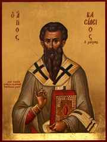
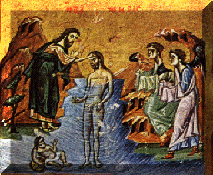
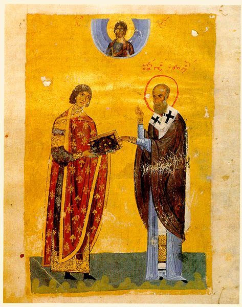
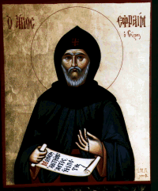

\[ [Home](index.md) \] \[ [Up](saintsof.md) \]
\[ [September](septembe.md) \] \[ [October](october.md) \]
\[ [November](november.md) \] \[ [December](december.md) \]
\[ January \] \[ [February](feb.md) \] \[ [June](june.md) \]
\[ [July](july.md) \] \[ [August](august.md) \]

# MONTH OF JANUARY

**It has 31 days. The day has 10 hours and the night 14.**

1\. The Circumcision according to the flesh of Our Lord Jesus Christ;
and commemoration of our Father among the Saints Basil the Great,
archbishop of Caesarea in Cappadocia.

Since the law of Moses lays down that if a woman gives birth to a male
child it shall be circumcised in the flesh of its foreskin on the eighth
day (Lev. 12:2-3), for this reason our Saviour on the present day, which
is the eighth from his Nativity, accepted the Circumcision prescribed by
the law, and received, in accordance with the Angel’s command, the name
which is above every name, JESUS, that is to say, Saviour (Matt. 1:21,
Lk. 1:31 and 2:21). As we celebrate our Lord’s name day today, from it
we begin the New Year from his incarnation.

Basil the Great was born towards the end of the year 329 in Caesarea of
Cappadocia of a family distinguished both for its culture and sanctity.
His parents were called Basil and Emilia. He studied in Constantinople
under the rhetorician Livanios and later in Athens, where he became the
friend of Gregory Nazianzen. He returned to Caesarea, but soon left for
the hesychasteria in the district of Pontus, where his mother and his
sister Makrina were leading the ascetic life. It was then that he wrote
his ascetic discourses. Around 370, on the death of the bishop of his
home country, he was chosen to succeed to the throne and entrusted with
the Church of Christ, which he shepherded for eight years, and became a
martyr by intent, reckoning nothing to the threats of the Arian emperor
Valens, and of Modestos, prefect of the East. He departed to the Lord on
January 1st 379. His wisdom and great learning, which abound in his
writings, through which he taught about God and made clear the nature of
beings, and adorned the morals of mankind, as well as the magnificence
and grandeur of his style have conferred on him the titles of ‘Revealer
of Heaven’ and ‘Great’.

****

No work, and Permission for everything.

Apolytikion of the Feast. Tone 1. When the stone had been sealed.

Without change you took a human form, being God by nature, most
compassionate Lord; and fulfilling the law you willingly accepted
Circumcision in the flesh, that you might banish shadows and strip off
the covering of our passions. Glory to your goodness; glory to your
compassion; glory to your ineffable condescension, O Word.

****

Of the Saint. Same Tone.

Your sound has gone out into all the earth, for it has received your
word, through which you taught in a manner fitting God: for you made
clear the nature of what exists; you set in order the conduct of
mankind. Royal priesthood, venerable Father, implore Christ God to grant
us his great mercy.

****

Kontakion of the Saint. Tone 4. Today you have appeared.

You appeared as an unshakeable foundation for the Church, maintaining
its authority as a sure refuge for mortals, sealing it by your
doctrines, venerable Basil, Revealer of heaven.

****

And of the Feast. Tone 3. Today the Virgin.

The Lord of all things undergoes circumcision, and cuts off, as he is
good, the faults of mortals. Today he gives salvation to the world. The
High Priest of the Creator too rejoices in the highest, godlike Basil,
the light-bearing initiate of Christ.

2\. Forefeast of the Theophany; and commemoration of our Father among
the saints Silvester, Pope of Rome.

He succeeded Miltiades in 314. He sent his representatives to the 1st
Ecumenical Council, which was held in Nicea in 325. He died in 335.

****

Apolytikion of the Saint. Tone 4. \[Common\]

The truth of your actions proclaimed you to your flock as a rule of
faith, an image of meekness and a teacher of self-control; and so you
gained through humility the things on high, through poverty riches, O
Father and Hierarch Silvester; intercede with Christ God that our souls
may be saved.

****

Forefeast. Tone 4. Joseph was amazed.

Zavoulon prepare, and make ready Nephthalim; river Jordan stand, leap
for joy as you receive the Master who comes to be baptised. Adam with
our Foremother be glad, do not hide yourselves as in Paradise of old;
for seeing you naked, he has appeared that he may put on the first robe.
Christ has appeared, as he wishes to renew the whole creation.

****

Kontakion of the Saint. Tone 4. Lifted up on the Cross.

Among priests, god-bearing Father, you were revealed as priest of the
King and God, and you became a companion of ascetics, therefore you now
rejoice with the choirs of Angels with gladness in the heavens;
Silvester, glorious shepherd of Rome, save those who celebrate your
memory with love.

****

Kontakion. Tone 4. Today you have appeared.

Today the Lord has come to the streams of Jordan, and cries aloud to
John: Do not be afraid to baptise me; for I have come to save Adam the
First-formed.

3\. Of the holy Prophet Malachy; and of the holy Martyr Gordios.

The Prophet was the last of the Minor prophets and the last of all the
Prophets of the Old Testament. He prophesied in the days of Nehemias, a
wise man among the Jews and steward of Artaxerxes the Long-handed, king
of the Persians, who reigned from 465-424 BC. His prophecy is divided
into four chapters.

The Martyr, who had the rank of Centurion, was from Caesarea in
Cappadocia. He was martyred under Licinius in 314.

****

Apolytikion of the Forefeast; and of the Saint. Tone 4. \[Common\]

Your Martyr, O Lord, by his struggle obtained the crown of incorruption
from you, our God; for with your might he destroyed tyrants, and
shattered the feeble insolence of the demons: at his prayers, O Christ
God, save our souls.

****

Kontakion. Tone 8. You have taken, Lord.

The sweat of your struggle watered the whole earth, and with your
precious blood you made the whole world glad. By your prayers,
all-praised Gordios, inspired by God, save all who sing to you with
faith and fittingly honour you as much-enduring.

****

Of the Prophet. Tone 4. Today you have appeared.

Enriched with the grace of prophecy, you clearly announced beforehand, O
Prophet, the coming of Christ, and the salvation of the world; by whose
radiance the world has been enlightened.

4\. The Assembly of the Seventy Apostles; and of Saint Theoktistos,
abbot in Koukoumos in Sicily.

****

Apolytikion of the Forefeast; and of the Apostles.  
Tone 3. \[Common\]

O holy Apostles, intercede with the merciful God to grant our souls
forgiveness of sins.

****

Kontakion. Tone 2. Seeking things on high.

Believers, let us with inspired hymns praise and celebrate the choir of
the Seventy disciples of Christ; for through them we have all learned to
honour an undivided Trinity; and we have them as lamps of divine Faith.

5\. Of the holy Martyrs Theopemptos and Theonas; and of Saint
Synklitiki.

The Martyrs suffered under Diocletian in the year 290. Synklitiki was
from Alexandria in Egypt. She lived for 83 years in virginity and
asceticism and became leader and teacher of many nuns. For the women she
appeared like Antony the Great for the men, and having become a model of
woman’s nature for the mortification of the flesh and endurance in
afflictions, she died around the middle of the 4th century.

****

Eve of Theophany. Fast, on whatever day it falls.

Apolytikion. Tone 4. Joseph was amazed.

The river Jordan once turned back before the mantle of Elissaios, when
Elias had been taken up, and the waters were divided on this side and on
that. The stream became for him a dry road, as a true type of Baptism,
through which we pass through the fleeting course of life. Christ has
appeared in Jordan to sanctify the waters.

****

Kontakion. Tone 4. Today you have appeared.

Today the Lord has come to the streams of Jordan, and cries aloud to
John: Do not be afraid to baptise me; for I have come to save Adam the
First-formed.

**6. The holy Theophany of our Lord and God and Saviour, Jesus Christ.**

Near the beginning of Jesus’ thirtieth year, John the Forerunner, who
was about the same age (being some six months older than Jesus) and who
had lived in the desert since boyhood, received a command from God and
came into the country round the Jordan, preaching a baptism of
repentance for the forgiveness of sins. Then Jesus, coming from Galilee
to the Jordan, sought and received baptism, the Master from the slave,
at which these supernatural wonders occurred. The heavens were opened;
the Spirit came down on the baptised in the form of a dove; and a voice
was heard from heaven bearing witness that this is the beloved Son of
God, who was then being baptised there as a man (Matt. 3, Lk. 1:26.80
and 3:1-23). From all this was revealed the Divinity of Jesus and the
great mystery of the Trinity; and for this reason the present feast is
named Theophany, that is the Appearing of God among men. From this
august day is dated Christian Baptism; from this day the saving
preaching of the Kingdom of heaven began.

****

No work, and Permission for everything.

Apolytikion. Tone 1.

As you were baptized in the Jordan, Lord, the worship of the Trinity was
made manifest; for the voice of the Father bore witness to you, naming
you the Beloved Son; and the Spirit, in the form of a dove, confirmed
the sureness of the word. Christ God, who appeared and enlightened the
world, glory to you\!

****

After the 3rd Ode. Ypakoï. Tone 2.

When by your Appearing you enlightened the universe, then the salt sea
of unbelief took flight, and Jordan, flowing down, was turned back,
raising us to heaven. But guard us, Christ God, by the height of your
divine commandments, at the prayers of the Mother of God, and save us.

****

Kontakion. Tone 4. Model Melody. \[By St Romanos\]

Today you have appeared to the inhabited world, and your light, O Lord,
has been signed upon us, who with knowledge sing your praise: You have
come, you have appeared, the unapproachable Light.

7\. The Assembly of the holy, glorious Prophet, Forerunner and Baptist
John.

We celebrate this festive Assembly in honour of the most sacred
Forerunner, as the one who ministered to the mystery of the divine
Baptism.

****

No work, and Permission for fish.

Apolytikion of the Feast; and of the Forerunner. Tone 2.

The just is remembered with praises; but for you, O Forerunner, the
Lord’s testimony suffices. For you were revealed as more praiseworthy
than the Prophets, because you were found worthy to baptise in running
streams the One they had proclaimed. Therefore you struggled bravely for
the truth with joy, and preached to those in Hell a God who had appeared
in flesh, who takes away the sin of the world and grants us his great
mercy.

****

Kontakion. Tone 6. Model Melody. \[By St Romanos\]

The Jordan, afraid at your coming in the body, was turned back in fear;
while John, fulfilling the ministry of a prophet, drew back in awe. The
ranks of Angels, seeing you in the streams being baptised in the flesh,
were amazed; and all those in darkness were filled with light as they
sang the praises of you who had appeared and enlightened all.

8\. Of our venerable Mother Domniki; and of our venerable Father George
the Chozevite.

She was originally from Carthage in Africa and led the ascetic life in
Constantinople around the end of the 4th century; while he was a monk in
Palestine around the beginning of the 9th, in a monastery called
Chozeba’s.

****

Apolytikion and Kontakion of the Feast.

9\. Of the holy Martyr Polyeuktos.

He was a soldier, originally from Melitini a city in Armenia, and was
martyred under Valerian in 255.

****

Apolytikion of the Feast; and of the Martyr. Tone 4. \[Common\]

Your Martyr, O Lord, by his struggle obtained the crown of incorruption
from you, our God; for with your might he destroyed tyrants, and
shattered the feeble insolence of the demons: at his prayers, O Christ
God, save our souls.

****

Kontakion. Tone 4. Today you have appeared.

When the Saviour bowed his head in Jordan, the heads of the dragons were
crushed; while the head of Polyeuktos when cut off put trickery to
shame.

10\. Of our venerable Father Gregory, bishop of Nyssa; and of the
venerable Dometianos, bishop of Melitini.

The latter flourished in the time of Justinian Rhinotmitos, who reigned
in 685. Gregory was the younger brother of Basil the Great, and was also
outstanding by his treatises, a zealot of the orthodox faith. He was
born in 331 and became bishop in 372. He was exiled by the arianising
Valens in 374 and was recalled to his throne by Theodosios the Great in
378. He was present at the local Synod of Antioch, by which he was sent
to visit the Churches of Arabia and Palestine, which were contaminated
and disrupted by Arianism. Later he attended the Second Ecumenical
Council of Constantinople in 381. He lived in all for 65 years, leaving
many distinguished writings. He died in 396, named by all Father of
Fathers.

****

Apolytikion. Tone 4. \[Common\]

God of our Fathers, who always deal with us in your forbearance, do not
deprive us of your mercy, but at their intercessions guide our life in
peace.

****

Kontakion. Tone 2. Nor tomb nor death.

The inspired High Priest of the Church, the august initiator into
wisdom, the watchful mind of Nyssa, Gregory, who dances with the Angels
and takes his pleasure in the divine light, intercedes unceasingly for
us all.

11\. Of our venerable Father Theodosios the Koinoviarch.

He was a native of Cappadocia and flourished in the time of Leo the
Thracian who reigned in 457, until around the beginning of the sixth
century. He raised from its foundations a very extensive monastery, in
which he shepherded many monks. He lived to the age of 103 and died in
peace.

****

Permission for wine and oil.

Apolytikion. Tone 8. \[Common\]

With the streams of your tears you cultivated the barren desert, and
with deep sighings from the heart you made your toils bring forth fruit
a hundredfold, and you became a beacon, shining in all the world by your
wonders, our venerable Father Theodosios; intercede with Christ God that
our souls may be saved.

****

Kontakion. Tone 8. To you my Champion.

Planted in the courts of your Lord, you blossomed sweetly by your
virtues, and in the desert you multiplied your children, watered by the
streams of your tears, flock leader of the godly sheepfolds of God;
therefore we cry: Hail, Father Theodosios\!

12\. Of the holy Martyr \[and Deacon\] Tatiana.

She was from Rome, daughter of a most distinguished father, of consular
rank. She became a deacon of the Church for women’s matters. Because of
her confession of the faith she was martyred under Alexander in the year
218.

****

Apolytikion and Kontakion of the Feast.

13\. Of the holy Martyrs Ermylos and Stratonikos.

They suffered under Licinius in 314.

**Their Office is sung together with that of the venerable Fathers,
because of the Leave-taking of the Feast to-morrow.**

****

Apolytikion. Tone 4. \[Common\]

Your Martyrs, O Lord, by their struggle obtained crowns of incorruption
from you, our God; for with your might they destroyed tyrants, and
shattered the feeble insolence of the demons: at their prayers, O Christ
God, save our souls.

****

Apolytikion of the Fathers. Tone 4. \[Common\]

God of our Fathers, who always deal with us in your forbearance, do not
deprive us of your mercy, but at their intercessions guide our life in
peace.

****

Kontakion of the Ascetics. Tone 2. Seeking things on high.

You fled from mingling with the world and changed to a state of calm,
crowned by the blood of martyrdom and the toils of the ascetic life;
therefore you have been revealed as companions of the Martyrs and the
Saints.

14\. Of our venerable Fathers, slaughtered in Sinai and Raïtho.

The latter were slain in the reign of Diocletian, in 296, by barbarians
from Arabia and Egypt called Blemmyes; the former by the same barbarian
peoples around the middle of the fifth century.

****

Today leave is taken of the Feast of Theophany.

15\. Of our venerable Fathers Paul the Theban and John the Kalyvite.

Paul, the very first of all the hermits, was born in the Thebaid of
Egypt in 227. In 250 he fled to the desert because of the persecution
launched by Decius, and he lived entirely alone for 91 years in a cave.
He lived in all for 114 years and died in 341. He was buried by Anthony
the Great, who had been guided there by God a few days before his death.
John was a native of Constantinople, the son of distinguished parents,
Evtropios the Senator and Theodora. When he was twelve years old he
withdrew secretly and left for the monastery of the Sleepless (December
29th). But after six years, burning with longing for his parents, he
returned to his family home disguised as a poor beggar (a
‘bread-seeker’). He made a little hut by the gate, from which he got
the surname ‘Kalyvitis’ \[‘Hut-dweller’\]. He remained there
unrecognised for a long time, mocked by his own servants. Foreseeing his
death, he revealed himself to his parents and after a few moments he
died, in around 450.

****

Apolytikion. Tone 4. Come quickly to help.

From infancy you longed fervently for the Lord, you abandoned the
pleasures in the world and nobly led the ascetic life; you fixed your
hut before your parents’ gates; you crushed the ambushes of demons, O
all-blessed; and therefore, John, Christ fittingly glorified you.

****

After the 3rd Ode, Kontakion of the Kalyvite.  
Tone 2. Seeking things on high.

Longing for poverty, wise Father, in imitation of Christ, you abandoned
your parents’ wealth, and grasping the Gospel in your hands, John, you
followed Christ God interceding unceasingly on behalf of our souls.

****

After the 6th, of the Theban. Tone 4. Today you have appeared.

All we believers sing the praise of the beacon who shone out by the
height of his virtues, the godlike Paul, as we cry: O Christ you are the
joy of your Holy Ones.

16\. The veneration of the precious Chain of the holy and all-praised
Apostle Peter.

Herod Agrippa, the descendent of Herod the Great (December 25th) and
king of the Jews, raging against the Church of Christ, slaughtered James
the brother of John the Evangelist in Jerusalem in 43. While when he saw
that this appeared to please the Jews he arrested Peter likewise and
shut him in prison, guarding him so that, when the feast of the Passover
according to the law was over, he might produce him to the people as a
pleasing victim; but the Apostle, wondrously loosed from his bonds by an
Angel, was saved (Acts 12:1-19). These bonds, that is the Chain, with
which the Apostle was bound received a sanctifying and healing grace
from the contact with his most sacred body for those who approach it
with faith. They fell into the hands of Christians and were later
translated to Constantinople by the devout Kings and a yearly feast was
established for their veneration for the hallowing of the faithful.

That such things work wonders and many healings holy Scripture is
witness when it says of Paul that the Christians in Ephesus showed him
such reverence that taking his handkerchiefs and aprons with great
devotion they cured through them the diseases of the sick So that when
the handkerchiefs or aprons that had touched his skin were brought to
the sick, their diseases left them (Acts 19:13). And not only the
clothing that had in any case been near their bodies, but even the
shadow by itself which fell from them worked the same cures. And seeing
this people would put their sick on beds and stretchers, bring them and
lay on the highways so that as Peter passed even his shadow might fall
on one of them (Acts 5:15), in as much that even if they were not cured,
those who brought them with toil were not content to toil in vain. From
this the Orthodox Church learnt the honour and devotion not only of
relics but also of the clothing of holy persons.

****

Permission for wine and oil.

Apolytikion. Tone 4.

Not leaving Rome you came to dwell with us through the precious Chains
which you wore, first-throned of the Apostles. As we venerate them with
faith we beg: by your entreaties to God grant us his great mercy.

****

Kontakion. Tone 2. Seeking things on high.

Christ the rock radiantly glorifies the rock of the faith, the
first-throned of the Disciples; for he invites all to feast the wonders
of the precious Chain of Peter and gives pardon of faults.

17\. Of our venerable and God-bearing Father Anthony the Great.

Anthony, the originator of the monastic life, was born in Egypt in 251
of devout parents. Having heard the voice of the Gospel: If you would be
perfect, go, sell all your goods and give to the poor (Mt. 19:21), he at
once put this into practice; and having distributed all that he
possessed to the poor and fled from all the hubbub of the world, he
withdrew into the desert. His many varied temptations there during
twenty years without interruption are beyond belief; his ascetic
struggles day and night, through which he slew the urgings of the
passions and reached the summit of dispassion, surpass the bounds of
nature; and the report of his virtuous deeds stirred such a multitude to
imitate him that the desert was transformed into a city, with him as
governor, lawgiver and trainer of all the citizens of this newest city.
But the cities of the world also enjoyed the fruit of his virtue. When
the Christians were being persecuted and put to death under Maximinus in
312 he hurried to their help and comfort. When the Church was disturbed
by the Arians he came down with zeal to Alexandria in 335 and struggled
against them on behalf of Orthodoxy; and he turned many back to Christ
through the grace of his own words. When he had thus lived his life and
become a model of virtue and a rule for monks, he died on the 17th of
January in 356, having lived for 104 years.

****

No work, and permission for wine and oil.

Apolytikion. Tone 4.

The zealous Elias you imitated by your life, you followed the Baptist by
straight paths, Father Anthony; you became the founder of the desert and
strengthened the whole world by your prayers; and so intercede with
Christ God that our souls may be saved.

****

Kontakion. Tone 2. Seeking things on high.

You rejected the tumults of life and lived your life to the end in
solitude, imitating the Baptist in every way. With him then we honour
you, most venerable Father Anthony, foundation of the Fathers.

18\. Of our Fathers among the saints and archbishops of Alexandria,
Athanasios and Cyril.

These two wise Teachers of the truth and champions of Christ’s Church
were natives of Alexandria. Athanasios was born, as some maintain, in
296. While still a deacon he was present at the 1st Ecumenical Council
in Nicea of the 318 holy Fathers, which was summoned in 325 against
Arius, at which he excelled all through his zeal and the teaching of the
Consubstantial. The next year, 326, having succeeded Alexander the
bishop of Alexandria, he refused communion to Arius, knowing the
tergiversation of his opinion and that the disease of heresy was still
lurking in his heart. From then on began the accusations and attacks
against him by the heresiarch’s followers; from then on began their
robbers’ plots against him and the unjust decrees against him and the
constant exiles by the Emperors, Constantine the Great, Constantius his
son, Julian the Apostate and the fervent champion of the Arians Valens,
the first because of his trust in the accusations of others, the rest
motivated by their own bad faith. The champion of Orthodoxy, at one time
compelled by the force of those who held power, at others yielding to
the rage of his enemies, was exiled to Trier in Gaul, fled to Rome, went
far away by fleeing to the deserts, was hidden in cellars for months on
end, endured ten thousand dangers and persecutions for 46 years; during
which he was recalled for a time, but shortly chased out again. Finally
he appeared again on his high throne like a shining, but evening, star,
and having illumined the orthodox people by the splendour of his words
for a short time, he declined towards the setting of his life and died,
the much-enduring, from his many toils in 373.

Cyril was Theophilos’s nephew, son of his mother’s brother, the bishop
of Alexandria, by whom he was taught from his youth. After he had spent
a considerable time living with the monks of Nitria he later succeeded
his uncle in 412. Driven from his throne through the machinations of the
Nestorians, he recovered it not long after. He was present at the 3rd
Ecumenical Council of the 200 Fathers in 431 under Theodosios the Less
which met at Ephesus, of which he was the leader, and through his most
wise words he put to shame Nestorius who blasphemed against the Mother
of God and refuted his impious doctrine. He shepherded Christ’s Church
for 32 years and died in 444.

Both left behind many wise writings, explanations of the holy
Scriptures, doctrinal works on the faith of Christ, demonstrations of
the truth and refutations of the error of heresies.

****

No work, and Permission for wine and oil.

Apolytikion. Tone 3. Your confession.

Shining by deeds of orthodoxy, quenching every false doctrine, you
became victorious champions; enriching all things by true religion,
greatly adorning the Church, fittingly you found Christ, who grants to
all his great mercy.

****

Kontakion. Tone 4. Today you have appeared.

Great Hierarchs of true religion and noble champions of the Church of
Christ, guard all who sing: Merciful Lord, save those who honour you
with faith.

19\. Of our venerable Father Makarios the Egyptian; and of our Father
among the Saints Arsenios of Kekyra.

Of these, St Makarios was from the Egyptian Thebaid, a disciple,
according to some of Anthony the Great. He was born around the year 301.
He lived the ascetic life at Skete in the desert. Through his extreme
wisdom and his severity of life while still a youth he was called
Boy-elder. He was ordained priest. He lived for 90 years and died in
391. Under his name are preserved 50 homilies; some say that Anthony the
Great wrote them in Syriac and that Makarios translated them into Greek.

Arsenios was a native of Palestine, son of god-loving parents. He was
dedicated to God from his youth and was took the monastic schema. He
studied in Selefkia, where he was also ordained priest. From there he
moved to Constantinople and was ordained as bishop of Kekyra; whose
throne he adorned through his virtue and education. He returned to
Constantinople when he was an old man and calmed the anger of the
emperor Constantine Porphyrogenitos against the leaders of Kekyra.
Finally, as he was returning to his see, he was taken ill at Corinth and
reposed in the Lord around the end of the 8th century.

****

Apolytikion of the Monk. Tone 1. \[Common\]

Citizen of the desert and Angel embodied, and wonder-worker you have
been declared, O God-bearing father Makarios; by fasting and by vigil
and by prayers receiving gifts of grace from heaven, you heal the sick
and the souls of those who have recourse to you in faith. Glory to him
who gave you strength; glory to him who crowned you; glory to him who
through you works healing for all\!

****

Another, of the Saint. Tone 4. \[Common\]

The truth of your actions proclaimed you to your flock as a rule of
faith, an image of meekness and a teacher of self-control; and so you
gained through humility the things on high, through poverty riches, O
Father and Hierarch Arsenios; intercede with Christ God that our souls
may be saved.

****

Kontakion of the Monk. Tone 4. Today you have appeared.

Truly the Lord placed you in the house of self-mastery as a fixed star,
bringing light to the ends of the earth, Father of Fathers, blessed
Makarios.

20\. Of our venerable and God-bearing Father Efthymios the Great.

He was from Melitini in Armenia, son of devout parents, Paul and
Dionysia. He was born around 377. His mother had previously been barren
and he was named Efthymios because of his parents desire and their joy
at his birth. He studied under Evtroïos, the bishop of Melitini, by whom
he was ordained priest and entrusted with the care of the monasteries in
Melitini. Then he left for Palestine where he was established as leader
of a great multitude of monks. He brought back to true religion many of
the Saracens and warred against the Nestorians, Eftychians and
Manicheans. He corrected Evdokia, queen consort of Theodosios the Less,
who had fallen into the heresy of the Monophysites. He became the oracle
of the Eastern Church, as one of the historians has written. He lived
for 96 years and died in 473 on the 20th of January.

****

No work, and Permission for wine and oil.

Apolytikion. Tone 4.

Desert that never gives birth, be glad; be filled with desire you that
never know labour; because a man of the desires of the Spirit multiplied
children for you, planting them with true religion, nurturing them with
self-mastery to perfection of virtues. At his entreaties, Christ God,
save our souls.

****

Kontakion. Tone 8. You have taken, Lord.

At your honoured nativity creation found joy, and at your godlike
memory, venerable Father, it received the desire of you Today you have
appeared r many wonders. Grant richly of them to our souls, and purify
the stains of sins, that we may sing: Alleluia.

21\. Of our venerable Father Maximos the Confessor; and of the holy
Martyr Neophytos.

The martyr was from Nicea in Bithynia, son of devout parents, Theodore
and Florence; he was martyred under Diocletian in 200.

The godlike Maximos was a native of Constantinople of a most
distinguished family, a philosopher and outstanding theologian. To begin
with he was appointed private secretary to the emperor Herakleios and
his son Constans; but because the royal court was dominated by the
monothelite heresy, which he hated, he left for the monastery of
Chrysopolis (Scutari), of which he later became abbot. He was required
by Constans either to accept the monothelite doctrine or to cease
speaking and writing against them. As he was not prepared to do either
his tongue and right hand were cut off and he was sent into exile, where
he died in 662. Some historians say nothing of the amputation of his
tongue and hand.

****

Of the Saint. Tone 8. Orthodoxy’s guide. \[Common\]

Orthodoxy’s guide, teacher of piety and reverence, beacon of the world,
fair ornament of monks, O wise Maximos, inspired by God, by your
teaching you have enlightened all, O harp of the Spirit; intercede with
Christ God that our souls may be saved.

****

Kontakion. Tone 8. To you my Champion.

Let us believers fittingly honour with songs great Maximos, lover of the
Trinity, who clearly taught the faith inspired by God, that Christ, who
exists in two natures, wills, and energies, should be honoured, as we
cry out: Hail, Preacher of the Faith\!

22\. Of the holy Apostle Timothy; and of the Monk and Martyr Anastasios
the Persian.

The Apostle was from Lystra in Lykaonia, born of a Greek \[pagan\]
father and a Jewish mother. He became a disciple of the Apostle Paul,
when he first preached there, and he followed him throughout the whole
time of his preaching. He was ordained by him as first bishop of the
church of Ephesus. After shepherding it under the direction of John the
Evangelist, who governed all the churches in \[the Roman province of\]
Asia, he met a martyr’s end in the year 97, being stoned be the pagans,
because he wished, as some thought, to oppose the feast of Artemis who
was worshipped by them.

Anastasios was a Persian by race. When he saw the implacable hatred of
Chorsoes II for the Christians he was at a loss as to its reason and
wished to learn the teaching of their faith in depth. And when he had
been taught it, he was amazed, came to love it greatly and embraced it.
He was baptized in Palestine and, having changed his name, which had
previously been Magoudat, to Anastasios, he lived as a monk for a
considerable time in the monasteries there. When Chosroes made that
fearful expedition of his against Palestine, in the course of which he
gained control of Jerusalem, burned down all the churches, slaughtered
all the clergy and sold the people he had taken prisoner, who numbered,
so they recount, 90,000, to the Jews and carried off all the sacred
vessels and the precious wood of the Cross itself to Persia, it was then
that Anastasios too, who confessed Christ boldly, was beheaded after
many and terrible tortures on the 22nd of January in the year 614.

****

Permission for wine and oil.

Apolytikion of the Apostle. Tone 4.

Having been taught goodness and, watchful in all things, clothed
yourself in a good conscience as fitted a priest, you drew ineffable
mysteries from the Vessel of election. Having kept the faith you
finished the same course, Apostle Timothy. Intercede with Christ God
that our souls may be saved.

****

Of the Martyr. Tone 4. \[Common\]

Your Martyr, O Lord, by his struggle obtained the crown of incorruption
from you, our God; for with your might he destroyed tyrants, and
shattered the feeble insolence of the demons: at his prayers, O Christ
God, save our souls.

****

Kontakion. Tone 4. The soldiers watching.

Believers, let us praise with hymns Timothy, the godly disciple and
fellow traveller of Paul, honouring with him wise Anastasios, who shone
forth from Persia like a star and who drives out the passions of our
souls and the diseases of our bodies.

23\. Of the holy Bishop and Martyr Clement of Ankyra; and of the holy
Martyr Agathangelos.

Agathangelos was a native of Rome. Clement was from Ankyra in Galatia,
son of an unbelieving father, but a believing mother, named Sophia. He
was at first a monk, but then became bishop of his native city and
suffered so much for the faith of Christ that the time of his sufferings
and struggles was drawn out to 28 years. Finally he was beheaded along
with Agathangelos under Diocletian and Maximianos in 296. \[In Greek a
‘branch’ is klima, hence the Apolytikion and Kontakion.\]

****

Apolytikion of Saint Clement. Tone 4.

You sprang up, most holy one, as a branch and stem of holiness, most
sacred flower of the contest of martyrdom and as a most sweet fruit
given by God to the faithful. But as one who shared the struggle of
Martyrs and the throne of Hierarchs, intercede with Christ God that our
souls may be saved.

****

Kontakion. Tone 4. Today you have appeared.

You have become an honoured branch of the vine of Christ, revealed as
one of many struggles, all-praised Clement, with your fellow champion
you cried out: Christ is the shining joy of Martyrs.

24\. Of our venerable Mother Xeni.

She was Roman by birth, descended from a noble family. While her parents
were preparing her for marriage, she slipped away and taking two of her
maid servants she left for Mylassa, a city of Karia in Asia. There she
ended her life as an ascetic, having changed her name to Xeni
\[‘foreigner’, ‘stranger’\], because of her exile in a foreign land,
in stead of Evsevbeia, which she had been called previously.

****

Apolytikion. Tone 8. \[Common\]

In you, Mother, was preserved unimpaired that which is according to the
image, for you took up the cross, and you followed Christ; and by your
deeds you have taught us to despise the flesh, for it passes away; but
to care for the soul, which is a thing immortal; and therefore your
spirit, holy Xeni, rejoices with the Angels.

****

Kontakion. Tone 2. With the streams of your blood.

As we who honour you with love, Xeni, celebrate the memory of your
strange way of life, we sing the praise of Christ, who in all ways
grants you the strength of cures. Ever entreat him on behalf of us all.

25\. Of our Father among the Saints Gregory, Archbishop of
Constantinople, the Theologian.

This great Father and Teacher of the Church was born in Areianzos, a
village of Cappadocia Secunda, not far from Nazianzus. His father, who
was called Gregory, later became bishop of Nazianzus. His mother was
Nonna. He was educated to begin with at Caesarea in Palestine, after
this in Alexandria and finally in Athens, where he became the fast
friend of Basil the Great, with whom he practised the ascetic life and
lived with him for some time in the hermitages of Pontus. He was
ordained as presbyter of the church of Nazianzus by his own father,
while by Basil the Great he was appointed bishop of Sasima, or Zasima,
which was subject to the bishop of Caesarea. In about 378 he left to
assist the Church of Constantinople, which had already been troubled for
forty years by the Arians, and when through his very wise sermons and
many toils he had freed it from the outrage of heresies, he was elected
its bishop by the second Ecumenical Synod that had then been assembled
there, at which he was conspicuous through his theological doctrines. He
governed the church there until 382, then, after delivering his
Syntaktirion, that is his farewell address, before the 150 bishops and
the Emperor himself, he returned to Nazianzus.

****

No work, and permission for wine. and oil.

Apolytikion. Tone 1.

The shepherd’s pipe of your theology has overcome the trumpets of the
orators; for as one who searches out the depth of the Spirit beauty of
utterance was added to you. But, Father Gregory, intercede with Christ
God that our souls may be saved.

****

Kontakion. Tone 3. Today the Virgin.

With your theologian’s tongue you untied the complications of the
rhetors, glorious Saint, and you robed the Church a tunic of orthodoxy
woven from on high. Wearing it she now cries out with us her children:
Hail Father, supreme mind of theology\!

26\. Of our venerable Father Xenophon and his Community.

He was a native of Constantinople, a wealthy and noble man, and one who
breathed true devotion to God. Having two sons, he sent them to Beirut
to learn the law and to be ascetics. But they, after being shipwrecked
on the voyage and barely escaping with their lives, went to Palestine.
Their father, unaware of what had happened to them, took his wife Mary
and they went off to visit his sons. When they found them in Jerusalem
clothed in the monastic habit, they did the same themselves. And so,
when they had devoutly completed the remainder of their lives, they
departed to the Lord around the beginning of the sixth century.

****

Apolytikion. Tone 4. \[Common\]

God of our Fathers, who always deal with us in your forbearance, do not
deprive us of your mercy, but at their intercessions guide our life in
peace.

****

Kontakion. Tone 4. Today you have appeared.

With your wife and children you kept vigil in the courts of the Master,
you cheerfully distributed your wealth to the poor, blessed Father. And
so you all inherited eternal delight.

27\. The Translation of the Relics of our Father among the Saints, John
Chrysostom.

This took place in 438 on the present date, when Theodosios the Less,
son of Arkadios and Evdoxia, who had exiled the Saint, had already been
reigning for thirty years, when Proclus, the Saint’s disciple, was
Archbishop of Constantinople (see November 20th).

****

No work, and permission for wine and oil.

Apolytikion. Tone 8.

The grace which shone from your mouth like a torch of flame enlightened
the whole earth; it laid up for the world treasures of freedom from
avarice; it showed us the height of humility. But as you train us by
your words, Father John Chrysostom, intercede with Christ God, the Word,
that our souls may be saved.

****

Kontakion. Tone 1. The angelic choir.

The holy Church was mystically made glad by the Translation of your holy
relics. And having concealed them like very precious gold, at your
prayers, John Chrysostom, they unceasingly grant the grace of healings
to those who sing your praise.

28\. Of our venerable Father Ephrem the Syrian.

He was from Nisibis in Mesopotamia, son of a farmer by trade. After the
first years of his youth he practised the extreme of the monastic life
and became a most holy hermit. Later he was ordained deacon of the
Church of Edessa. His God-inspired zeal established him as a most
eloquent orator. He wrote many remarkable works in Syriac, almost all of
which were translated into Greek while he still living for the
instruction of the faithful and the defence of the truth. And so, having
passed a life pleasing to God, he fell asleep in peace in the year 379.

****

Apolytikion. Tone 8. \[Common\]

With the streams of your tears you cultivated the barren desert, and
with your deep groans your made your toils bring forth fruit a
hundredfold, and you have become a beacon, shining in all the world by
your wonders: Venerable Father Ephrem, intercede with Christ God that
our souls may be saved.

****

Kontakion. Tone 2. Seeking things on high.

Ever looking towards the hour of the trial, you wept tears of
compunction, venerable Ephrem. But by your works you became a teacher in
deeds. Therefore, universal Father, you rouse the slothful to
repentance.

29\. The Translation of the Relics of the holy Bishop and Martyr
Ignatios the Godbearer (see December 20th).

****

Apolytikion. Tone 4. \[Common\]

You shared their way of life and you succeeded to the Apostles’ thrones;
you found the practice, O God-inspired, to climb the heights of
contemplation; rightly proclaiming the word of truth; and in faith you
struggled to shedding of blood, Bishop and Martyr Ignatios; intercede
with Christ God that our souls may be saved.

****

Kontakion. Same tone. Today you have appeared.

Today having dawned from the east and made all creation radiant by his
teachings, the Godbearing and godly Ignatios has been adorned by
martyrdom.

30\. Of our Fathers among the Saints and Ecumenical Teachers, Basil the
Great, Gregory the Theologian and John Chrysostom.

****

No work, and permission for wine and oil.

Apolytikion. Tone 1.

The three greatest beacons of the Three-sunned Godhead, who lighted the
whole inhabited world with the beams of their divine doctrines, the
rivers of wisdom flowing with honey, who watered all creation with
streams of the knowledge of God, Basil the Great and Gregory the
Theologian with famous John whose tongue spoke golden words, let all we
lovers of their words now assembled honour them in hymns. For they ever
intercede with the Trinity on our behalf.

****

Kontakion. Tone 2. You have taken, Lord.

You have taken, Lord, the sacred, the God-inspired heralds, the high
peak of your Teachers, for the enjoyment of your good things and for
repose; for you accepted above every offering their toils and their
death, you who alone glorify your Saints.

31\. Of the holy and wonderworking Unmercenary Saints, Kyros and John.

They lived in the days of Diocletian, Kyros being from Alexandria and
John from Edessa in Mesopotamia. Because of the persecution that was
then raging they took refuge in a monastery situated near the Arabian
gulf. There having become monks, they passed their lives practising
every virtue and, through the grace of Christ, healing freely every
disease and every sickness. But when they heard that a woman called
Athanasia had been arrested with her three daughters, Theodoti,
Theoktisti and Evdoxia, and had been brought to trial because of her
confession of the faith, and being afraid that, being women, they might
quail under tortures and deny Christ, they went to strengthen them for
martyrdom. But they were arrested themselves and having been condemned
with those holy Women, they were all beheaded in the year 292.

****

Apolytikion. Tone 5.

You have given us the wonders of your holy Martyrs, Christ God, as an
unbreakable wall. At their entreaties scatter the counsels of nations,
strengthen the sceptres of the Kingdom, for you alone are good and love
mankind.

****

Kontakion. Tone 3. Today the Virgin.

Having received from divine grace the free gift of wonders, O Saints,
you unceasingly work wonders, by your invisible surgery cutting out all
our passions, inspired Kyros with godlike John. For you are godlike
physicians.

-----

All texts and translations on this page are copyright to  
Archimandrite Ephrem ©

**This page was last updated on 03 November 2008**

