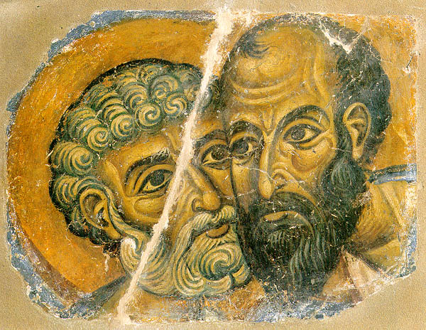

\[ [Home](index.md) \] \[ [Up](saintsof.md) \] \[ [September](septembe.md) \] \[ [October](october.md) \] \[ [November](november.md) \] \[ [December](december.md) \] \[ [January](january.md) \] \[ [February](feb.md) \] \[ June \] \[ [July](july.md) \] \[ [August](august.md) \]

INTRODUCTORY NOTE
-----------------

Since most of June will frequently fall during the Apostles’ Fast, a number of days are given in the Book of Hours as ’Alleluia’. This refers to the fact that, according to the strict Typikon, during the Apostles’ fast on Mondays, Wednesdays and Fridays the ’Lenten’ form of the office is used, with ’Alleluia’ rather than ’The Lord is God’ at the start of Matins, the prayer of St Ephrem with the prescribed prostrations and so forth.

------------------------------------------------------------------------

MONTH OF JUNE
=============

**It has 30 days. The day has 15 hours and the night 9**

**1. Of the holy martyr Justin the Philosopher.**

He was a platonic philosopher from Neapolis in Palestine. Born in 103 he came when already a grown man to the Christian faith because of the persecutions, which he saw the Christians enduring. He left for Rome, where he gave the Emperor Marcus Aurelius a written defence, through which he demonstrated the innocence and holiness of the Christian faith. He died a martyr in 167.

**Alleluia.**

**2. Of our father Nikephoros, patriarch of Constantinople, the Confessor.**

Born in Constantinople in 758, he served as secretary in the palace, but after embracing the monastic life, he practised asceticism not far from the royal city, of which he was also ordained patriarch on the 12th of April 806, but was forced to give up by the iconoclast Leo the Armenian on the 13th of March 815. He died between 826 and 828 in his seventieth year.

**Apolytikion. Tone 4. \[Common\]**

The truth of your actions proclaimed you to your flock as a rule of faith, an image of meekness and a teacher of self-control; and so you gained through humility the things on high, through poverty riches, O Father and high priest Nikephoros; intercede with Christ God that our souls may be saved.

**Kontakion. Tone 4. Today you have appeared.**

As you have received from heaven at God’s hands the crown of victory, glorious Nikephoros, save those who with faith honour you as Christ’s high priest and teacher.

**3. Of the holy martyr Lukillianos.**

**Alleluia.**

**4. Of our father among the saints Mitrophanes, archbishop of Constantinople.**

Ascending the throne in 320 he sent his vicar general to the 1st Ecumenical Council, unable to be present himself due to old age. He died between 325 and 327. Note that the Canons to the Trinity in the Octoichos are not this Mitrophanes’ compositions, but those of another Mitrophanes, appointed bishop of Smyrna around the middle of the 9th century, under patriarch Photios.

**Apolytikion. Tone 4. \[Common\]**

The truth of your actions proclaimed you to your flock as a rule of faith, an image of meekness and a teacher of self-control; and so you gained through humility the things on high, through poverty riches, O Father and high priest **** Mitrophanes; intercede with Christ God that our souls may be saved.

**Kontakion. Tone 2. Seeking things on high.**

You taught clearly the faith of Christ, and keeping it you truly increased your faithful flock to a multitude; and so, Mitrophanes, you now rejoice with the Angels and intercede unceasingly for us all.

**5. Of the holy bishop and martyr Dorotheos of Tyre.**

He became bishop of Tyre and having transferred to Odyssopolis in Thrace, or according to others to Edessa in Mesopotamia, he was murdered by idolaters under Julian the apostate in 361, at the age of 107. He was extremely learned and also knowledgeable in the Latin tongue.

**Apolytikion. Tone 4. \[Common\]**

You shared their way of life and you succeeded to the Apostles’ thrones; you found the practice, O God-inspired, to climb the heights of contemplation; rightly directing the word of truth; and in faith you struggled to shedding of blood, Bishop and Martyr Dorotheos; intercede with Christ God that our souls may be saved.

**6. Of our venerable father Hilarion the New, abbot of the monastery of the Dalmati.**

The venerable **Hilarion** was a native of Cappadocia and a fervent zealot for the veneration of the holy images. He was born in 775. Around 806-811 he became abbot of the monastery of the Dalmati (May 30th), was exiled by the emperor Leo the Armenian and subsequently by Theophilos, but was freed by the devout empress Theodora and became for a second time abbot of the monastery of the Dalmati from 842-845, when he died.

**7. Of the holy bishop and martyr Theodotos of Ankyra.**

**8. The Translation of the relics of the holy great martyr Theodore the General (Feb. 8th).**

**Permission for wine and oil.**

**Apolytikion. Tone 4. Lifted up on the Cross.**

O Champion Theodore, by the truth of your warfare you have become an outstanding general of the heavenly King, for with weapons of faith you wisely took your stand and utterly destroyed the massed ranks of the demons, and you appeared as a victorious athlete; and so with faith we call you blessed.

**Kontakion.**

Armed with the faith and grasping the word of God as a lance with courage of soul you mortally wounded the foe, Theodore, glory of Martyrs; with them do not cease to intercede with Christ God for us all.

**9. Of our father among the saints Cyril, archbishop of Alexandria.**

To-day the chief object of celebration is his falling asleep; on the 18th of January his flight from Alexandria as protector of good for the Church, because after it the Third Ecumenical Council of Ephesus was summoned and outlawed the blasphemous teaching of Nestorius (See Jan. 18th).

**Note that from to-day, on which the summer solstice takes place \[by the old calendar\], the sun begins to turn towards the south, and for us the nights begin to lengthen and the days to shorten.**

**Apolytikion. Tone 8. \[Common\]**

Orthodoxy’s guide, teacher of piety and reverence, beacon of the world, fair ornament of high priests, inspired by God, O wise Cyril, by your teaching you have enlightened all, O harp of the Spirit; intercede with Christ God that our souls may be saved.

**Kontakion. Tone 4. Lifted up on the Cross.**

You tore apart the webs of heresies by the power of Christ and enriched the Church with divine words; you cut out all the tares of Nestorius; therefore with choirs of Angels you stand before Christ, blessed Father, and earnestly entreat him to grant to all forgiveness of offences.

**10. Of the holy martyrs Alexander and Antonina.**

**11. Of the holy Apostles Bartholomew and Barnabas.**

**Bartholomew** was one of the Twelve, a native of Galilee. This is all we know for certain about him from the Gospels. About his apostolic work all say that he preached in Arabia and Persia and above all to the Indians, to whom he brought the Gospel of Matthew written in Hebrew, which Pantenus, a stoic philosopher and an outstanding teacher in the Christian school of Alexandria, found there a hundred years later (Eusebius, Eccl. Hist. V.19). He died according to the usual view by crucifixion, or by being flayed alive, at Albanopolis in Armenia, as is clear from the ancient and reliable tradition of the Armenians. Some hold that Bartholomew and Nathanael are one and the same, because, they say, that while the call of Bartholomew appears nowhere, that of Nathanael is mentioned (Jo.1:46-52); that the evangelists who speak of Bartholomew say nothing of Nathanael, while John, who alone mentions him, says nothing of Bartholomew; that Bartholomew is not properly his name, but a patronymic which means ‘son of Tholomaios’, which when translated means ‘one who hangs up or checks waters’, and is formed on Greek models from the Hebrew Tolmi or Tolmai (Josh.15:14; II Kingd.3:3). Bartholomew, then, means ‘son of Tholomaios’ or ‘Ptolomaios’ - since the name is also found written Bar-ptolomaios), just as Bartimaios means ‘son of Timaios’ (Mk 10:46), and this therefore could be his surname, while Nathanael is his proper name. Finally they say that John seems to number Nathanael with the Apostles where he says: ‘There were together Simon Peter and Thomas, called Twin, and Nathanael from Cana of Galilee‘ (Jo.21:2).

**Barnabas** was a native of Cyprus and one of the Seventy, a Levite by tribe and a fellow pupil with Paul under Gamaliel. At first he was called Joses, but his name was later changed to Barnabas, which means ‘son of consolation’, no doubt to differentiate him from the other Joses, called Barsabas and nicknamed ‘Justus’. This Barnabas owned some land which he sold and brought the money to the Apostles (Acts 1:23 and 4:36-37). He evangelised many places as Paul’s travelling companion and on his own. Finally he underwent a martyr’s death, stoned by the Jews in his native land after the year 51. In the reign of Zeno, in 478, his sacred relics were found, with the Gospel according to Matthew, written in Greek in Barnabas’ own hand, on his chest, and were offered to Zeno. From the latter the archbishop of Cyprus received the privilege of signing his name in scarlet letters.

**Permission for wine and oil.**

**Apolytikion. Tone 3. \[Common\]**

O holy Apostles, intercede with the merciful God to grant our souls forgiveness of sins.

**Kontakia: of St Bartholomew. Tone 4.
Today you have appeared.**

You appeared like a great sun to the Church, by the beams of your teachings and awesome wonders guiding to the light all who honour you, Bartholomew, Apostle of the Lord.

**Another: of St Barnabas. Tone 3. Today the Virgin.**

You became a true servant of the Lord and appeared as the first of the Seventy Apostles; together with Paul you set your preaching in a clear light revealing Christ as Saviour to all; therefore with hymns, O Barnabas, we celebrate your godly memory.

**12. Of our holy fathers Onuphrios of Egypt and Peter of Athos.**

**Apolytikion. Tone 1. \[Common\]**

Citizen of the desert and Angel embodied, and wonder-worker you have been declared, O God-bearing father Onuphrios; by fasting and by vigil and by prayers, receiving gifts of grace from heaven, you heal the sick and the souls of those who have recourse to you in faith. Glory to him who gave you strength; glory to him who crowned you; glory to him who through you works healing for all!

**Another, common to both. Tone 1. \[Common\]**

God of our fathers, who always act towards us in accordance with your fairness, do not remove your mercy from us; but at their intercessions pilot our lives in peace.

**Kontakion. Tone 2. Seeking things on high.**

You were revealed as a radiant star for monks; like moonlight at night you flood the ends of the earth; so, Father, you shine like the sun by your ascetic life. Therefore, Onuphrios, do not cease to intercede on behalf of us all.

**Another. Tone 8.**

Receiving in your heart the spiritual and heavenly light, you appeared, Peter, as a vessel of the uncontainable Trinity, and you received the grace of wonders as you cried: Alleluia!

**13. Of the holy martyr Aquilina.**

She was martyred under Diocletian at Byblos in Palestine.

**Apolytikion. Tone 4. \[Common\]**

O Jesu, your lamb cries aloud: O my Bridegroom, I long for you; and seeking you I struggle, and I am crucified and buried with you in your baptism; and I suffer for your sake, that I may reign with you; and I die for you, that I may live in you; but as a spotless victim now accept one who with longing is slain for you. Through her prayers, as you are merciful, save our souls!

**14. Of the holy prophet Elisaius; and of our father among the saints Methodios, patriarch of Constantinople, the Confessor.**

The prophet, the son of Saphat, was from the city of Abel-Meoul, or Abel-Neoul, in the land of Manassee. His earlier profession was that of farmer. In the year 908 BC., on orders from God, the prophet Elias anointed him as prophet in his place, when he was ploughing the land with twelve yoke of oxen. These he slaughtered on the spot and using the ploughs and other wooden farm implements he roasted them and gave them as food to the people. When he had said good-bye to his relatives he followed Elias and served him until the latter’s assumption into heaven (July 20th). Having received his teacher’s cloak and a double gift of his prophetic spirit, he showed by the wonderful works, which the Fourth Book of Kingdoms recounts of him, whose disciple he was indeed. He lived until 839 BC. and died full of years and was buried in Samaria. But God also glorified him after his death, because a year later as a corpse was being carried out for burial, the bearers suddenly catching sight of a band of Moabite robbers threw the corpse onto the prophet’s tomb and fled. But hardly had the corpse come near the bones of the prophet than it came back to life at once and stood up on its feet (IV Kingd.13:20-21). Sirach also mentions this when he says: ‘In his life he worked miracles; and in his death his works were wonderful‘ (48:44). By this the reverence of the faithful for the relics of the saints is increased, and the devout opinion of the Orthodox Church about them is justified (Jan.16th).

**Methodios** was born in Syracuse in Sicily of wealthy parents towards the end of the 8th century. As a priest he was sent to Rome as a legate around 815-816 by Nikephoros of Constantinople, who had been banished by Leo the Armenian (June 2nd). After his death he returned to Constantinople, but as a zealot for the honour of the holy images he was banished on the spot to the little island of Andrew the First-called, which lies off Akritis near Bithynia, by the emperor Michael the Stammerer. When he too died, he was briefly freed, but was imprisoned again by Theophilos for the same zeal in a pitch dark prison, as if in a tomb, where he was fed by a poor fisherman. Finally, when the Church recovered her freedom under the empress Theodora, he once more ascended the patriarchal throne of Constantinople in 842, which he governed for four years and died in 846. He contributed to the re-erection of the holy images.

**Apolytikia: of the Prophet. Tone 4. Come quickly to help.**

The angel embodied, the Prophets’ foundation, the second forerunner of the coming of Christ, Elias the glorious by sending down grace from on high to Elisaius drives out diseases, cleanses lepers; and so he overflows with healings for those who honour him.

**Of the Bishop. Same Tone. \[Common\]**

The truth of your actions proclaimed you to your flock as a rule of faith, an image of meekness and a teacher of self-control; and so you gained through humility the things on high, through poverty riches, O Father and high priest Methodios; intercede with Christ God that our souls may be saved.

**Kontakia: of the Prophet. Tone 2. Seeking things on high.**

You were revealed as a Prophet of God, blest Elisaius, when you received the double share of the grace which you truly deserved; for you became the companion of Elias and with him you intercede unceasingly with Christ God on behalf of us all.

**Of the Bishop. Same Tone. You have taken.**

As though without flesh you struggled on earth, and you inherited heaven, O Methodios, as you made clear to the ends of the earth the veneration of the Ikons; for when you had passed through toils and tribulations beyond measure you did not cease with boldness to confound those who rejected the Ikon of Christ.

**15. Of the holy prophet Amos.**

He was from the city of Tekoa in the territory of Zabulon, a private citizen, who was formerly a herdsman of goats and sheep, as he testifies himself (Am.7:44-45). He began to prophesy two years before the earthquake (ibid.1:1), which the critics date to the twenty fifth year of the reign of Ozias, king of Juda, around 785 BC. Later the false priest of Bethel, Amasias, brought about his death. His prophecy is divided into nine chapters and ranked third among the Minor Prophets. This Amos is different from the father of the prophet Isaias, who was also called Amos.

**Alleluia.**

**16. Of our holy father Tychon, bishop of Amathon in Cyprus.**

**Apolytikion. Tone 1. \[Common\]**

Citizen of the desert and Angel embodied, and wonder-worker you have been declared, O God-bearing father Tychon; by fasting and by vigil and by prayers, receiving gifts of grace from heaven, you heal the sick and the souls of those who have recourse to you in faith. Glory to him who gave you strength; glory to him who crowned you; glory to him who through you works healing for all!

**Kontakion. Tone 3. Today the Virgin.**

Pre-eminent by an ascetic life beloved by God, O Saint, you received from on high power of the Paraclete to destroy the wooden idols of error, to save peoples, drive out demons and heal diseases; therefore, blest Tychon, we honour you as God’s friend.

**17. Of the holy martyr Isavros and his companions; and of the holy martyrs Manuel, Sabel and Ishmael.**

They were Persians by race, brothers according to the flesh, soldiers by rank. They were martyred under Julian the apostate at Constantinople in the year 363.

**Apolytikion. Tone 4. \[Common\]**

Your Martyrs, O Lord, by their struggle obtained crowns of incorruption from you, our God; for with your might they destroyed tyrants, and shattered the feeble insolence of the demons: at their prayers, O Christ God, save our souls.

**Kontakion. Tone 2. Seeking things on high.**

Wounded by the faith of Christ and faithfully drinking his cup, you hurled to the ground the idols of the Persians and their insolence, as equal in number to the Trinity you make intercession for us all.

**18. Of the holy martyr Leontios.**

He was martyred under Vespasian in about 73.

**Apolytikion. Tone 4. \[Common\]**

Your Martyr, O Lord, by his struggle obtained the crown of incorruption from you, our God; for with your might he destroyed tyrants, and shattered the feeble insolence of the demons: at his prayers, O Christ God, save our souls.

**Kontakion. Tone 3. Today the Virgin.**

You put shame the evil plots of tyrants, refuted the godless worship of the Greeks and made the knowledge of God shine on all mankind by teachings of true religion, godly Martyr; therefore with love we honour your memory, wise Leontios.

**19. Of the holy apostle Jude.**

He was one of the choir of the Twelve, called by Luke (6:16 and Acts 1:13) Jude of James, that is the brother of James the brother of God and consequently a relative of the Lord in his humanity; by Matthew (10:3) he is called Lebaios, surnamed (he says) Thaddaios, who is different from the Thaddaios who was one of the Seventy, who healed the suffering of Abgar or Agbar, according to Eusebius (Hist. Eccl.I.13). He preached in Mesopotamia, Arabia, Idumea and Syria and ended the course of his godly apostolate as a martyr in Beirut, as they say, around the year 80. His is the last of the Catholic Epistles, written to the faithful Jews in the diaspora after the capture of Jerusalem by Vespasian.

**Apolytikion. Tone 1. The soldiers watching.**

As we know you, Jude, to be a relative of Christ and a valiant Martyr we hymn your praise as one who trampled on error and kept the faith; and so to-day as we feast your all-holy memory, we receive at your prayers release from our sins.

**Kontakion. Tone 1. The angelic Choir.**

You have dawned for us as a God-given shoot from a noble root, eyewitness of the Lord, Apostle, Brother of God and all-wise herald of Christ; with the fruits of your words you nourish the whole world as you teach the orthodox faith of the Lord, as initiate of grace.

**20. Of the holy bishop and martyr Methodios, bishop of Patara.**

Because of his wisdom and virtue he was nicknamed ’Evboulos’. He became bishop of the Patara in Lycia, and was later translated to the throne of Tyre, where he underwent a martyr’s death in Chalkis of Coelosyria in the year 311 under Diocletian. Of his surviving writings there is one entitled The Virgins’ Banquet.

**21. Of the holy martyr Julian of Tarsis.**

**22. Of the holy bishop and martyr Eusebius of Samosata.**

A zealot for the true faith and persecutor of the Arians, he was exiled by the emperor Valens, a supporter of the Arians, to the region of the Danube. After Valens death the holy Eusebius returned to his diocese, where he met a blest end when an Arian woman hurled a roof tile at the bishop martyr’s head.

**23. Of the holy woman martyr Agrippina.**

****24. The Nativity of the honoured and glorious Forerunner and Baptist John.****

This greatest of those born of women and by the testimony of God himself a prophet higher than all the prophets (Matt.11:9-11), Elizabeth, old and barren, gave birth to, filling all her relatives and neighbours with joy and wonder after her child-bearing. But far more wonderful was what happened afterwards, on the eighth day, the day of the circumcision and the child’s naming. Those present called him by his father’s name, Zachary. The mother, under divine inspiration, answered and said: No, but he is to be called John. The father being asked about this requested by signs, for he was unable to speak (Sept.23), a writing tablet and wrote: John will be his name. And immediately his mouth was opened and his tongue freed from it nine month bondage, and filled with the Holy Spirit he sang the second of the New Testament canticles, blessing the God of Israel, who had fulfilled the promises made to his fathers, who had visited those who sat in darkness and the shadow of death and had sent out to them his saving light. He prophesies too about the child, that he will be called the prophet of the Most High and Forerunner of Jesus Christ (Lk 1:57-79). ’But the child John, who appeared full of grace, grew (says the evangelist) and was mighty in spirit and he was in the wilderness until the day of his manifestation to Israel’ (ibid.80).

**No work and permission for fish.**

**Apolytikion. Tone 4. Come quickly to help.**

Prophet and Forerunner of the coming of Christ, we cannot praise as we should, who honour you with love; for your mother’s barrenness and your father’s dumbness have bee abolished by glorious and holy birth, and the incarnation of the Son of God is proclaimed to the world.

**Kontakion. Tone 3. Today the Virgin.**

She who before was barren to-day bears the Forerunner of Christ, and he is the fulfilment of every prophecy; for the One whom the prophets worshipped on him he laid his hand in the Jordan and was declared to be Prophet, Herald and Forerunner of God the Word.

**25. Of the holy virgin martyr Febronia.**

She was martyred under Diocletian in the year 303.

**Apolytikion of the Forerunner.**

Prophet and Forerunner of the coming of Christ, we cannot praise as we should, who honour you with love; for your mother’s barrenness and your father’s dumbness have bee abolished by glorious and holy birth, and the incarnation of the Son of God is proclaimed to the world.

**And of the Martyr. Tone 4. \[Common\]**

O Jesu, your lamb cries aloud: O my Bridegroom, I long for you; and seeking you I struggle, and I am crucified and buried with you in your baptism; and I suffer for your sake, that I may reign with you; and I die for you, that I may live in you; but as a spotless victim now accept one who with longing is slain for you. Through her prayers, as you are merciful, save our souls!

**Kontakion of the Forerunner, as above.**

She who before was barren to-day bears the Forerunner of Christ, and he is the fulfilment of every prophecy; for the One whom the prophets worshipped on him he laid his hand in the Jordan and was declared to be Prophet, Herald and Forerunner of God the Word.

**26. Of our venerable father David of Thessaloniki.**

**Apolytikion. Tone 8. \[Common\]**

In you, Father, was preserved unimpaired that which is according to the image, for you took up the cross, and you followed Christ; and by your deeds you have taught us to despise the flesh, for it passes away; but to care for the soul, which is a thing immortal; and therefore your spirit, holy David, rejoices with the Angels.

**27. Of our venerable father Sampson the Hospitaller.**

He came from Rome and flourished under Justinian the Great. He practised medicine, and after the emperor had been cured by him he built him a large hospital, known to history as Sampson’s Hostel.

**Apolytikion. Tone 8.**

By your patience you gained your reward, venerable Father, you persevered unceasingly in prayers, loving the poor and bringing them help. But Sampson, inspired and blessed, intercede with Christ God that our souls may be saved.

**Kontakion. Tone 8. As firstfruits of nature.**

As we hurry to your godly tomb, venerable Sampson and inspired, we hymn you with hymns and psalms as best of physicians and acceptable minister, as we glorify Christ who granted you such a grace of healings.

**28. The Translation of the relics of the holy and wonder-working Unmercenaries Cyrus and John (see 31 January).**

**Apolytikion. Tone 5.**

Christ our God, you have given us the wonders of your Martyrs as an invincible wall; at their entreaties scatter the counsels of the nations and strengthen the sceptres of the kingdom, as you alone are good and love mankind.

**Kontakion. Tone 2. Not honouring an image.**

Let us the faithful sing with upraised voice the great source of healing for the world, Christ’s well-loved pair, two beacons shining out with the beams of their healings, as we cry out in their temple: Cyrus and John, the givers of wonders, the physicians of the sick, shed their light on the ends of the earth!

****29. Of the holy, glorious and all-praised Princes of the Apostles, Peter and Paul.****

Of these, **Peter**, blest of God, was from Bethsaida in Galilee, son of Jonas, brother of Andrew the First-called, a fisherman by trade, a private citizen and a poor man. He was called Simon at first, but later his name was changed to Peter by Jesus himself when he looked on him and said: You are Simon, son of Jonas, you will be called Cephas, which means Peter (Jo.1:43). Raised by the Lord the rank of apostle he became inseparable from him and a zealous disciple. He followed him from the beginning of his saving preaching until the Passion, in the courtyard of the High Priest Caiaphas; where he denied Christ three times through his fear of the Jews and the imminent danger. But through the most bitter tears he once again received pardon of his own offence. After Christ’s Resurrection and the Descent of the All-holy Spirit he preached him in Judea, Antioch and certain areas of Asia, finally reaching Rome, where, crucified by Nero, head downwards and feet upwards, he departed to the eternal dwellings in the year 66 or 68. He left to Christ’s Church two Catholic Epistles.

The inspired **Paul**, Christ’s vessel of election, the glory of the Church, the Apostle of the nations and teacher of the whole world, was Jewish by race, of the tribe of Benjamin, Tarsus his fatherland, a Roman citizen by rank, knowledgeable in the Greek language, highly skilled in the science of the teachers of the Law, a Pharisee by order, born of a Pharisee father and a pupil under the Pharisee Gamaliel, the celebrated teacher of the Law in Jerusalem. And as a result a most fervent zealot at the start for his ancestral traditions, and a dedicated persecutor of Christ’s Church, called at time Saulos or Saul (Acts 22:3-4). In around the year 36 when, under the violent impulse of his frenzy and rage against the Lord’s disciples he had set out for Damascus, bearing letters of authorisation from the High Priest to bring from there bound to Jerusalem all those he might find who believed in the Christ, he was nearing the city at mid-day, he was suddenly surrounded by a heavenly light and falling to the ground he heard a voice saying to him: Saoul, Saoul, why do you persecute Me? And on his asking: Who are you, Lord? he heard again: I am Jesus whom you persecute. It is hard for you to kick against the goad. The heavenly voice and the flood of light filled him with terror and blinded him for a time. He was led by the hand into the city and when he had been baptised according to a divine revelation by the apostle Ananias (Oct.1st), he opened both his bodily and spiritual eyes to recognise the Sun of justice that had dawned. And immediately - O how wonderful a change! - he spoke boldly in the synagogues, and, against every expectation of the Jews, proclaimed Christ, that He is the Son of God (Acts 9:1-20).

His subsequent zeal for the preaching of the Gospel, his numberless toils and manifold tribulations, the blows, the imprisonments, the beatings, the stonings, the shipwrecks, the journeyings, the dangers on land and sea, in cities and deserts, the constant vigils, the daily fasts, the penury, thirst and nakedness, and all the other things that he underwent for the name of Christ, which he carried before nations and kings and Israelites, and above all his care for all the Churches, his burning longing for the salvation of all, through which he became all things to all men, that he might, if possible, save all, by which, his heart aflame, he constantly journeyed to visit them all, and like a bird he flew to Asia and Europe, to East and West, staying nowhere, stopping nowhere: all these are recounted in detail in the book of Acts and by himself in his Epistles. His Epistles, which number fourteen and have been expounded in 250 homilies by Saint Chrysostom, display the elevation of his thoughts, greatness of th revelations granted him and the wisdom given him by God, through which he wonderfully traverses the Old with the New Testament, expounding the mysteries of the latter, which were hidden under types in the former; he enlarges the ethical teaching the Gospel and precisely explains the duties of each rank and age and condition of men. In all this having established his mouth as a spiritual trumpet and his tongue as brighter than the sun, through them he made the word of truth sound clearly and enlightened the ends of the inhabited world. Finally, when he had fulfilled the work of his ministry, he too died a martyr, beheaded in Rome itself under Nero, at the same time, some say, as St Peter was crucified.

The change of his name occurs in Acts, when at Paphos in Cyprus he converted the proconsul, who was a pagan named Sergius Paulus, to Christ (13:6-12). The reason is that while a Jew by race and religion he was called Saul, as a Roman by citizenship, being born in Tarsus in Cilicia, he was also called Paul, and when he began to preach the word of God to the pagans he used this second name, as more usual and better known to the Greeks and Romans. Such is the view of some.

**No work and permission for fish.**

**Apolytikion. Tone 4.**

Princes of the Apostles and Teachers of the world intercede with the Master of all to grant peace to the whole world and to our souls his great mercy.

**After the 3rd Ode the Ypakoï. Tone 8.**

What prison did not have you as prisoner? What Church does not have you as preacher? Damascus boasts in you Paul, for it saw you cast to earth by light, Rome received your blood and it too is filled with pride; but Tarsus rejoices more than all and with love honours your swaddling clothes. But Paul, Apostle and boast of the whole world, come, strengthen us.

**After the 6th Ode Kontakion. Tone 2. Model melody.**

You have taken to the enjoyment of your good things and to their rest, Lord, the sure and god-inspired heralds, the summit of the Apostles; for you accepted their toils and death above every holocaust, who alone know the secrets of the heart.

**30. The assembly of the holy, glorious and all-praised Twelve Apostles.**

Their names are these: **Simon** called Peter and **Andrew** his brother and also the First-called; **James** the son of Zebedee and **John** his brother, the evangelist and theologian; **Philip** and **Bartholomew**, **Thomas** and **Matthew** the tax-collector, who is also Levi, the evangelist; **James** son of Alphaeus and **Jude** the brother of James the brother of God, who is also called Lebbaeus and Thaddaeus; **Simon** the Canaanite, which means Zealot, and **Matthaias**, who was elected in the place of the traitor Judas (See 9 Aug).

**No work and permission for wine and oil.**

**Apolytikion of the Princes.**

Princes of the Apostles and Teachers of the world intercede with the Master of all to grant peace to the whole world and to our souls his great mercy.

**Another. Tone 3. \[Common\]**

O holy Apostles, intercede with the merciful God to grant our souls forgiveness of sins.

**Kontakion. Tone 2. Seeking things on high.**

To-day Christ the Rock radiantly glorifies the rock of the faith, the chief of the disciples, and with Paul the whole regiment of the twelve. As we faithfully celebrate their memory we glorify him who glorified them.

------------------------------------------------------------------------

All texts and translations on this page are copyright to
Archimandrite Ephrem ©

**This page was last updated on 03 November 2008**
