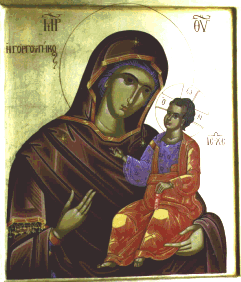

\[ [Home](index.md) \] \[ [Up](horologion.md) \]
\[ [Saints of the Month](saintsof.md) \]
\[ [Vespers for Sundays and Feasts](vespers.md) \]
\[ [Matins for Sundays and Feasts](mat-sun.md) \]
\[ [Weekday Matins](weekday_matins.md) \]
\[ [Midnight Office](midnight_office.md) \]
\[ [Saturday Midnight Office](saturday_midnight_office.md) \]
\[ [Sunday Midnight Office](sunday_midnight_office.md) \]
\[ [Lesser Hours](lesser_hours.md) \]
\[ [Small Compline](small_compline.md) \]
\[ [Lenten Offices](lenten_offices.md) \] \[ Little Paraklesis \]

**SERVICE\
OF THE LITTLE CANON OF SUPPLICATION\
TO THE MOST HOLY MOTHER OF GOD**

****

PREFACE
-------

****A**ugust in Constantinople was a month of disease and pestilence and
so it was the custom to carry the True Cross in procession through all
the quarters of the City during the first two weeks of the month. The
office for the first of the month still commemorates this practice, as
does the solemn blessing of Holy Water, which is performed in many
churches on that day, although it is the normal Orthodox custom to do so
on the first of every month. In Greek use it is the custom to sing the
Office of Supplication to the Mother of God each evening during the
first fortnight of August. This may well be a survival of the ancient
practice in an adapted form.**

**In present practice the two Canons, the Great and the Little, are sung
on alternate evenings, but since the Typikon of the Great Church does
not prescribe the office for the 1st, in many places the Little Canon is
sung on the 2nd and the Great on the 3rd and so forth. The full rite
supposes that the office is sung at Vespers immediately after the Song
of Symeon, ‘Now, Master’*.* It is the custom in many monasteries of the
Holy Mountain and elsewhere to sing the Canon of the Mother of God from
the *Theotokarion,* with its Prosomia, each weekday evening at this
point of Vespers. The Canons of Supplication replace this during the
first fortnight of August.**

**Use of this office is not confined to the first fortnight of August,
and so the two forms of the office are given here. It is the equivalent
of the Slav *Molieben*, but Greek use has never reduced the Canon simply
to the refrains between the troparia, omitting the troparia themselves,
as in the common Slav use. The Canon itself is used as the first canon
at Matins for those feasts of Saints on which the *Paraklitiki* is not
used and which do not have a special canon to the Mother of God.**

**The present translation has been made in such a way that it can be
sung to the standard Byzantine melodies and so the text has been laid
out in accordance with the metrical structure of the original. When the
texts are set out as prose, the current Greek books use commas to
indicate musical punctuation; a confusing practice, since commas are
also used for ordinary punctuation of the text. The use of the monastery
of Grottaferrata was to indicate the metrical structure with asterisks,
and a number of modern Greek books have adopted this. The hymn ‘It is
truly right’ and its Megalynarion, ‘Greater in honour’, which are taken
from the official translation of the Divine Liturgy of the Archdiocese
of Thyateira and Great Britain, do not fit exactly to the melody, but
can be sung quite easily without written music by an experienced
singer.**

**Clearly certain liberties have had to be taken with the text in order
to fit the translation to the strict musical forms of the original, but
we believe that no ideas have been introduced which are not in the
original and we have tried to limit additions to standard epithets and
occasional synonymous expansions. The work of translation has been done
by Archimandrite Ephrem and David Melling. David Melling has done all
the work on the music, which is also available. We hope in time to
publish similar versions of the Great Canon of Supplication and of the
Office of the Akathist to the Mother of God.**

**It should be noted that the Office of Supplication is celebrated for
the living, and the departed should not be commemorated in the
litanies.**

**The icon of the Gorgoÿpikoos,** ’**She Who Responds Quickly**’**,
Proctectress of the Monastery of Docheiariou on the Holy Mountain, was
painted for Archimandrite Ephrem by Monk Silouan of the Monastery of St
Arsenios in Chalkidiki. This icon is an icon of the Mother of God
’Hodegitria’, in whose honour the service is sung, as the penultimate
Megalynarion makes clear.**

------------------------------------------------------------------------

**SERVICE\
OF THE LITTLE CANON OF SUPPLICATION\
TO THE MOST HOLY MOTHER OF GOD**

{width="241" height="282"}

****Icon of the Holy Mother of God Gorgoÿpikoos****

Sung in every trouble and affliction of soul.

**During the first fortnight of August it is sung, alternating with the
Great Canon of Supplication, joined to Vespers. In this case the opening
blessing is omitted and the service begins immediately after the Song of
Symeon,** Now, Master, **with Psalm 142**.

**The Priest gives the blessing:** Blessed is our God always, now and
for ever, and to the ages of ages.

**Reader:** Amen.

\[**If there is no priest we begin,** Through the prayers of our holy
fathers, Lord Jesus Christ our God, have mercy on us. Amen.\]

**Then at once the following Psalm.**

**Psalm 142**

Lord, hear my prayer; in your truth give ear to my supplication, and in
your justice hear me. Do not enter into judgement with your servant, for
in your sight no one living can be justified. For the enemy pursued my
soul; humbled my life to the ground; made me dwell in darkness, like
those for ever dead. My spirit in me grew weary, and my heart was
troubled within me. I remembered days of old; I meditated on all your
works. I made the works of your hands my meditation. I stretched out my
hands towards you; my soul thirsted for you like a waterless land. Hear
me swiftly, O Lord; my spirit has failed. Do not turn your face from me,
or I shall be like those who go down to the Pit. Make me hear of your
mercy in the morning, for I have hoped in you. Make known to me the way
in which I should walk, for to you I have lifted up my soul. Deliver me
from my enemies, Lord; I have run to you for shelter. Teach me to do
your will, for you are my God. Your good Spirit will guide me in an
upright land. For your name’s sake, O Lord, you will give me life. In
your justice you will bring my soul out of trouble; in your mercy slay
my enemies, and destroy all those who afflict my soul, for I am your
servant.

**After the Psalm we sing the following in Tone 4.**

The Lord is God, and has appeared to us. Blessed is he who comes in the
name of the Lord. **(This is sung after each of the following verses by
the two choirs alternately)**

**Verse 1:** Give thanks to the Lord, for he is good: his mercy endures
for ever.

**Verse 2**: All the nations surrounded me, but in the name of the Lord
I drove them back.

**Verse 3:** This is the Lord’s doing, and it is marvellous in our eyes.

**Then these Troparia.**

**Tone 4. Lifted up on the Cross.**

Now to God’s Mother let us humble sinners run in haste\
and in repentance let us fall down before her feet,\
crying aloud with fervour from the depths of our souls,\
‘Sovereign Lady, help us now,\
have compassion upon us,\
hasten, for we perish\
from our many offences.\
Let not your servants go empty away;\
we have you as our only hope’.

Glory. **The same again, or the Apolytikion of the Church.**

\[**Strictly, if the latter is not in Tone 4, the following Theotokion
should be replaced by one in the appropriate Tone.**\]

Both now. **The following.**

Though most unworthy, may we never by silence\
fail to proclaim your mighty acts and accomplishments,\
for if you do not stand to intercede for us all,\
Mother of our God, who then\
will preserve us in freedom?\
Who would have delivered us\
from such terrible dangers?\
O Sovereign Lady, from all kinds of threats\
you save your servants,\
may we not abandon you.

**Then Psalm 50, read by the Reader.**

**Psalm 50**

Have mercy on me, O God, in accordance with your great mercy. According
to the multitude of your compassion blot out my offence. Wash me
thoroughly from my wickedness, and cleanse me from my sin. For I
acknowledge my wickedness, and my sin is ever before me. Against you
alone I have sinned and done what is evil in your sight, that you may be
justified in your words and win when you are judged. For see, in
wickedness I was conceived and in sin my mother bore me. For see, you
have loved truth; you have shown me the hidden and secret things of your
wisdom. You will sprinkle me with hyssop and I shall be cleansed. You
will wash me and I shall be made whiter than snow. You will make me hear
of joy and gladness; the bones which have been humbled will rejoice.
Turn away your face from my sins and blot out all my iniquities. Create
a clean heart in me, O God, and renew a right Spirit within me. Do not
cast me out from your presence, and do not take your Holy Spirit from
me. Give me back the joy of your salvation, and establish me with your
sovereign Spirit. I will teach transgressors your ways, and sinners will
turn to you again. O God, the God of my salvation, deliver me from
bloodshed and my tongue will rejoice at your justice. Lord, you will
open my lips, and my mouth will proclaim your praise. For if you had
wanted a sacrifice, I would have given it. You will not take pleasure in
burnt offerings. A sacrifice to God is a broken spirit. A broken and a
humbled heart God will not despise. Do good to Sion, Lord, in your good
pleasure, and let the walls of Jerusalem be rebuilt. Then you will be
well pleased with a sacrifice of justice, oblation and whole burnt
offerings. Then they will offer calves upon your altar.

**And we begin the Canon.**

**A Composition by Monk Theostiriktos, or, as some say, Theophanes.**

**Ode 1, Tone 8. The Irmos.**

****O****n crossing the water as though dry land,\
escaping from Egypt\
and its miseries in his flight,\
the Israelite raised his voice and cried aloud,\
‘To our Redeemer and our God now let us sing!’

**Troparia.\
In each Ode, after the first two Troparia we sing,***\
*Most holy Mother of God, save us!

****B****y many temptations I am held fast,\
and seeking salvation\
come for refuge in flight to you\
O Mother of God’s own Word and Virgin,\
from my dread dangers and troubles now rescue me.

****T****he passions torment with their assaults,\
despondency’s burden\
presses heavily on my soul,\
with the calm of your Son and God, pure Maiden,\
O All-immaculate Virgin, now give me peace.

Glory.

****T****o God and our Saviour, you once gave birth,\
pure Maiden, I beg you,\
from dread troubles may I be saved,\
for as I now run to you for refuge,\
it is to you that I lift both my soul and mind.

Both now.

****I****n body and soul, sick as I am,\
consider me worthy,\
only Mother of our true God,\
of your godly providence and kindness,\
for you are good and the one who gave birth to Good.

**Ode 3. The Irmos.**

****Y****ou constructed the heavens’ high vault, O Lord, and the
Church,\
has you as its builder, do you establish me in your love,\
you are the pinnacle\
of all desires, and foundation,\
mankind’s only Lover, of all who believe in you.

**Troparia.**

****A****s protection I set you and as the shield of my life,\
you gave birth to God, Virgin Mother, guide me as a pilot now\
into your anchorage,\
you the support of the faithful,\
source of all good things, you alone the one all-praised.

****I**** entreat you, O Virgin, dispel the strife in my soul,\
pacify, I pray you, the tempest of my despondency,\
for you, O Bride of God,\
gave birth to him who is calm’s source,\
you gave birth to Christ, you alone are the one all-praised.

****B****enefactor is he whom you bore and cause of all good,\
pour out then for all the abundant wealth of his benefits,\
power to do all things,\
is yours who bore Christ the mighty,\
powerful in strength is he, O greatly blessed by God.

****C****ruel illnesses test me, and passions most damaging,\
help me, I beseech you, O Virgin, aid me, all-blameless one,\
for I know you to be\
the inexhaustible treasure,\
never failing storehouse, of healings that have no price.

**Other Troparia.**

Save your servants,\
from every danger, O Mother of God,\
for next after God\
we all fly for refuge to you\
as unbreachable wall and protection.

With kindness, all-praised Mother of God,\
look on the dire affliction of my body\
and heal the pain of my soul.

**Then the Litany of supplication.**

**Priest:** Have mercy on us, O God, according to your great mercy, we
pray you, hear and have mercy.

**People:** Lord, have mercy **(three times after each petition)**.

**Priest:** Also we pray for our Archbishop **N**., and for all our
brotherhood in Christ.

Also we pray for mercy, life, peace, health, salvation, visitation,
pardon and forgiveness of sins for the servants of God, all devout and
Orthodox Christians, those who dwell in or visit this city and parish,
the wardens and members of this church and their families.

Also we pray for the servants of God who make this supplication, and for
the servants of God **(and he commemorates the names of those for whom
the supplication is being made)**.

**People:** Lord, have mercy **(x3 or x12).**

**Priest:** For you, O God, are merciful and love mankind, and to you we
give glory, Father, Son and Holy Spirit, now and for ever, and to the
ages of ages.

**People:** Amen.

**Kathisma. Tone 2. Seeking things on high.**

Invincible rampart, fervent intercession,\
the wellspring of mercy, refuge of the world, to you\
we all cry insistently,\
‘Sovereign Lady, Mother who bore our God,\
hasten, from perils swiftly set us free,\
alone you are ever swift in our defence’.

**Ode 4. Irmos.**

****I**** have heard, Lord, the mystery\
of your dispensation, I heard and was afraid,\
I have meditated on your works\
and exalt and glorify your Deity.

**Troparia.**

****I**** entreat you, O Bride of God,\
still my passions’ tumult, the tempest of my faults,\
still the raging turmoil in my soul;\
you who brought to birth my pilot and my Lord.

****A****s I call on you grant to me\
your compassion’s depths, let me know your tenderness,\
you who bore the Saviour of all those\
who now lift their voices and who sing your praise.

****A****ll-Immaculate Virgin,\
we acknowledge you as the Mother of our God\
as we offer you our hymns of thanks,\
for your many gracious gifts which we enjoy.

****A****s our hope and assurance,\
rampart of salvation which none can overthrow\
we have gained you, highly honoured one,\
and from every trouble you deliver us.

**Ode 5. The Irmos**.

****L****ord, enlighten us,\
with your ordinances and commands,\
and with your upraised arm grant unto us your peace,\
for you alone, O Lord, are Lover of humanity.

**Troparia.**

****F****ill my heart, I pray,\
with your gladness and unsullied joy,\
Virgin most pure, the only Mother of our God,\
for you who gave birth to him who is the cause of gladness.

****C****ome, deliver us\
from all dangers, Mother of our God,\
you bore eternal liberation, Maid most pure,\
the peace which passes all understanding came to birth from you.

****D****issipate the fog,\
Bride of God, the murk of my misdeeds,\
with the illumination of your radiance,\
you who gave birth to the divine and pre-eternal light.

****H****eal me, O Most Pure,\
heal the sickness that afflicts my soul,\
making it worthy of your kindness and your care,\
and by your fervent intercession grant me health, I pray.

**Ode 6. Irmos.**

****I**** pour out\
my supplication to the Lord,\
and to him I shall declare my afflictions,\
for, see, my soul has been filled up with evils\
and now my life has been drawn very close to Hell.\
Like Jonas I appeal to you,\
‘O my God, bring me up from corruption!’

**Troparia.**

****A****s from death\
and from corruption and decay,\
when to death and to decay it captive,\
he saved my nature held fast by corruption\
giving himself over into the hand of death,\
O Virgin, beg your Lord and Son\
from the malice of foes to deliver me.

****I**** know you\
to be my life’s sure guardian\
its protection and shield, O pure Virgin,\
you who dispel the great throng of temptations,\
and drive away assaults of demon hordes,\
unceasingly I plead with you,\
‘From the passions’ corruption deliver me’.

****O**** Maiden,\
complete salvation of our souls,\
we have gained you as our rampart of refuge,\
as our relief in afflictions and torment,\
and in your light evermore we are filled with joy.\
O Sovereign Lady, save us now\
from the passions and dangers besetting us.

****I****n sickness\
and with no healing in my flesh\
now I lie upon my bed, yet I implore you,\
as you gave birth to our God and the world’s Saviour,\
to him who frees us from sickness and malady,\
O good one, hear me, I implore,\
‘From disease’s corruption now raise me up’.

**Other Troparia.**

Save your servants,\
from every danger, O Mother of God,\
for next after God\
we all fly for refuge to you\
as unbreachable wall and protection.

Immaculate,\
who through a word gave birth to the Word\
beyond explanation in the last days,\
make intercession,\
as you have a mother’s freedom to speak.

**Then again the Litany of supplication.**

**Priest:** Have mercy on us, O God, according to your great mercy, we
pray you, hear and have mercy.

**People:** Lord, have mercy **(three times after each petition).**

**Priest:** Also we pray for our Archbishop N., and for all our
brotherhood in Christ.

Also we pray for mercy, life, peace, health, salvation, visitation,
pardon and forgiveness of sins for the servants of God, all devout and
Orthodox Christians, those who dwell in or visit this city and parish,
the wardens and members of this church and their families.

Also we pray for the servants of God who make this supplication, and for
the servants of God **(and he commemorates the names of those for whom
the supplication is being made)**.

**People:** Lord, have mercy **(x3 or x12)**.

**Priest:** For you, O God, are merciful and love mankind, and to you we
give glory, Father, Son and Holy Spirit, now and for ever, and to the
ages of ages.

**People:** Amen.

**Kontakion. Tone 2.**

**P**
-----

rotection of Christians that cannot be put to shame,\
unfailing mediation with the Maker,\
do not despise the voices of us sinners as we pray;\
but, in your love, be quick to help us\
who cry to you with faith,\
‘Hasten to intercede,\
make speed to entreat,\
O Mother of God’,\
for you ever protect those who honour you.

**Then the Anavathmi, the 1st Antiphon in Tone 4:**

From my youth up many passions make war on me: but you, O Saviour, help
me and save me. **(x2)**

You who hate Sion, may you be put to shame by the Lord: for you will be
dried up as grass by fire. **(x2)**

Glory.

By the Holy Spirit every soul is given life, by cleansing it is exalted,
it is made bright by the threefold Unity in a sacred mystery.

Both now.

By the Holy Spirit the streams of grace well up, watering all creation
to engender life.

**Then the Prokeimenon in Tone 4. Psalm 44.**

I will remember your name throughout all generations **(x2)**.

**Verse:** Listen my daughter and see, and incline your ear, and forget
your people and your father’s house, and the King will desire your
beauty.

I will remember your name throughout all generations.

**Priest:** And that he would count us worthy to listen to the holy
Gospel, let us pray to the Lord God.

**People:** Lord, have mercy **(x3)**.

**Priest:** Wisdom, stand upright. Let us listen to the holy Gospel.

**Priest:** Peace to all.

**People:** And to your Spirit.

**Priest:** The Reading is from the holy Gospel according to Luke.
\[**1, 39—49.56**\]

**People:** Glory to you, O Lord, glory to you!

**Priest:** Let us attend.

****I****n those days Mary arose and went with haste into the hill
country, to a city of Juda, and she entered the house of Zachary and
greeted Elizabeth. And when Elizabeth heard Mary’s greeting, the infant
leaped in her womb; and Elizabeth was filled with the Holy Spirit and
she exclaimed with a loud cry, ‘Blessed are you among women, and blessed
is the fruit of your womb! And why is this granted me, that the mother
of my Lord should come to me? For see, when the voice of your greeting
came to my ears, the infant in my womb leaped for joy. And blessed is
she who believed that there would be a fulfilment of what was spoken to
her from the Lord.’ And Mary said, ‘My soul magnifies the Lord, and my
spirit has rejoiced in God my Saviour, for he has regarded the low
estate of his handmaiden. For behold, from henceforth all generations
will call me blessed; for he who is mighty has done great things for me,
and holy is his name. And Mary remained with her about three months, and
returned to her own house.

**People**: Glory to you, O Lord, glory to you!

Glory to the Father and to the Son and to the Holy Spirit. **Tone 2.**

Father, Word and Spirit, Trinity in Unity, blot out the multitude of my
transgressions.

Both now and for ever and to the ages of ages. Amen.

Through the prayers of the Mother of God, O Merciful One, blot out the
multitude of my transgressions.

Have mercy on me, O God, according to your great mercy; according to the
fullness of your compassion blot out my offence.

**Tone 6. Having placed all your hope.**

Sovereign and all-holy one,\
do not trust me to protection\
which is merely human,\
but accept the pleading of your supplicant,\
anguish has hold of me,\
nor can I endure\
the hostile demons’ arrows;\
no shelter can I find,\
no, nor place of refuge, wretch that I am,\
from every side I am assailed,\
and, save you, I find none that offers solace,\
Queen of all creation,\
Protection of the faithful and our hope,\
do not despise my entreaty,\
but take action for my good.

**Other Theotokia in the same Tone.**

No one who has recourse to you\
goes from your presence put to shame and rejected,\
O Mother of God, pure Virgin,\
but asking for grace\
they receive gifts and benefits\
most advantageous to the plea they make.

For the afflicted, transformation\
and liberation for the ailing\
are you, O Mother of God, most pure Virgin:\
save your City, save us all.\
To all those embattled, you are peace,\
you are calm to those tossed by the tempest\
the one Protection of the faithful.

**Priest:**

O God, save your people and bless your inheritance, visit your world
with mercy and pity, exalt the horn of Orthodox Christians and send down
upon us your rich mercies; at the prayers of our all-pure Lady, Mother
of God and Ever-Virgin Mary; by the power of the precious and
life-giving Cross; at the protection of the honoured Bodiless Powers of
heaven; through the intercessions of the honoured, glorious Prophet,
Forerunner and Baptist John, of the holy, glorious and all-praised
Apostles; of the holy, glorious and triumphant Martyrs; of our venerable
and Godbearing Fathers and Mothers; of Saint **N**. \[**the patron of
the Church**\]; of the holy and righteous Forebears of God, Joachim and
Anne, of Saint **N., whose memory we celebrate \[the Saint of the day\],
and of all your Saints, we beseech you, only merciful Lord, hearken to
us sinners as we pray to you and have mercy on us.**

**Singers:** Lord, have mercy **(x12 in groups of three)**.

**Priest:** By the mercy and compassion and love towards mankind of your
only-begotten Son, with whom you are blessed, together with your
all-holy, good and life-giving Spirit, now and for ever, and to the ages
of ages.

**Singers:** Amen. **And we continue with the rest of the Canon.**

**Ode 7. Irmos.**

****T****he Three Youths from Judea\
who attained to the faith of the holy Trinity\
in Babylon of old,\
sang out as they trampled\
on the furnace’s raging flames,\
‘Blessed are you, O God,\
the God of our Fathers!’

**Troparia**.

****W****ith the will to accomplish\
our salvation, O Saviour, you made your dwelling place\
within the Virgin’s womb,\
revealed her as the champion\
and protection for all the world.\
‘Blessed are you, O God,\
the God of our Fathers!’

****O**** pure Mother implore him\
who desires to grant mercy, the one you brought to birth,\
that they may be set free\
from faults and soul’s defilements,\
those who cry out with faith and sing,\
‘Blessed are you, O God,\
the God of our Fathers!’

****Y****ou revealed her who bore you\
as a tower of safety, as incorruption’s fount,\
salvation’s treasure store\
and doorway to repentance\
for all those who now cry aloud,\
‘Blessed are you, O God,\
the God of our Fathers!’

****A****s you bore Christ the Saviour\
for our sake, deign to heal from all sicknesses of the soul\
and weakness of the body\
those who with love and longing,\
O most pure, who gave birth to God,\
come close to you, to draw near\
to your divine protection.

**Ode 8. Irmos.**

****T****he King of heaven,\
whose praise the Angels are singing,\
all the hosts of the bodiless powers\
praise him and exalt him most highly to all ages.

**Troparia.**

****D****o not despise those\
who beg your help, O pure Virgin,\
as their raise their song up in your honour,\
praising and exalting you, Maiden, to the ages.

****U****nending rivers\
of healings you pour, O Virgin,\
for all those who him and extol and praise you,\
those whose songs exalt your Birth-Giving beyond language.

****Y****ou cure, O Virgin,\
all my soul’s weakness and sickness,\
and the flesh’s tormenting afflictions,\
so that I may sing of your glory, Highly Favoured.

****T****he passions’ onslaughts\
and the assaults of temptations\
you, O Virgin, repel and drive from us,\
wherefore we shall praise and hymn you to all ages.

**Ode 9. Irmos**.

****W****e who through you, O Virgin,\
have been saved confess you\
to be most truly the one who gave birth to God,\
with all the choirs of the heavens you we now magnify.

**Troparia.**

****D****o not reject my weeping,\
tears that flow unceasing,\
for you, O Virgin, gave birth to our Saviour Christ,\
and it he who has wiped every tear from every face.

****C****ome, fill my heart, O Virgin,\
fill my heart with gladness,\
for you received in his fullness the joy of all,\
and made the pain and the sadness of sin now disappear.

****O**** Virgin, be the haven,\
shelter and protection\
of those who flee to you, rampart unshakeable,\
may they have as their refuge, their gladness and their joy.

****D****ispel the fog of error,\
ignorance’s darkness,\
and let your light’s rays, O Virgin, illumine those\
who with devotion proclaim you the Mother of our God.

****H****eal one laid low and wretched,\
in a place of sickness,\
a place, O Virgin, of ill and of wretchedness,\
grant transformation from weakness and feebleness to health.

**Then the Megalynaria, during which the Priest censes.**

****I****t is truly right to call you blessed,\
who gave birth to God,\
ever-blessed and most pure, and Mother of our God.

****G****reater in honour than the Cherubim\
and beyond compare more glorious than the Seraphim,\
without corruption\
you gave birth to God the Word;\
truly the Mother of God,\
we magnify you.

****H****igher than the heavens is she by far,\
and yet more resplendent than the sun with its blazing rays,\
she who has delivered\
us from the curse’s power,\
in hymns now let us honour\
her who rules all the world.

****F****rom the swarming multitude of my sins,\
both my soul and body are now weakened, they are both sick,\
O Most Highly Favoured,\
to you I fly for refuge,\
the hope of those who have none,\
grant me, I pray you, your help.

****M****other of the One who redeemed us all,\
hear the supplications your unworthy household makes,\
be our intercessor\
with him, the One born from you,\
the world’s true Sovereign Lady,\
become our Advocate.

****F****ervently and joyfully we now sing\
hymns and odes to you, the all-praised Mother of our God,\
with the Lord’s Forerunner\
and all the Saints in heaven,\
implore your Son, O Mother,\
to show us pity now.

****L****et the impious’ lips be bereft of speech,\
who do not worship this your icon, the all-revered,\
this which was depicted\
by Luke, the Lord’s Apostle,\
the icon with the title,\
‘She who points out the Way’.

**The Megalynarion of the Patron of the Church.**

**Then**

****A****ll you hosts of heaven, the Angel Bands,\
John, the Lord’s Forerunner, the Apostles, the holy Twelve,\
Saints beyond all number,\
with our God’s own Mother,\
make intercession for us,\
that we may all be saved.

**Reader:** Holy God, Holy Strong, Holy Immortal, have mercy on us
**(three times)**.

Glory to the Father, and to the Son, and to the Holy Spirit; both now
and for ever, and to the ages of ages. Amen.

All-holy Trinity, have mercy on us. Lord, cleanse us from our sins.
Master, pardon our iniquities. Holy One, visit and heal our infirmities
for your name’s sake. Lord, have mercy. Lord, have mercy. Lord, have
mercy.

Glory to the Father, and to the Son, and to the Holy Spirit; both now
and for ever, and to the ages of ages. Amen

**O**ur Father, in heaven, may your name be hallowed, your kingdom come;
your will be done on earth as in heaven. Give us today our daily bread,
and forgive us our debts, as we forgive our debtors, and do not lead us
into temptation, but deliver us from the evil one.

**Priest:** For yours is the kingdom, the power and the glory, of the
Father, the Son and the Holy Spirit, now and for ever, and to the ages
of ages.

**Reader:** Amen.

**If the Service of Supplication is sung by itself without Vespers, or
outside the first fortnight of August, then the following are sung.**

**Troparia of Compunction. Tone 6.**

Have mercy on us, Lord, have mercy on us; for we sinners, lacking all
defence, offer you, as our Master, this supplication: have mercy on us.

Glory.

Lord, have mercy on us, for in you we have put our trust. Do not be very
angry with us, nor remember **** our iniquities. But look on us now, as
you are compassionate, and rescue us from our enemies. For you are our
God, and we are your people; we are all the work of your hands, and we
have called on your name.

Both now.

Open the gate of compassion to us, blessed Mother of God; hoping in you,
may we not fail. Through you may we be delivered from adversities, for
you are the salvation of the Christian race.

**If, however, the Service is sung as part of Vespers, or during the
first fortnight of August, then the Apolytikion of the day, together
with the appropriate Theotokion, is sung.**

**Then the Litany of supplication.**

**Priest:** Have mercy on us, O God, according to your great mercy, we
pray you, hear and have mercy.

**People:** Lord, have mercy **(x3)**

**People:** Lord, have mercy **(three times after each petition)**.

**Priest:** Also we pray for our Archbishop **N.**, and for all our
brotherhood in Christ.

Also we pray for mercy, life, peace, health, salvation, visitation,
pardon and forgiveness of sins for the servants of God, all devout and
Orthodox Christians, those who dwell in or visit this city and parish,
the wardens and members of this church and their families.

Also we pray for the servants of God who make this supplication, and for
the servants of God **(and he commemorates the names of those for whom
the supplication is being made)**.

**People:** Lord, have mercy **(x3 or x12)**.

Also we pray for the protection of this city and land from plague,
famine, earthquake, flood, fire, sword, invasion by enemies, civil war
and sudden death; and that our good God, who loves mankind, will be
merciful, kindly and easily entreated, will turn away and dispel all
wrath and disease stirred up against us, and deliver us from his just
threat that hangs over us, and have mercy on us.

**Reader:** Lord, have mercy **(x40)**. \[**In groups of 10 while the
Priest is praying**\]

**Priest:** Also we pray that the Lord, our God, will hearken to the
voice of supplication of us sinners and have mercy on us.

**Reader:** Lord, have mercy **(x3).**

**Priest:** Hear us, O God our Saviour, the hope of all the ends of the
earth and of those far off on the sea; and show pity, show pity, Master,
on our sins, and have mercy on us. For you, O God, are merciful and love
mankind, and to you we give glory, to the Father, the Son and the Holy
Spirit, now and for ever, and to the ages of ages.

**Reader:** Amen.

**Priest:** Glory to you, Christ, God, our hope, glory to you.

**Reader:** Glory. Both now. Lord, have mercy **(x3)**. Holy Father,
bless.

**Priest:** May Christ our true God, through the prayers of his all pure
and holy Mother, the intercessions of the holy glorious, all-praised
Apostles, **(of the Saint of the church and of the day)** and of all the
Saints, have mercy on us and save us, for he is good and loves mankind.

**While the Christians kiss the Icon of the Mother of God, we chant the
following Troparia.**

**Tone 2. When from the Tree**.

All those, loving Virgin, you protect,\
with your mighty hand, who in faith come\
to seek refuge with you;\
for we sinners, bowed beneath the weight of many faults,\
have no other who in our dangers and our afflictions\
is ever-present intercessor before God,\
Mother of God, the Most High,\
whence we fall before you, ‘Deliver\
all your servants in every predicament’.

**The same melody.**

Joy of all who are afflicted,\
champion of all dealt injustice,\
the food for those who are in need,\
you, the stranger’s advocate, support and staff of the blind,\
loving care of the sick are you, to all who are crushed down\
shield, defence and aid are you, the orphan’s succour and help,\
Mother of our God the Most High,\
hasten, All-Immaculate, hasten,\
hear our prayer, deliver all your servants.

**Tone 8.**

Accept the pleadings\
of your servants, O Lady,\
and rescue us from every constraint and affliction.

**Tone 2.**

All my hope I lay on you,\
Mother of God.\
Guard me beneath your protection.

**During the first fortnight of August it is customary to sing, instead
of the preceding Theotokia, the following Exapostilaria.**

**Tone 3. As God you adorned the heavens.**

Apostles, you assembled here\
brought here from the earth’s furthest limits,\
here in the bounds of Gethsemane\
I bid you inter my body.\
And you, my Son and my God,\
my dear Son, receive my spirit.

O sweetness of the Angels,\
the joy of all those in distress,\
the Virgin Mother of the Lord,\
you are the protection of Christians,\
come to my aid, deliver me\
from the eternal torments.

For you I have as advocate\
before the God who loves mankind,\
do not expose what I have done\
before the sight of the Angels,\
and I entreat you, O Virgin,\
pray, come to my aid, come swiftly.

O Tower wreathed in gold,\
O glorious Twelve-walled City,\
The Throne from which the sun pours down,\
the Seat of the King of all,\
O wonder beyond understanding!\
How is it you suckle the Master?

**Priest**

Through the prayers of our holy fathers, Lord Jesus Christ our God, have
mercy on us.

**Reader:** Amen.

------------------------------------------------------------------------

The Translation is © by Archimandrite Ephrem and David Melling 

------------------------------------------------------------------------

All texts and translations on this page are copyright to\
Archimandrite Ephrem ©

**This page was last updated on 03 November 2008**
