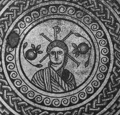

\[ [Home](./) \] \[ [Liturgical Texts](liturgic.md) \] \[ [Voice of the Fathers](voiceof.md) \] \[ [Songs of the Fathers](songsof.md) \] \[ [Obiter Scripta](obiter_scripta.md) \] \[ Manchester Churches \] \[ [York and Durham](york_and_durham.md) \]

 

**ORTHODOX CHURCHES
IN
GREATER MANCHESTER**
====================

****
=====================================================

The following is a list of the Orthodox Churches and Oriental Orthodox Churches and Communities in Greater Manchester, together with the address and telephone number of a contact person, in most instances the priest in charge, and the times of the principal Sunday services and the main languages used in them.

**Oecumenical Patriarchate:**
-----------------------------

Archdiocese of Thyateira and Great Britain.

**1\] Greek Church of the Annunciation:** Bury New Road, Salford. M7 0EA.

Priest in Charge: **Archimandrite Nicolas Sergakis**

 Tel: 0161 792-2694, Fax: 0161 792-9816.

Orthros & Liturgy, Sunday 9.30 -12.30 *Greek (for the most part)*

*The full list of services for Christmas, New Year and Theophany can be found at the church’s excellent web site, below:*[
http://www.greek-church-manchester.org.uk/](http://www.greek-church-manchester.org.uk/)

**2\] Monastery of St Andrew the Apostle.**

**Archimandrite Ephrem**. Tel: 0161-881-5774. Fax: 0870 77063279. Email: [ephrem@chorlton.com](mailto:ephrem@studite.demon.co.uk)

Ukrainian Diocese in Great Britain.

There are **Ukrainian Orthodox** Churches of the Oecumenical Patriarchate in Manchester, Bolton, Oldham and Rochdale.

Please contact **Fr Bohdan Matwijczuk**. Tel : 01706-521634.

**Patriarchate of Antioch.**
----------------------------

**Church of St Aidan.** Clare Road, Levenshulme, M19 2GG

**Father Gregory Hallam**. Tel: 0161-285-8587

Hours and Divine Liturgy: 10.00. *English.*

*For times of Christmas services visit Fr Gregory’s web site:
*<http://www.orthodox.clara.net>

**Patriarchate of Moscow.**
---------------------------

**Church of the Pokrov \[The Protecting Veil of the Mother of God\] and the Holy New Martyrs and Confessors of Russia.
**The parish is presently directly subject to the Moscow Patriarchate, and is not  part of the patriarchal diocese of Sourozh.

64 Clarence Road,
Longsight,
Manchester 13 0YE

**Archbishop Anatoly** **of Kerch.** Tel: 020 7386 7837

**Divine Liturgy
8th February 2004 
Sunday of the Wastrel Son**

Confessions: 10.00
Divine Liturgy: 10.30. *Slavonic.*

All enquiries to: **George Dance**, Tel: 0161-292-1652

**Belarusian Autocephalous Orthodox Church**
--------------------------------------------

The Primate of the Belarusian Autocephalous Orthodox Church is
Metropolitan Iziaslav, of Brooklyn, New York

**Church of the Holy Mother of Zyrovicy,** 22 Daresbury Street, Cheetham Hill, Mancheter M8 9NB.

Parish Priest: **The Very Revd** **Mitred Archpriest John Ababurko**.
Tel: 0161-740 8230

All enquiries, please, to **The Very Revd Achimandrite** **Deiniol**. Tel: 01766-831272
Archimandrite Deiniol is the Head of the Department of Inter-Church Relations BAOC.

ORIENTAL ORTHODOX CHURCHES
==========================

**Armenian Apostolic Church**
-----------------------------

**Church of the Holy Trinity**, Upper Brook Street.

Divine Liturgy normally on the First Sunday of the Month.

All enquiries, please, to Mr **Tatto Couligian**. Tel: 01625-526659
or 
Mr. **Douglas J. Buchanan**,
10 Rosemoor Gardens, Appleton,
Warrington WA4 5RJ. Tel: 01925 261206
Email: [dj.gkbuchanan@ntlworld.com](mmailto:dj.gkbuchanan@ntlworld.com)

**Coptic Orthodox Church**
--------------------------

**St Mary and St Minas Coptic Orthodox Church**
Heaton Moor Road, Heaton Moor,
Stockport SK4 4PB.
For full details of the Coptic Orthodox Church in Manchester visit their website at:
[www.geocities.com/stmary\_stmina](http://www.geocities.com/stmary_stmina)
or contact **Father Bishoy Michel Naguib**
Tel: 0161-678 1939.
Fax: 0161-652 7312 Mobile: 0777 309 5957
Email: [f\_bishoy90@hotmail.com](mmailto:f_bishoy90@hotmail.com)

**There have been Christians in Britain since Roman times, as the mosaic head of Christ from a Roman villa in Dorset testifies.**

All texts and translations on this page are copyright to
Archimandrite Ephrem ©

**This page was last updated on 29 April 2004**
