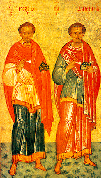
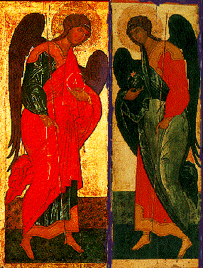
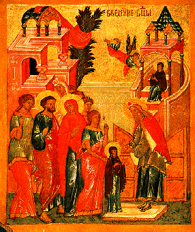
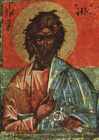

\[ [Home](index.md) \] \[ [Up](saintsof.md) \] \[ [September](septembe.md) \] \[ [October](october.md) \] \[ November \] \[ [December](december.md) \] \[ [January](january.md) \] \[ [February](feb.md) \] \[ [June](june.md) \] \[ [July](july.md) \] \[ [August](august.md) \]

THE MONTH OF NOVEMBER
=====================

(**Having 30 days. The day has 10 hours and the night 14**)

1. Of the holy and wonder-working, unmercenary physicians, Cosmas and Damian; and of their venerable mother Theodotes.

They were from Asia, and their father was a pagan. After his death, their Christ-loving mother now having found freedom, brought them up devoutly and taught them every form of virtue and knowledge, in particular medicine. They took this up as their profession and went around every disease and weakness, giving their cures without payment both to all humans and also to animals, hence they were given the epithet ‘Unmercenaries’. In this way they completed the course of their lives and died in peace.

****

Permission for wine and oil.*
*Apolytikion. Tone 8.

Holy Unmercenary Saints and wonderworkers, visit our weaknesses: freely you have received, freely give to us.

****

Kontakion. Tone 2.

Glorious, wonder-working Healers, you have received the grace of healings, and spread strength on those in need. But by your visitation calm too the insolence of our enemies and heal the world by your wonders.

2. Of the holy Martyrs Akindynos, Pegasios, Aphthonios, Elpidophoros and Anempodistos.

They suffered in Persia around the year 330, under Savorios, or Saporios, the Second, King of the Persians.

****

Apolytikion. Tone 2.

Champions of the Lord, blessed is the earth enriched by your blood; and holy the dwellings which have received your spirits; for in the stadium you triumphed over the foe and with boldness proclaimed Christ. Intercede with him, we beg, as he is good, that our souls may be saved.

****

Kontakion. Tone 1. The angelic choir.

As unwandering stars of the Sun of glory the soldiers of Christ shone on the earth, scattering the darkness of the passions and forming without hindrance a fount of unstinted grace for all, they give salvation without danger with hope of the faith.

3. Of the holy Martyrs Akepsimas, Joseph and Aeithalas; and the dedication of the church of the holy Great Martyr George of Lydda, or the laying up of his body.

Akepsimas and his companions were martyred in 330 under Savorios or Saporios II, king of the Persians.

The dedication took place in the time of Constantine the Great.

****

Apolytikion: of St George. Tone 4.

As liberator of captives, protector of the poor, physician of the sick, champion of kings, O victor and great martyr George, intercede with Christ God that our souls may be saved.

****

Of the Martyrs. Tone 4. \[Common\]

Your Martyrs, O Lord, by their struggle obtained the crowns of incorruption from you, our God; for with your might they destroyed tyrants, and shattered the feeble insolence of the demons: at their prayers, O Christ God, save our souls.

****

Kontakia: of the Martyrs. Tone 2. Seeking things on high.

All-blessed, wise Martyr, without blemish you were a guide to divine mysteries and became an acceptable sacrifice; for gloriously you drank the cup of Christ, holy Akepsimas, with your fellow champions, as you intercede for us all.

****

Of St George. Tone 8. To you, my Champion.

To your triumphant and swift assistance we faithful flee for refuge and we implore that those who hymn you may, through you, Christ’s champion, be delivered from the pitfalls of the foe, and from every kind of danger and of ill, that we may cry to you: Hail, martyr George!

4. Of our venerable father Ioannikios the Great; and of the holy hieromartyrs Nikander, bishop of Myra, and Hermaios, presbyter.

They drew many unbelievers to the faith of Christ; they were denounced to the count of the city, Livanios, by whom, after many other torments, they were immured alive into a tomb, and so handed their spirits into the hands of God. The ascetic was born in Bithynia, around the year 740; his father was named Myritikes, his mother Anastaso, and from his early manhood he served as a soldier and was found worthy of royal honours for his courage. Later he came to despise them all and left for Mt Olympus, where he passed the rest of life as an ascetic, and having become mighty in virtue, he fell asleep in the Lord in 834, having lived for all of 94 years. His is the brief prayer: ‘The Father is my hope,’ etc.

****

Apolytikia: of the Ascetic. Tone 8. \[Common\]

With the streams of your tears you cultivated the barren desert, and with your deep groans your made your toils bring forth fruit a hundredfold, and you have become a beacon, shining in all the world by your wonders: Venerable Father Ioannikios, intercede with Christ God that our souls may be saved.

****

And of the Bishop Martyr. Tone 4. \[Common\]

You shared their way of life and you succeeded to the Apostles’ thrones; you found the practice, O God-inspired, to climb the heights of contemplation; rightly directing the word of truth; and in faith you struggled to shedding of blood, Bishop and Martyr Nikander; intercede with Christ God that our souls may be saved.

****

Kontakion of the Ascetic. Tone 4. Today you have appeared.

Assembled to-day in your sacred memory, venerable Ioannikios, all we believers implore that we may find mercy from the Lord.

5. Of the holy martyrs Galakteon and his wife Epistimi.

He was a son of Kleitophon and Lefkippi, who at first had both been pagans, but were later taught the true faith by a certain Christian, named Onouphrios. Epistimi was also the child of unbelieving parents and was baptised because of her marriage to Galakteon. They were martyred under Decius around 250.

****

Apolytikion. Tone 4. \[Common\].

Your Martyr, O Lord, by his struggle obtained the crown of incorruption from you, our God; for with your might he destroyed tyrants, and shattered the feeble insolence of the demons: at his prayers, O Christ God, save our souls.

6. Of our father among the saints Paul, Archbishop of Constantinople, the Confessor.

A native of Thessaloniki, he was first a priest and then bishop of the Church of Constantinople; a distinguished man, generous, upright for things of God, witnessing by the goodness of his life. He was a most fervent zealot for the Council of Nicea and a most valiant champion of the faith in the Homoousios until death. But he was on two occasions exiled from his throne by the arianising Emperor Constantius, son of Constantine the Great, finally he was exiled around 350 to Koukousos in Armenia, where at the instigation of the Arians, those who were taking him into exile throttled him.

****

Apolytikion. Tone 3. Model Melody.

Your confession of the divine faith proved you a second Paul, a zealot for the Church. With you Abel and the just blood of Zachary cry out to the Lord. Venerable Father, implore Christ God to bestow on us his great mercy.

****

Kontakion. Tone 2. Seeking things on high.

Blazing upon earth like a star shining in the heavens, you now enlighten the catholic Church, for which you struggled and laid down your life, blest Paul, and like Abel and Zachary your blood cries out clearly to the Lord.

7. Of the thirty holy Martyrs of Melitini; and of our venerable father and wonderworker Lazarus of Mt Galisios.

They were martyred under Diocletian and Maximianos in 290. Lazarus led the ascetic life under Constantine Monomachos. He was born in 967, travelled round various regions of the East to visit monasteries and, having returned to his own country in 1005, he built the monasteries of Mt Galisios after 1012 and fell asleep in the Lord on the 7th of November 1053.

****

Apolytikia: of the Martyrs. Tone 4. \[Common\]

Your Martyrs, O Lord, by their struggles obtained the crown of incorruption from you, our God; for with your might they destroyed tyrants, and shattered the feeble insolence of the demons: at their prayers, O Christ God, save our souls.

****

And of the Ascetic. Tone 8. \[Common\]

With the streams of your tears you cultivated the barren desert, and with your deep groans your made your toils bring forth fruit a hundredfold, and you have become a beacon, shining in all the world by your wonders: Venerable Father Lazarus, intercede with Christ God that our souls may be saved.

****

Kontakion. Tone 4. Today you have appeared.

As a mighty beacon the Church of Christ glorifies you with joy in psalms; therefore do not cease to intercede with Christ God to grant to all pardon of offences.

****

8. The Assembly of the Chief Captain Michael and the rest of the Bodiless Powers.

All the Angels, according to the Apostle Paul, are ministering spirits, sent out for those who are to inherit salvation \[Heb. 1:14\]. God has established them as guardians over every nation and people, and as guides for what is good \[Lev. 32:8\]. He orders them to guard those who hope in him, that nothing may harm them, that no evil may draw near their dwellings \[Ps. 6:9-14\]. In heaven they look continually on the face of God, as they sing to him the thrice-holy hymn and intercede before him on our behalf, as they likewise also rejoice over one sin who repents \[Is. 6:2-3; Mt. 18:10; Lk. 15:7; Acts 12:15\]. In a word they serve God for our benefit in so many ways that the pages of the holy Scriptures are full of accounts of them.

Therefore the orthodox Church, gratefully honouring these divine ministers and our protectors and guardians, ordains to-day this present assembly, that is our gathering for their common feast and praise; but especially of the Archangels Michael and Gabriel, as they are mentioned by name in the Scriptures. Michael means ‘Who is as God?’, while Gabriel means ‘Power of God’. The number of the Angels is not defined by holy Scripture, though Daniel says thousands upon thousands minister to God and ten thousands upon ten thousands stand before him \[7:10\]. Nevertheless they are all divided into nine ranks called: Thrones, Cherubim, Seraphim, Dominions, Powers, Authorities, Principalities, Archangels and Angels.

****

No work and permission for wine and oil.

Apolytikion. Tone 4. Lifted upon the Cross.

Chief captains of the heavenly armies, we the unworthy implore you to protect us by your supplications with the shelter of the wings of your immaterial glory as you guard us who fall down and insistently cry out: Deliver us from dangers, as Captains of the Powers above.

****

Kontakion. Tone 2.

Chief captains of God, ministers of divine glory, guides of mankind and princes of the Bodiless ones, ask for what is for our good and for great mercy, as Chief Captains of the Bodiless ones.

9. Of the holy martyrs Onesiphoros and Porphyrios; and of our venerable mother Matrona; and of our Father among the Saints Nekatarios of Pentapolis.

The martyrs suffered under Diocletian and Maximianos in the year 290. The ascetic was from Perge in Pamphylia and flourished around 466; she had been married to a husband and had a daughter by him; after her husband’s death she entrusted her to a certain wise woman, while she herself ended her life ascetically. She lived to be almost a hundred.. Saint Nektarios was from Selyvria in Thrace, and was devoted to God from childhood. When he had been carefully educated he was consecrated Metropolitan of Pentapolis in Egypt. He came to Greece and passed his life in virtue, wisdom and the other precepts of the Gospel. By divine counsel he founded the women’s monastery of the Holy Trinity in Aegina, where he spent the rest of his life in holiness and virtue, in constant prayer and humility. He fell asleep in 1920. In the same monastery, which already bears his name, are preserved his sacred relics, which ineffably give off a sweet fragrance and are the source of numerous wonders.

****

Apolytikia: of the Martyrs. Tone 4. \[Common\]

Your Martyrs, O Lord, by their struggles obtained crowns of incorruption from you, our God; for with your might they destroyed tyrants, and shattered the feeble insolence of the demons: at their prayers, O Christ God, save our souls.

****

And of the Ascetic. Tone 8. \[Common\]

In you, Mother, was preserved unimpaired that which is according to the image, for you took up the cross, and you followed Christ; and by your deeds you have taught us to despise the flesh, for it passes away; but to care for the soul, which is a thing immortal; and therefore your spirit, holy Matrona, rejoices with the Angels.

****

Of St Nektarios. Tone 1. Citizen of the desert.

Selyvria’s offspring and Aegina’s guardian, the true friend of virtue, revealed in these last times, Nektarios let us the faithful praise as inspired servant of Christ; for he pours out healings of every kind for those who devoutly cry: Glory to Christ who gave you glory! Glory to him who made you wondrous! Glory to him who through you works healings for all!

****

Kontakion of the Hierarch. Tone 8. To you my Champion.

The newly shining star of Orthodoxy, and new-built outer rampart of the Church of Christ let us sing his praises with joy of heart, for by the power of the Spirit glorified he pours out abundant grace of healings for those who cry aloud: Hail, Father Nektarios!

10. Of the holy apostles of the Seventy, Olympas, Rhodion, Erastes, Sosipater and Quartus, and of the holy martyr Orestes.

Of these Olympas and Rhodion, or Herodion \[Rom. 16:11\], followed Peter the prince of the Apostles to Rome, where their heads were cut off by Nero. The others ended their lives in peace, having become bishops, Sosipater of Iconium, Quartus of Beirut, Erastes of Paneas or Paneias (which was renamed Caesarea Philippi), he had been appointed treasurer of the Church in Corinth \[Rom. 16:22\]. The martyr was from Tyana in Cappadocia in the time of Diocletian. Holes were bored in his ankles by long nails, he was bound to a wild horse, dragged violently along by it and expired, in the year 289.

****

Apolytikia: of the Apostles. Tone 3. \[Common\]

O holy Apostles, intercede with the merciful God to grant our souls forgiveness of sins.

****

And of the Martyrs. Tone 4. \[Common\]

Your Martyrs, O Lord, by their struggles obtained crowns of incorruption from you, our God; for with your might they destroyed tyrants, and shattered the feeble insolence of the demons: at their prayers, O Christ God, save our souls.

****

Kontakion. Tone 4. Today you have appeared.

The Apostles’ festival has been made manifest to-day, manifestly granting forgiveness of offences to all who celebrate their memorial.

11. Of the holy martyrs Menas, Victor and Vincent; and of the holy Martyr Stephanis; and of our venerable Father Theodore the Studite.

Menas was an Egyptian who suffered in Kotyaeios in Phrygia in 296 under Diocletian and Maximianos; Victor and Stephanis in Italy in 160 under Antonius; Vincent in Spain in 235 under Maximinus.

Theodore the Studite was born in Constantinople in 759 of devout parents, Photeinos and Theoctisti; from his youth he was clothed in the monastic schema in the monastery known as that of Sakkodion, of which he became abbot in 794 (having been ordained deacon and priest around 784 by the most holy patriarch Tarasios). Later he transferred to the monastery of Studios, so called because it had been founded by Studios, a Roman consul, and he received the epithet ‘Studite’. He appeared as a fervent zealot for the traditions of the fathers; he fought till his death for the honour of the holy icons; he endured exile on three occasions because of his zeal for the true faith. On the third occasion he was condemned by the iconoclast Emperor Leo the Armenian; he endured nobly, being beaten and bound and being transferred from one gloomy dungeon to another even more stygian, for seven whole years. Finally he was recalled from exile by Michael Travlos, and after a short respite from his long labours he rested in the Lord on November 11th, 826, on a Sunday, when his disciples were kneeling round him and singing the ‘Blameless’. Some say that he himself, after receiving the spotless mysteries, began to sing this psalm; but that when he reached the verse: ‘I shall not forget your judgements for ever, for by them you have made me live’ (118:93), he expired, at the age of 67. Among his many other sacred writings he composed, with the co-operation of his own brother Joseph, almost the whole of the book, full of compunction, the Triodion (Cf. also July 14th).

****

Apolytikia: of the Martyrs. Tone 4. \[Common\]

Your Martyrs, O Lord, by their struggles obtained crowns of incorruption from you, our God; for with your might they destroyed tyrants, and shattered the feeble insolence of the demons: at their prayers, O Christ God, save our souls.

****

And of the Saint. Tone 8 \[Common\].

Orthodoxy’s guide, teacher of piety and reverence, beacon of the world, fair ornament of monks, inspired by God, O wise Theodore, by your teaching you have enlightened all, O harp of the Spirit; intercede with Christ God that our souls may be saved.

****

Kontakia: Of the Martyrs. Tone 8.

As Martyrs of true religion and inspired athletes, the Church, as she glorifies to-day their godly struggles, honours Menas the champion, Victor the noble and Vincent the high-minded; and she cries out with love as she glorifies the Lover of mankind.

****

Of the Ascetic. Tone 2. Seeking things on high.

Your ascetic life, equal to an angel’s, you made radiant by an athlete’s wrestlings, and you appeared, Theodore, blessed by God, as a companion of Angels, with whom you implore Christ God on behalf of us all.

12. Of our father among the saints John the Merciful, archbishop of Alexandria; and of our venerable father Neilos.

John was from Cyprus, from the town of Amathon, son of Epiphanios, governor of Cyprus. He was born in 555, he was placed on the archiepiscopal throne in 608 and died in 619, at the age of 64.

Neilos was from Constantinople, a disciple of Chrysostom At first he was eparch of the city but later a monk on Mt Sinai. He wrote letters and various acetic writings. He died around 451.

****

Permission for wine and oil.

Apolytikia: Of the Bishop. Tone 8.

By endurance you gained your reward, venerable Father, in prayers you were unceasingly strong, you loved the poor and provided for them; but intercede with Christ God, blest John the Merciful, that our souls may be saved.

****

Of the Ascetic. Tone 8. \[Common\]

With the streams of your tears you cultivated the barren desert, and with your deep groans your made your toils bring forth fruit a hundredfold, and you have become a beacon, shining in all the world by your wonders: Venerable Father John, intercede with Christ God that our souls may be saved.

****

Kontakia: Of the Bishop. Tone 2, Seeking things on high.

You distributed your wealth to the poor and now you have wealth from heaven, all-wise John; and so we all honour you, as we celebrate the memory of the Mercy, whose name you bear.

****

Of Saint Neilos. Tone 8. To you my Champion.

The rebellious undergrowth of the passions of the body, blest Neilos, you vigorously cut out by your sleepless intercession. But as you have boldness towards the Lord, free me from every kind of danger that I may cry to you: Hail, universal Father!

****

13. Of our father among the saints John Chrysostom, archbishop of Constantinople.

This great teacher of the inhabited world was born in Antioch the Great in 344 of devout parents, Secundus and Anthousa. He was a pupil the rhetor Livanios and the philosopher Andragathios. He was at first a monk in the hermitages around Antioch and later ordained priest of the church of Antioch in 383. He mounted the archiepiscopal throne on the 15th of December 397.

He was banished in 402 by Arkadios and Evdoxia, but after a short time he was recalled to his throne. After seven or eight months he was banished for a second time on June 29th 404, and having suffered greatly in exile for more than three years, being constantly transferred from place to place, he died on the road in Komani on the 14th of September 407 at the age of 63. He was named Chrysostom because of his eloquence. He wrote a great many works and explained the divine Scriptures more than any other of the Fathers. 1,447 of his sermons have been preserved and 240 letters. Twenty two teachers of the Church have composed eulogies for him.

****

Note that because of the feast of the Exaltation of the Cross on September 14th, his commemoration was transferred to the present date.

No work and permission for wine and oil.

Apolytikion. Tone 8.

The grace which shone from your mouth like a torch of flame has enlightened the whole world; it has laid up for the world treasures free of avarice; it has shown us the height of humility. But as you instruct by your words, O Father John Chrysostom, intercede with Christ God, the Word, that our souls may be saved.

****

Kontakion. Tone 6..

You received divine grace from heaven, and through your lips you teach us all to worship one God in Trinity, O venerable John Chrysostom, wholly blessed. Fittingly we praise you, for you are a guide who makes clear things divine.

14. Of the holy and all-praised Apostle Philip.

He was one of the Twelve, from Bethsaida in Galilee, a fellow citizen of Andrew and Peter. Educated in the teachings of the Law, he devoted himself to the study of the prophetic books; and so Jesus called him to the rank of Apostle, he sought and at once found Nathanel, and said to him: We have found the one of whom Moses wrote in the Law, Jesus the son of Joseph from Nazareth (Jo. 1:46). He preached Jesus the God-man in many parts of Asia Minor, and having suffered much for his name, he was crucified head downwards in Hierapolis in Phrygia.

****

No work and permission for fish.

Apolytikion. Tone 3. \[Common\]

O holy Apostle Philip, intercede with the merciful God to grant our souls forgiveness of sins.

****

Kontakion. Tone 8.

Inspired Philip, your disciple and friend and imitator of your passion, proclaimed you as God to the whole inhabited world. At his intercessions guard your Church from lawless foes, through the Mother of God, O Most merciful.

15. Of the holy Martyrs and confessors, Gourias, Samonas and Avivos.

Of these, Gourias and Samonas suffered under Diocletian in 288. While Avivos, a deacon, was martyred in the time of Licinius, in 316.

****

From today we begin the Christmas Fast.

Apolytikion. Tone 5.

You have bestowed on us, Christ God, the wonders of your holy Martyrs as an unbreachable wall; at their entreaties scatter the counsels of the nations, strengthen the sceptres of the Kingdom, as you alone are good and love mankind.

****

Kontakion. Tone 2. Seeking things on high.

Receiving the grace from on high, you stood fast in trials, all-praised Saints; and therefore you delivered a maiden from a bitter death; for you are truly the glory of Edessa, and the joy of the world.

16. Of the holy Apostle and Evangelist Matthew.

He is also called Levi, son of Alphaios. A native of Galilee, by profession a tax collector. He wrote first in Palestine his version of the Gospel in Hebrew eight or nine, or, according to some, fifteen years after the Assumption of the Saviour. In pictures he has next him a human form, the first of the symbolic living creatures of Ezekiel (1:10), because he begins his Gospel with the genealogy of Jesus Christ according to the flesh. He was one of the Twelve.

****

Permission for wine and oil.

Apolytikion. Tone 3. \[Common\]

O holy Apostle and Evangelist Matthew, intercede with the merciful God to grant our souls forgiveness of sins.

****

Kontakion. Tone 4. As first fruits of nature.

Having cast aside the yoke of the custom house, you were joined to the yoke of justice and revealed as an excellent merchant, acquiring as wealth the wisdom from on high; therefore you proclaimed the word of truth, and roused the souls of the slothful, by writing of the hour of the Judgement.

17. Of our father among the saints Gregory, bishop of Neocaesarea, the wonderworker.

He was born in Neocaesaria in Cappadocia of unbelieving parents. He studied in Athens, Alexandria, Beirut and finally in Caesarea for five years under Origen, by whom he was also instructed in the Christian faith. Then, in the year 240, he became bishop of his home country, in which he found only seventeen Christians. When he died in about 265 he left scarcely as many unbelievers. The whole period of his episcopate was a succession of remarkable wonders, from which he acquired the epithet ‘Wonderworker’, being called even by the enemies of the truth a ‘Second Moses’ (cf. Basil the Great, On the Holy Spirit Chap. 29).

****

Apolytikion. Tone 8.

Watchful in prayers, mighty in works of wonders, you obtained your achievements as title. But intercede with Christ God, Father Gregory, to enlighten our souls, that we may never sleep in sins unto death.

****

Kontakion. Tone 2. Seeking things on high.

You received the force of many wonders, made the demons quake by fearful signs and drove out the diseases of men, all-wise Gregory; and so you are called ‘Wonderworker’, taking your title from your works.

18. Of the holy martyrs Plato and Romanos.

Plato was martyred under the governor Agrippinos in 296, and was from the territory of the Galatians, from the city of Ankara. Romanos was from Antioch in the time of Maximianos. Arraigned before the eparch Asklepiades, and urged by him to worship idols, he asked that an infant be brought from the market-place, that it might be the judge of the proposed idea. When the infant was asked: Which God should one worship? it answered: The God of the Christians. It was then mercilessly flayed on the tyrant’s orders and then its head was struck off. The martyr had his tongue cut out and was thrown into goal, finally he was throttled there in 305. It was in this Romanos’ name that Saint Helen later founded the lovely church in Constantinople.

****

If it is not Alleluia,
Apolytikion. Tone 4. \[Common\]

Your Martyrs, O Lord, by their struggles obtained crowns of incorruption from you, our God; for with your might they destroyed tyrants, and shattered the feeble insolence of the demons: at their prayers, O Christ God, save our souls.

19. Of the holy Prophet Avdias \[Obadiah\].

The place and date at which the Prophet flourished is unclear from Holy Scripture; and so some say that he is the steward of Achab, who hid one hundred prophets in a cave from the wrath of Jezabel and fed them on bread and water (3 Kingd. 18:4), and that later he became a disciple of the prophet Elias in around 903 BC. While Kalmetis and his followers judge that from the words of his own prophecy, he was a little later than Joel (October 19th). He is also called Ovdiou, and Avdias and Ovdias. His prophecy consists of only one chapter and is placed fourth among the Minor Prophets.

Varlaam was from a village by Syrian Antioch; he was an old man and a farmer by profession. He was martyred in the time of Diocletian.

****

If it is not Alleluia,
Apolytikion of the Prophet. Tone 2. \[Common\]

As we celebrate the memory of your Prophet Avdias, O Lord, through him we beseech you: Save our souls.

****

Another, of the Martyr. Tone 4. \[Common\]

Your Martyr, O Lord, by his struggle obtained the crown of incorruption from you, our God; for with your might he destroyed tyrants, and shattered the feeble insolence of the demons: at his prayers, O Christ God, save our souls.

20. Forefeast of the Entry of the most-holy Mother of God into the Temple; and commemoration of our holy fathers Gregory of Decapolis and Proclus, archbishop of Constantinople.

Gregory was from Decapolis in Coelo-Syria, son of Sergios and Maria, he flourished in the time of the iconoclasts around 837.

Proclos lived in the time of Theodosios the Less; he became a disciple and secretary to Chrysostom. He ascended the archiepiscopal throne of Constantinople in 434. He received in triumph the most sacred relics of his godlike Teacher at their translation (January 27th) and died in peace in 447.

****

Apolytikia: Of the Saints. Tone 4. \[Common\]

God of our Fathers, who always deal with us in your forbearance, do not deprive us of your mercy, but at their intercessions guide our life in peace.

****

Of the Forefeast. Tone 4. Come quickly to help.

Anna to-day solicits joy for us, for she has put forth a fruit the contrary of grief, the only Ever-virgin; her prayers fulfilled, in joy she brings her to-day to the Lord’s temple as truly a temple of God the Word and a pure Mother.

****

Kontakion of Proclus. Tone 4. Today you have appeared.

The city truly the most honoured of all, fittingly to-day keeps festival at your revered translation, Father of Fathers, all-blest Proclus.

****

Kontakion of the Forefeast. Tone 4. Today you have appeared.

The whole to-day has been filled with joy, at the glorious festival of the Mother of God, as it cries: She is the heavenly Tabernacle.

****

21. The Entry of our most holy Lady the Mother of God into the Temple.

According to the tradition of the Church, the Mother of God was brought to the Temple at the age of three years and there dedicated to God. She lived there for eleven or twelve whole years, until the age of fourteen or fifteen; and then as a perfect maiden, by the common counsel of the priests - her parents having died three years before - she was betrothed to Joseph.

****

No work, and permission for fish.

Apolytikion. Tone 4. \[See 25th March\]

Today is the foreshadowing of the good-pleasure of God, and the proclaiming of the salvation of mankind. In the Temple of God the Virgin is revealed, and be-forehand she announces Christ to all. To her let us also cry aloud with mighty voice: Hail, the fulfilment of the Creator’s dispensation!

****

Kontakion. Tone 4. Lifted up on the Cross.

The all-pure Temple of the Saviour, the precious Bridal Chamber and Virgin, the sacred Treasury of the glory of God, is being brought to-day into the house of the Lord; and with her she brings the grace of the divine Spirit; of her God’s Angels sing in praise: She is indeed the heavenly Tabernacle.

22. Of the holy Apostles Philemon, Apphia, Archippos and Onesimos; and of the holy martyr Cecilia and her companions Vallerianus and Tiburtius.

Philemon was from Kolossae, or Kolassae, a city in Phrygia, a man wealthy and of noble birth. Apphia was his wife, Archippos bishop of the Church in Kolossae. All three were disciples of the Apsotle Paul. St Onesimos, a non-Christian slave of Philemon, having stole from him, fled to Rome, but the Apsotle, having found him there and guided him to the way of virtue and to the knowledge of the truth, sent him back to his master Philemon, having also written him a letter in the year 64 (it is one of the 14 epistles of Paul), in which he supports this Onesimos. They all died as martyrs, being stoned to death by idolaters. St Cecilia was from Rome, of distinguished ancestry. She was betrothed to Vallerianous, whom she drew to the faith of Christ. He in turn converted his own brother Tirburtius. They were martyred under Diocletian in 288.

****

Apolytikion. Tone 3. \[Common\]

O holy Apostles, intercede with the merciful God to grant our souls forgiveness of sins.

****

Of the Feast.

Kontakion of the Apostles. Tone 2. Nor tomb, nor death.

As foundations and lamps of the Church, and inspired Apostles of the saviour, Philemon, Apphia and Onesimos along with Archippos, intercede on our behalf with Word, wise preachers.

23. Of our fathers among the saints, Gregory, bishop of Akragas and Amphilochios of Iconium.

Gregory was from Akragas, a city in Sicily, son of Christian parents, Chariton and Theodoti. He flourished in the reign of Justinian Rinotmitos around 685. Amphilochios was by race from Cappodocia, reknowned from hsi youth for asceticism and sacred knowledge. He was elected bishop in 341 and struggled nobly against the blasphemy of Eunomios, Makedonios, the opponent of the Spirit, and the supporters of Arius. He was present at the 2nd Ecumenical Council of 150 Fathers in Constantinople, which was summoned under Theodosios the Great in 381, and having lived to a ripe old age, he went to his rest in peace around 395.

****

Apolytikion. Tone 4. \[Common\]

God of our Fathers, who always deal with us in your forbearance, do not deprive us of your mercy, but at their intercessions guide our life in peace.

****

After the 3rd Ode, Kontakion. Tone 4. Today you have appeared.

With beams of shining light the Church of the Holy Spirit leads to the light those who celebrate your radiant falling asleep, venerable Father, all-blessed Gregory.

****

After the 6th Ode. Tone 1. The angelic choir.

As surely chosen and known to God, by divine decree you were elected as a most worthy shepherd for the safekeeping of many. Therefore, revealed to be an excellent High Priest, as a leader of the faithful, in accordance with Orthodox thought you destroyed every heresy.

24. Of our fathers among the saints and martyr bishops Clement of Rome and Peter of Alexandria.

Clement was taught the Christian faith by the apostle Paul. He became bishop of Rome in 91, the third after the death of the Apostles. He died a martyr around 100 under Trajan. Peter presided outstandingly over the Church of the Alexandrians for 12 years, and through his virtuous life and the practice of the sacred words he was something godlike among bishops and teachers of true religion in Christ, according to Eusebius (History of the Church 8,13 & 9,6). He was decapitated under Maximinos in 311.

****

Apolytikion. Tone 4. \[Common\]

God of our Fathers, who always deal with us in your forbearance, do not deprive us of your mercy, but at their intercessions guide our life in peace.

****

Kontakion. Tone 4. Today you have appeared.

Unshakeable and godlike towers of the Church, truly inspired and mighty pillars of the Faith, all-praised Clement and Peter, protect us all by your prayers.

25. Of the holy great Martyr and all-wise Katherine, and of the holy martyr Mercurius.

Mercurius was martyred under Valerian in 255. He was from Paphlagonia, son of certain Gordianos, a Scythian by race. Katherine was from Alexandria, daughter of Constuc, or Cestus, a maiden of outstanding beauty and sobriety, famous by her wealth, family and education. Through her unflinching resolution she utterly defeated the passionate and licentious soul of Maximinos , the tyrant of Alexandria. Through her eloquence she silenced the rhetoricians who deabted aginst her. She won her martyr’s crown around the year 305.

****

Today we take leave of the Feast of the Entry.
No work, and permission for wine and oil.

Apolytikion. Tone 4. \[Common\]

O Jesu, your lamb cries aloud: O my Bridegroom, I long for you; and seeking you I struggle, and I am crucified and buried with you in your baptism; and I suffer for your sake, that I may reign with you; and I die for you, that I may live in you; but as a spotless victim now accept one who with longing is slain for you. Through her prayers, as you are merciful, save our souls!

****

Or, Tone 5. Let us believers.

Let us sing the praise of the far-famed bride of Christ, the godlike Katherine, defender of Sinai, our help and assistance; for brilliantly she silenced the artful speakers of the godless with the sword of the Spirit. And now, as crowned Martyr, she asks for all God’s great mercy.

****

Apolytikion. Tone 4. \[Common\]

Your Martyr, O Lord, by his struggle obtained the crown of incorruption from you, our God; for with your might he destroyed tyrants, and shattered the feeble insolence of the demons: at his prayers, O Christ God, save our souls.

****

Kontakion. Tone 2. Seeking things on high.

Lovers of martyrs, inspired by God, now raise a holy dance, honouring all-wise Katherine; for she proclaimed Christ in the stadium and trampled on the serpent, rejecting with contempt the knowledge of the clever.

****

Of the Saint. Same melody.

Truly led, wise Saint, into the mysteries of God, you became an acceptable sacrifice; for you with fervour the cup of Christ. And so, revered Mercurios, you intercede unceasingly for us all.

26. Of our venerable fathers Alypios the Column Dweller and Nikon the ‘Repent’.

Of these, Alypios was from Adrianoupolis in Bithynia. Having lived on a column for 53 years he died at the age of 100 around 607. Nikon was from Armenia, son of nobleman. He abandoned parents and fatherland and travelled through the regions of the East, crying out to everyone, ‘Repent!’, from this he gained his epithet. Finally he reached Sparta in the Peloponnese and there raise a church to Christ our Saviour, where he lived as a solitary until his death. He departed to the Lord around the end of the 9th century.

****

Apolytikion of Alypios. Tone 1.

You became a pillar of endurance, rivalling the forefathers, venerable Saint: Job in sufferings, Joseph in trials, and the life of the Bodiless Powers while in the body. Our Father Alypios, intercede with Christ God that our souls may be saved.

****

Another, of Nikon. Tone 3. Your confession.

Lakedemon rejoices, for it holds the godly casket of your relics, that pours out a source of healings and saves from afflictions, Father, all who have recourse to you through faith. Venerable Nikon, implore Christ God to grant us his great mercy.

27. Of the holy Great martyr Jacob the Persian.

He was from the city of Vythava of distinguished ancestry, intimate and honoured friend of Isdigeis, or Iesezegirdis 1st, king of the Persians, who reigned from 399-425. Though a Christian through his parents, he denied Christ, seduced by the friendship and flattery of the king. Learning of this, his mother and wife informed him by letter that they would have no further dealings with him, preferring the love of Christ to passing glory. He, struck to his soul by these words and having come to himself, he repented of the sins he had committed, and abandoned his connection with the king. And so the latter was furiously angry and decreed against him the most painful death, such as no one would decree against a wild animal, that is to say his body was to be cut up joint by joint of arms and legs. And so the noble martyr was cut limb by limb as far as his thighs and shoulders. Finally his head was struck off.

****

Apolytikion. Tone 4. \[Common\]

Your Martyr, O Lord, by his struggle obtained the crown of incorruption from you, our God; for with your might he destroyed tyrants, and shattered the feeble insolence of the demons: at his prayers, O Christ God, save our souls.

****

Kontakion. Tone 2. Seeking things on high.

Persuaded by your noble wife and fearing the dread judgement, stout-hearted James, you rejected with contempt the spirit of the Persians and were revealed as a wondrous martyr, your body cut up like a branch.

28. Of the holy monk martyr Stephen the New; and of the holy martyr Irenarchos.

The ascetic was born in Constantinople in 715 of Orthodox parents, John and Anne. He led the ascetic life from his youth in the monastery of St Auxentios in Bithynia, which lies on high ground called the Mountain of St Auxentios. He became superior of the monks there and the fame of his spiritual struggles was heard of everywhere and the fair fragrance of his virtues drew many to him. He died a martyr because of his veneration of the holy ikons under Constantine Copronymos, by whom he was first condemned to eleven months in chains and prison, then he was dragged down on the ground and stoned like the proto-martyr Stephen, from whom Stephen the New was named. He was struck with wood against his membrane of his brain, and, when his head had been crushed, he gave up his spirit in 767. Irenarchos was from Sebasteia in the time of Diocletian, being in his youth an agent for the punishment of the holy martyrs. But once, while watching seven women being tortured for Christ and marvelling at their courage, because, though feeble by nature, they were most courageous against the tyrant and put him to shame, he was enlightened by divine grace. Then, having boldly confessed Christ, he was tortured by fire and water and his head was cut off alongside the holy women in 298.

****

Apolytikion. Tone 4. Lifted up on the Cross.

Trained as an ascetic on the mountain, you destroyed the immaterial ranks of the hostile powers with the full armour of the Cross. But then you stripped once again with courage for the contest, slaying Copronymos with the sword of faith. And for both you have been crowned by God, honoured Monk and Martyr Stephen.

****

Of the Martyr: Apolytikion. Tone 4. \[Common\]

Your Martyr, O Lord, by his struggle obtained the crown of incorruption from you, our God; for with your might he destroyed tyrants, and shattered the feeble insolence of the demons: at his prayers, O Christ God, save our souls.

****

Kontakion. Tone 8. To you my Champion.

Lovers of festivals, from the heart let us praise with faith in songs godlike Stephen, the lover of the Trinity, as one who honoured the fair likeness of the Master and his Mother, and let us now rejoicing with one accord cry out to him with love: Hail, honoured Father!

29. Of the holy martyrs Paramonos and Philoumenos.

Of these Paramonos suffered under the emperor Decius in 250, while Philoumenos was martyred under the emperor Aurelian in 270.

****

If it is not Alleluia, Apolytikion. Tone 4. \[Common\]

Your Martyrs, O Lord, by their struggles obtained crowns of incorruption from you, our God; for with your might they destroyed tyrants, and shattered the feeble insolence of the demons: at their prayers, O Christ God, save our souls.

****

30. Of the holy glorious and all-praised Apostle Andrew the First-called.

He was from Bethsaida in Galilee, son of Jonas, brother of the prince of Apostles Peter, disciple at first of John the Baptist. Then, having heard his testimony concerning Jesus, when he pointed to him and said, ‘See, the lamb of God, who takes away the sin of the world’ (John 1,36), he followed Jesus at once and became his first disciple, from he he was given the title ‘First-called’ of the Apostles. After the Saviour’s assumption, he preached him in many places and suffered much for his name. He died in Patras in Achaia, being crucified head downwards.

****

No work, and permission for wine and oil.

Apolytikion. 4th Tone.

As the First-called of the Apostles and full brother of the Prince, implore the Master of all things, Andrew, to give peace to the inhabited world, and to our souls his great mercy.

****

Kontakion. 2nd Tone. Nor tomb, nor death.

Let us sing the praise of God’s herald, whose name is ‘courage’, the First-called of the Saviour’s disciples, the brother of Peter; because as to him of old, so now to us he cries: Come, we have found the one so longed for.

All texts and translations on this page are copyright to
Archimandrite Ephrem ©

**This page was last updated on 03 November 2008**
