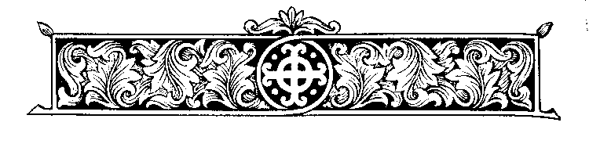

\[ [Home](index.md) \] \[ [Up](sunday_of_orthodoxy.md) \]
\[ [Vespers](vespers1.md) \] \[ Synodikon \]
\[ [Canon of the Synodikon](canon_of_the_synodikon.md) \]

# SYNODIKON OF ORTHODOXY

The text of the Synodikon of Orthodoxy has been much altered over the
centuries, chiefly by the addition of material and names that postdate
the Restoration of the Icons in 843. This is the case with the text that
is printed in the current Triodia. Some of the more zealous contemporary
Orthodox even include condemnations of such things as the ‘pan-heresy of
Ecumenism‘.  It is probably impossible to reconstruct the original text
exactly. However the British Library possesses a manuscript, (BL.
Additional 28816) written in 1110 or 1111 by a monk Andrew of the
monastery of Oleni in Moraea, which may give some idea of the scope and
contents of the original. In the opinion of Jean Gouillard, the editor
of the critical edition of the Synodikon, ‘the London manuscript is
certainly one of the best witnesses to the primitive and purely
Constantinopolitan form of the Synodikon’. The manuscript was unknown to
him when he prepared his edition and has in consequence been generally
neglected.

This text of the Synodikon is written at the end of a manuscript of the
Acts, Epistles and Apocalypse, with the somewhat misleading title
‘Definition \[*Horos*\] of the 7th Holy Synod’. The text of the
Synodikon is finely written in red and black and is provided throughout
with ekphonetic notation. The text was, therefore, intended to be
solemnly chanted, like the Apostle or Gospel, and not simply read. A
number of names, in particular those of Symeon Stylites and Theodore the
Studite, are given special prominence. The words 

’God will give their kingdom peace. Heavenly King, protect those on
earth\!’ are, it seems, peculiar to this manuscript. The seven numbered
paragraphs are so numbered in the margin of the manuscript.

The translation is from one made by Professor Andrew Louth of the full
text, and used here by his kind permission, edited to correspond with
that of BL. Additional 28816 by Archimandrite Ephrem, and with the
Scriptural references added. The manuscript itself does not mark out the
scriptural passages in any special way. Phrases in square brackets are
added by the translator for the sake of clarity The translation below
has been set out in such a way as to represent, as far as possible, the
layout of the manuscript, with its rubrications and paragraphing. The
latter is indicated in the manuscript by larger, rubricated, letters. 

## TRANSLATION

A yearly thanksgiving is due to God on account of that day when we
recovered the Church of God, with the demonstration of the dogmas of
true religion and the overthrowing of the blasphemies of wickedness.

**F**ollowing prophetic sayings, yielding to apostolic exhortations, and
standing on the foundation of the accounts in the Gospels, we make
festival on this day of dedication.  For Isaias says that the
**islands** will be **dedicated**[\[1\]](#_ftn1) to God, meaning, \[by
the islands,\] the churches from the nations and, by churches, not
splendid church buildings, but the fullness of those who perform acts of
reverence in them and worship the divine with hymns and praises.  The
Apostle recommends the same thing, when he commands us to **walk in
newness of life**[\[2\]](#_ftn2), and—by saying that **if anyone is in
Christ he is a new creation**[\[3\]](#_ftn3)—to be renewed. 

Then there are the words of the Lord, which are to be taken
prophetically: **It was**, he said, **the feast of the dedication in
Jerusalem, and it was winter.**[\[4\]](#_ftn4)  \[By winter is
signified\] either the spiritual \[winter\], according to which the
nation of the Jews stirred up storms of bloodthirstiness and trouble
against the Saviour of us all, or that which affects the bodily senses
when the air changes to being icy-cold. 

For there was a winter with us—along hard winter, and not just a
fleeting season— one of great wickedness, spewing out savagery, but now
there has blossomed forth for us the first of seasons, the spring of the
graces of God, in which we have gathered together to make a
thank-offering to God, a harvest of good works; or, to express it rather
in the words of the psalm: **Summer and spring, you have made them,
remember this**.[\[5\]](#_ftn5) 

For the enemies who reproach the Lord and utterly dishonour the holy
veneration of him in holy icons, raising and puffing themselves up
through their blasphemies: the Lord of wonders will tear them to shreds,
and dash to the earth the insolence of their apostasy. 

He does not disregard the voice of those who cry to Him, **Remember, O
Lord, the reproach of your servants, the reproach of many nations that I
bore in my bosom, with which your enemies reproached you, O Lord, with
which they reproached the exchange of your Christ**.[\[6\]](#_ftn6)

For the ‘exchange of Christ’ means those who have been redeemed by his
death and have believed in him, through the preaching of the words and
the depictions in images.  For it is in this way that the great work of
the Economy, accomplished through the cross and the sufferings he
endured and the wonders he worked both before and after the cross, is
made known to those who have been saved.  And the imitation of his
suffering passes over to the Apostle and then to the martyrs, and comes
down, through them, to the confessors and the ascetics.

This reproach, **with which the enemies** of the Lord **reproached, with
which they reproached the exchange of** his **Christ**,[\[7\]](#_ftn7)
our God has born in mind.  His heart is full of consolation, and he is
inclined by the prayers of his mother, and the apostles, and all the
saints.  For they also shared the insolence shown towards him, and with
him were set at naught in the icons, so that, just as they shared with
him the suffering in the flesh, so in a similar fashion they shared with
him in the insolence offered to the icons.

Now God has at last made clear what he has willed today, and has done a
second time what he accomplished earlier.  For earlier, after the
passage of many years when the holy icons suffered contempt and
dishonour, he turned back piety to himself.  Now, a second time, after a
brief period of thirty years’ wickedness, he has restored to our
unworthy selves freedom from vexation, the redemption of those who
grieve, the renewed proclamation of piety, the assurance of the
veneration of icons, and the feast that bears to us all these saving
gifts. 

For in the icons we see the Master’s sufferings for our sake, the cross,
the tomb, Hades slain and despoiled, the martyrs’ combats, their crowns,
salvation itself, which the judge of the combat and giver of the prize
and the crowns has accomplished in the midst of the earth.

Today we make festival on this holy day, and making merry together and
rejoicing in prayers and litanies, we cry out in psalms and songs.

**Who is a great God like our God? You are our God, who alone does great
wonders.**[\[8\]](#_ftn8)

## F

or you mock those who despise your glory, and show those who dare boldly
to set themselves against your icon to be cowardly and put them to
flight.

## B

ut there is thanksgiving to God, and the sovereign trophy against the
antagonists in these matters; yet another statement and detailed
indictment makes clear the contests and struggles \[that have taken
place\] against those who fight against the icons. 

As we stand in possession of the spiritual Jerusalem, in a certain place
of rest after the passage through the desert, in imitation of Moses, or
rather as obedient to a divine command, we set up a pillar made out of
great stones, ready to be written on, it is right and fitting that we
should inscribe in the hearts of the brothers the blessings that are due
to those who kept the law and the curses which the lawless have brought
upon themselves. Therefore we say:

1\.Those who confess the incarnate presence of God the Word by word, by
mouth, in the heart and the mind, by writing and in icons:

May their memory be eternal\!

2\. Those who know the difference in essences of the one and the same
hypostasis of Christ attribute to it properties both created and
uncreated, visible and invisible, capable of suffering and beyond
suffering, circumscribed and uncircumscribed; they ascribe to the divine
essence uncreatedness and the rest, while they acknowledge in the human
nature the other qualities, including being circumscribed, and affirm
all this both in word and in images:

May their memory be eternal\! **

3\. Those who, believing and proclaiming, preach the words of the Gospel
in writings, and the deeds in forms, to gather together in a single duty
that includes both proclamation through words, and sure confirmation of
the truth through icons:

May their memory be eternal\!* *

4\. Those who sanctify their lips by the word, and then those who hear
them through the word, knowing and preaching that as the eyes of those
who see are sanctified by the sacred icons, so the mind is led to the
knowledge of God, just as it is through consecrated churches, and sacred
vessels and other holy treasures:

May their memory be eternal\!**

5\. Those who know that the rod and the tablets, the ark and the lamp,
and the table, and the altar depicted in advance and prefigured the
All-holy Virgin, Mary, the Mother of God; and also that these things
prefigured her, and she did not become them, for the maiden was and
remained after giving birth to God a virgin, and therefore  the maiden
is to be depicted in images rather than foreshadowed in types:

May their memory be eternal\!**

6\. Those who know and accept and believe the prophetic visions, as the
Divine himself gave them shape and form, which the chorus of prophets
behold and explain; and who, strengthened by the written and unwritten
tradition of the Apostles, continuing to the Fathers, therefore express
holy things in images and honour them:

May their memory be eternal\!* *

7\. Those who understand Moses, who said, Be attentive to yourselves
that **on that day, when the Lord God spoke on the mount Horeb, you
heard the sound of words, but you saw no likeness**,[\[9\]](#_ftn9) and
know how to answer rightly, that if we see something, we truly see, as
the son of thunder taught us, **he who was from the beginning, whom we
heard, whom we saw, whom we beheld with our own eyes, and our hands
touched, concerning the word of life**,[\[10\]](#_ftn10) ** and to these
we bear witness; and again, as the other disciples of the Word, **we ate
with him and drank with him**, not only before his passion, but also
**after** the passion and **the resurrection**;[\[11\]](#_ftn11) those
who are able to distinguish the precepts in the law from the teaching of
grace, and see that he is invisible in the former, but seen and touched
in the latter, and that therefore what has been seen and touched is to
be depicted in icons and worshipped:

May their memory be eternal\!**

As the Prophets saw, as the Apostles taught, as the Church has received,
as the Teachers express in dogma, as the inhabited world understands
together with them, as grace illumines, as the truth makes clear, as
error has been banished, as wisdom makes bold to declare, as Christ has
assured, so we think, so we speak, so we preach, honouring Christ our
true God, and his Saints, in words, in writings, in thoughts, in
sacrifices, in churches, in icons, worshipping and revering the One as
God and Lord, and honouring them because of their common Lord as those
who are close to him and serve him, and making to them relative
veneration.

This is the faith of the Apostles; this is the faith of the Fathers;
this is the faith of the Orthodox; this faith makes fast the inhabited
world. These preachers of true religion, we praise as brothers and as
those we long to have as our fathers, to the glory and honour of the
true religion for which they struggled, and say:

Germanus, Tarasius, Nicephorus and Methodius, truly high priests of God,
who taught orthodoxy and fought for it:

May their memory be eternal\!* *

Ignatius, Photius, Stephen, Antony, and Nicolas, the most holy and
orthodox Patriarchs:

May their memory be eternal\!* *

On everything that has been written or spoken against the holy
Patriarchs Germanus, Tarasius, Nicephorus and Methodius, Ignatius,
Photius, Nicephorus, Antony and Nicolas:

Anathema\!**

On every innovation and action contrary to the tradition of the Church,
and the teaching and pattern of the holy and celebrated Fathers, or
anything that shall be done after this:

Anathema\!* *

Euthymius, Theophilus and Aimilianus, the celebrated confessors and
archbishops:

May their memory be eternal\!* *

Theophylact, Peter, Michael and Joseph, the blessed metropolitans:

May their memory be eternal\!* *

John, Nicolas and George, the thrice-blest confessors, and archbishops,
and all the bishops who thought like them:

May their memory be eternal\!

Theodore, the all-holy abbot of the Studites:

May his memory be eternal\! **

Isaac the wonderworker, and the most prophetic Joannikios:

May their memory be eternal\! 

Hilarion the most holy archimandrite, and abbot of the Dalmata
monastery:

May his memory be eternal\!

****

## S

**ymeon, the most holy stylite:**

May his memory be eternal\!**

These blessings have passed down from them to us, as from fathers to
sons who are zealous for their piety, and curses overwhelm the
parricides, who disdain the master’s commands.  Therefore, we, as the
community of piety, publicly inflict on them the curse which they have
brought on themselves.**

On those who accept with their reason the incarnate economy of God the
Word, but will not allow that this can be beheld through images, and
therefore affect to receive our salvation in words, but deny it in
reality:

Anathema\! 

On those who wickedly make play with the word ‘uncircumscribed’ and
therefore refuse to depict in images Christ, our true God, **who
likewise shared our flesh and blood**,[\[12\]](#_ftn12) and therefore
show themselves to be fantasiasts:

Anathema\! 

On those who admit, even against their will, the prophetic visions, but
will not accept the making of images of what they saw—O wonder\!—even
before the Incarnation of the Word, but emptily say that the
incomprehensible and unseen essence itself was seen by those who beheld
it, or conclude that these things make manifest images, figures and
forms of the truth to those who see them, but will not accept that the
Word become man, and his sufferings for our sake, may be depicted in
icons:

Anathema\!

## O

n those who hear and understand the Lord saying, **If you believed
Moses, you would have believed me**,[\[13\]](#_ftn13) and the rest, and
Moses saying, **The Lord** our **God will raise up** for you from your
brothers **a prophet like me**,[\[14\]](#_ftn14) and then say that the
prophet is received, but that they will not represent the grace of the
prophet and the salvation he brought for the whole world through
images,, even though he was seen and lived among men and women, and
cured sufferings and sickness with mighty acts of healing, and was
crucified, and buried, and rose again, and did and suffered all this for
our sake; on those who will not accept that these works of salvation,
accomplished for the whole world, may be seen in icons, nor honoured and
venerated in them:

Anathema\!

On those who remain in the icon-fighting heresy, or rather the
Christ-fighting apostasy, and neither wish to be led to their salvation
through the Mosaic legislation, nor choose to live piously in accordance
with apostolic teaching, nor are persuaded to turn from their error by
the advice and exhortations of the Fathers, nor are abashed by the
harmony of every part of the ecumenical Church of God, but once and for
all have subjected themselves to the lot of the Jews and the
pagans\[lit: Greeks\]; for immediately they have uttered blasphemies
against the Archetype, and have not blushed to dare to make the image of
the archetype identical with the archetype himself.  On those,
therefore, who have heedlessly accepted this error, and have stuffed
their ears against very divine word and spiritual teaching, as they are
already putrefied, and cut themselves off from the common body of the
Church:

Anathema\!

Anastasius, Constantine and Nicetas, those who started off the Isaurian
heresies, unholy men and leaders to ruin:

Anathema\!

Theodotus, Antony and John, procurers one for another of vices, and
false successors of impiety:

Anathema\!

Paul who turned back to Saul, and Theodorus called Gastes, and Stephen
the Molutes, as well as Theodore Krithinus, and Louloudios the lion, and
anyone who is like them in uttering impiety, to whatever category of
clergy or any other honour or way of life they belong; on all these who
continue in their impiety:

Anathema\!* *

To all the heretics: Anathema\!

Those who apply the sayings of the divine Scripture that are directed
against idols to the august icons of Christ our God and his saints:

Anathema\!

Those who share the opinion of those who mock and dishonour the august
icons:

Anathema\!**

Those who say that Christians treat the icons like gods:

Anathema\! 

Those who say that another, apart from Christ our God, delivered us from
the error of idols

Anathema\! 

Those who dare to say that the Catholic Church has accepted idols, thus
overthrowing the whole mystery and mocking the faith of Christians

Anathema\!

h MANY YEARS TO THE BASILEIS\!

**G**od will protect their might. **G**od will give their kingdom peace.

**H**eavenly King, protect those on earth\!

**M**ichael, our orthodox Basileus, and Theodora, his holy mother:

May their memory be eternal\!

**B**asil and Constantine, Leo and Alexander, Christopher, and Romanos,
Nicephorus, and John, Basil, and Constantine, Romanos, Michael,
Constantine, Michael and Isaakios, who have all changed the earthly
kingdom for the heavenly one:

May their memory be eternal\!

**E**udocia and Theophano, Theodora and Helen, Theophano and Theodora,
Zoe and Theodora, most orthodox Augustae:

May their memory be eternal\!

**G**ermanos, Tarasios, Nikephoros, and Methodios, the renowned and
blessed patriarchs:

May their memory be eternal\!

**I**gnatios, Photios, Stephen and Antony, Nicolas and Euthymios,
Stephen, Trypho, Theophylact and Antony, Polyeuctus, Nicolas, Sisinios,
Sergios, Eustathios, the Orthodox Patriarchs:

May their memory be eternal\!

**T**he Holy Trinity has glorified them. By their contests and struggles
and teachings for the sake of true religion to the point of death, we
entreat God that we may be guided and strengthened and beg that we may
be shown to be imitators of their inspired way of life until the end, by
the pities and grace of the great and first high-priest Christ, our true
God; at the intercessions of our most-glorious Lady, Mother of God and
Ever-Virgin Mary, of the god-like Angels and all the Saints.  Amen.

**The End**

-----

  

-----

[\[1\]](#_ftnref1) Isaias 41:1.

[\[2\]](#_ftnref2) Romans 6:4.

[\[3\]](#_ftnref3) 2 Corinthians 5:17.

[\[4\]](#_ftnref4) John 10:22.

[\[5\]](#_ftnref5) Psalm 73:17-18.

[\[6\]](#_ftnref6) Psalm 88:51-52.

[\[7\]](#_ftnref7) Psalm 88:52.

[\[8\]](#_ftnref8) Psalm 76:14-15.

[\[9\]](#_ftnref9) Psalm 4:15.

[\[10\]](#_ftnref10) 1 John 1:1.

[\[11\]](#_ftnref11) Acts 10:41.

[\[12\]](#_ftnref12) Cf. Hebrews 2:14.

[\[13\]](#_ftnref13) John 5:46.

[\[14\]](#_ftnref14) Deuteronomy 18:15; cf. Acts 3:22.

 

-----

All texts and translations on this page are copyright to  
Archimandrite Ephrem ©

**This page was last updated on 03 November 2008**

