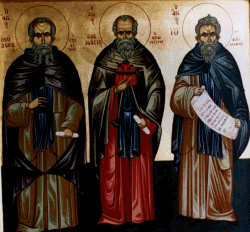

\[ [Home](index.md) \] \[ [Liturgical Texts](liturgic.md) \] \[ Voice of the Fathers \] \[ [Songs of the Fathers](songsof.md) \] \[ [Obiter Scripta](obiter_scripta.md) \] \[ [Manchester Churches](manchester_churches.md) \] \[ [York and Durham](york_and_durham.md) \]

[Athanasios of Alexandria](athanasios_of_alexandria.md)
[Theodore the Studite](theodore.md)
[Ephrem the Syrian](ephrem.md)

VOICE OF THE FATHERS
====================

**Our Venerable Fathers
Theodore the Studite, Athanasios of Athos and John of Sinai**

****The icon was painted for me by a friend from Manchester.****

****The background is the opening page of St Luke’s Gospel from the 5th century Codex Alexandrinus in the British Library. The codex was presented to King Charles 1st by Patriarch Cyril Lukaris of Constantinople.****

On this page you will find translations of sermons, letters and other non-liturgical writings of the Fathers. The translations are newly made and are for the most part of texts that have not previously been translated into English, or that are not easily available. Where possible they are made from the latest critical editions, though for many of them we still have to use the early printed editions from the 18th century. 

All texts and translations on this page are copyright to
Archimandrite Ephrem ©

**This page was last updated on 03 November 2008**
