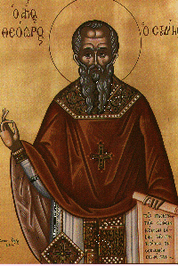

\[ [Home](index.md) \] \[ [Up](voiceof.md) \]
\[ [Athanasios of Alexandria](athanasios_of_alexandria.md) \]
\[ Theodore the Studite \] \[ [Ephrem the Syrian](ephrem.md) \]

[To the Nun Anna](Anna-ep.md)\
[Two Letters from Exile](exile-epp.md)\
[Catechesis 2](ths02.md)\
[Catechesis 4](ths04.md)\
[Catechesis 6](ths06.md)\
[Catechesis 7](ths07.md)\
[Large Catechesis 14](ths14l.md)\
[Catechesis 20](ths20.md)\
[Catechesis 24](ths24.md)\
[Catechesis 32](ths32.md)\
[Lent](lent.md)\
[Catechesis 78](Ths78.md)

 

{width="200" height="298"}

****Icon of Saint Theodore****

CATECHESES TO HIS MONKS 
========================

------------------------------------------------------------------------

All texts and translations on this page are copyright to\
Archimandrite Ephrem ©

**This page was last updated on 03 November 2008**
